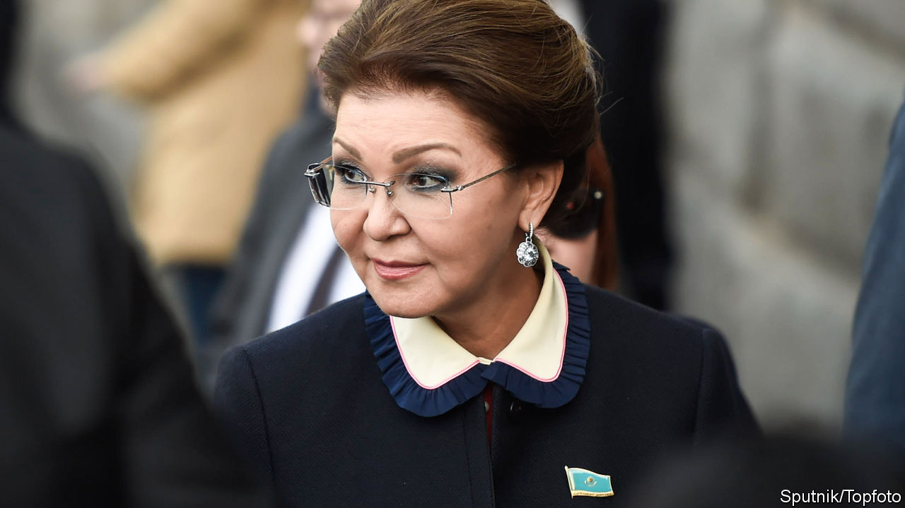

###### Bye-bye Nazarbayeva

# A Kazakh politician with a pedigree unexpectedly loses her job 

##### The former president’s daughter is no longer next in line to the presidency 

 

> May 7th 2020 

WHEN HE STEPPED down abruptly as president of Kazakhstan last year after 30 years in power, Nursultan Nazarbayev appeared to take out an insurance policy. As stipulated in the constitution, he was succeeded by the speaker of the Senate, Kassym-Jomart Tokayev, who was later affirmed as president in a rubber-stamp election. To replace Mr Tokayev as speaker, the Senate chose none other than Dariga Nazarbayeva, the outgoing president’s daughter. Should Mr Nazarbayev for some reason feel let down by Mr Tokayev, many speculated, an even more loyal lieutenant was poised to take charge—or perhaps was being groomed to advance a Nazarbayev dynasty in due course. So when Ms Nazarbayeva lost her job this week, Kazakhs were left surprised and confused.

Ms Nazarbayeva was replaced by Maulen Ashimbayev, a technocrat who is thought to be closer to Mr Tokayev than Mr Nazarbayev. That prompted talk that Mr Tokayev, who is widely seen as the puppet to Mr Nazarbayev’s puppeteer, was trying to bolster his authority. But the “Leader of the Nation”, as Mr Nazarbayev is officially known, still chairs the committee that controls the security forces and could certainly have prevented the change had he wanted to. That suggests that Ms Nazarbayeva has fallen foul not of Mr Tokayev, but of her father. If so, her problems probably stem not from events in Nur-Sultan—the capital, renamed after Mr Nazarbayev last year—but from peculiar goings-on in London, where two embarrassing family dramas have recently unfolded, in the courts and around a rehab clinic frequented by the rich and famous.


In April Ms Nazarbayeva and her eldest son, Nurali Aliyev, successfully fought off a British government attempt to seize $80m-worth of property deemed “unexplained wealth”. The British authorities failed to prove that they purchased the property—including a ten-bedroom mansion on a street nicknamed “Billionaires’ Row”—with funds obtained through corruption. She declared herself “vindicated” by the ruling, which would “clear her name”. However, the case shone an unwelcome spotlight on the Nazarbayev family’s fortune (another daughter, Dinara Kulibayeva, and her husband, Timur Kulibayev, are together worth $5.2bn, according to Forbes magazine), just as the coronavirus pandemic and low oil prices were beginning to vitiate the Kazakh economy.

Even more embarrassing has been the furore stirred by Ms Nazarbayeva’s youngest son, who uses the name Aisultan Rakhat and who featured prominently in British tabloids last year after his arrest for biting a police officer summoned to remove him from a stranger’s flat in central London. He was convicted of causing bodily harm and received a suspended sentence and a fine. On a judge’s orders, Mr Rakhat, who has admitted to a history of substance abuse, went into rehab at the Priory clinic, a haunt of celebrities with a habit. In January he suddenly posted a series of startling allegations on Facebook. Most shockingly, he claimed that his real father was not Rakhat Aliyev, the deceased former husband of Ms Nazarbayeva, but Mr Nazarbayev. Kazakh officials dismissed the claim as the fantasy of a drug-addled mind.

Ms Nazarbayeva has fallen from grace before. In 2007 Rakhat Aliyev fell out with Mr Nazarbayev (whom he memorably dubbed his “godfather-in-law”), prompting Ms Nazarbayeva to divorce him and Kazakh courts to convict him in absentia of an outlandish plot to topple Mr Nazarbayev using poisoned isotopes and mercenaries. Ms Nazarbayeva subsequently lost her job as a prominent MP. It was four years before she returned to politics. Whatever their other qualities, Mr Tokayev did not generate many foreign headlines while he ran the Senate, and Mr Ashimbayev seems unlikely to. ■

