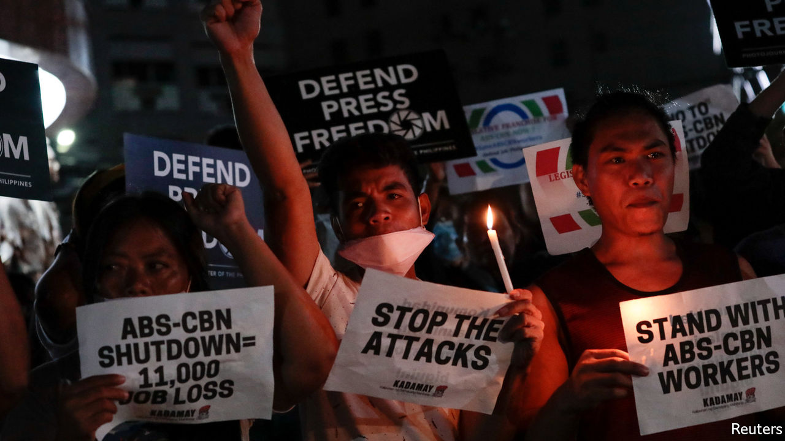

###### Blank screen

# A Philippine broadcaster is forced off the air 

##### President Rodrigo Duterte says ABS-CBN’s troubles are nothing to do with him 

 

> May 7th 2020 

A  NEW TELEVISION drama is gripping the Philippines. Its protagonists include ABS-CBN, a giant broadcaster, and President Rodrigo Duterte. The story begins back in 2016, when ABS-CBN did not air some adverts backing Mr Duterte’s campaign for president, noting that others had booked the slots first. He has held a grudge ever since, compounded by the network’s damning reports on his blood-drenched campaign against drugs. Matters came to a head on May 5th. The National Television Commission (NTC), a regulator, ordered the broadcaster to cease operations immediately. It went off-air at 7.52pm that day. (Its cable-news channel and digital offerings are still available.)

The reason given for the NTC’s order was the expiry a day earlier of the media group’s 25-year broadcasting franchise. The solicitor-general, José Calida, took it upon himself on May 3rd to warn the NTC not to grant ABS-CBN any kind of temporary permission to remain on air while Congress, which is packed full of the president’s supporters, considers whether to renew its franchise. (Lawmakers have been sitting on bills to do so since July.) Mr Calida has a big part in the drama. In February he filed a petition with the Supreme Court to revoke the channel’s franchise because of its “highly abusive practices”.


A spokesman for Mr Duterte claims he is “completely neutral” about whether Congress should renew the broadcaster’s franchise. The NTC, he added, came to its decision independently. This contrasts with the president’s own statements regarding ABS-CBN. In December he declared, “I’m sorry. I will see to it that you’re out.”

Press-freedom watchdogs have been howling, but the president cares little. Journalists are “sons of bitches”, he says. Other outlets have also suffered since he came to power. Rappler, a news website, and its boss, Maria Ressa, face charges including tax evasion and cyber-libel which observers say are politically motivated. But ABS-CBN is far bigger quarry: it is the country’s most watched broadcaster and the maker of the most popular news programme in Tagalog, the Philippines’ most widely spoken language. “The move is clearly a case of political harassment against a pillar of Philippine democracy,” says the Foreign Correspondents Association of the Philippines. It does not seem to count the president, sadly as a pillar. ■

