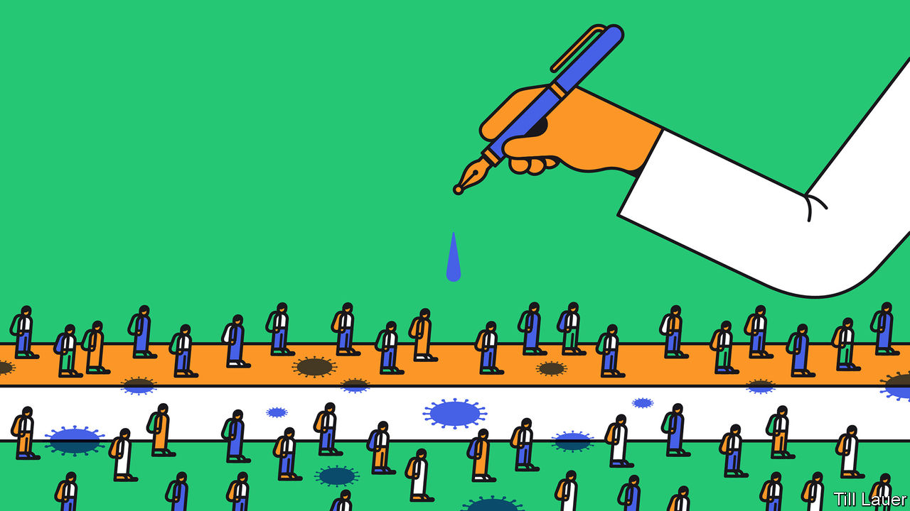

###### Banyan

# India’s government is better at curbing critics than covid-19 

##### Bureaucrats can be a nuisance, but politicians are often a menace 

 

> May 9th 2020 

Editor’s note: The Economist is making some of its most important coverage of the covid-19 pandemic freely available to readers of The Economist Today, our daily newsletter. To receive it, register . For our coronavirus tracker and more coverage, see our 

MANY INDIANS will remember the coronavirus epidemic less for social distancing, or for watching re-runs of “Ramayan”, a popular 1980s television saga based on Hindu myth, than for the endless queues. Destitute migrant workers hoping for a train home are not the only ones who have been made to line up and wait. Nor are the millions now surviving on charity, or the hope of it. Many in the middle class, too, have been stuck in monstrous tailbacks while trying to make urgent journeys, the victims of arbitrary decisions by babus, as Indians derisively call civil servants.

For example, in the state of Haryana, which almost encircles Delhi, babus have ordered nearly impenetrable roadblocks to seal off the capital. This is akin to Maryland walling off Washington, DC, or the Home Counties blocking access to London. The babus say the blockade is to protect Haryana’s healthier citizens from being infected by sick Delhi-wallahs. The trouble is that severing the city from its suburbs has, among other nuisances, blocked doctors, nurses and patients from travelling to hospitals.


The babus of Delhi, for their part, have generated equally enormous queues. When the central government’s babus decided it was time to lift a nationwide ban on alcohol sales (a measure whose utility in the fight against covid-19 remains mysterious), the government of Delhi decreed that only particular liquor stores could open. This needless constriction created a crush so great as to squash any semblance of social distance. The babus then added insult by slapping a 70% tax on booze.

Not to be outdone as nuisance-makers, the babus of Noida, a suburb of Delhi in the state of Uttar Pradesh, have declared it illegal to carry a smartphone without downloading the government’s contact-tracing app. Many people do not own smartphones and, besides, the software is highly controversial. Yet the wise men of Noida still think it reasonable to threaten citizens with six months in prison for shunning it.

If it were only ill-conceived, ever-shifting rules that magnified the grief of covid-19, Indians would simply shrug and roll their eyes. It is what they have come to expect from the “gomment”. Yet for some citizens things are worse. If you happen to be Muslim, for example, or to have joined the widespread protests earlier this year against government moves to inject religious criteria into citizenship rules, or to have been branded “anti-national” for any other reason, then you may be singled out for special treatment. Despite the spreading epidemic and the hardship caused by the continuing lockdown, the government has not relented from pursuing a range of critics, increasingly invoking draconian laws intended to combat terrorism.

Consider Anand Teltumbde, a 69-year-old management professor who champions the rights of Dalits, at the bottom of the caste system. He has been imprisoned since mid-April, awaiting trial along with ten other leftist intellectuals on credulity-stretching charges of inciting violence, including a purported plot to assassinate Narendra Modi, the prime minister. Or take Safoora Zargar, a 27-year-old graduate student at Delhi’s Jamia Millia Islamia University, arrested a month ago and repeatedly denied bail, despite being four months pregnant. Her membership of a university protest group has been twisted into a leading role in a purported “premeditated conspiracy” by Muslims to stoke the communal violence that engulfed parts of Delhi in February and left more than 50 dead. Among numerous facts that might suggest that this police narrative is pure fantasy, three-quarters of those killed in the riots happened to be Muslim.

Perhaps most disturbing has been the government’s failure to act at all against far more obvious troublemakers. During the covid-19 crisis, it has seemed completely uninterested in staunching a nasty wave of Muslim-baiting on social media, just as it ignored incitement to violence against anti-government protesters before the Delhi riots. The gist of the rumours doing the rounds is that the Muslims are deliberately spreading the epidemic as a “corona jihad” against the Hindu majority. One watchdog group has counted no fewer than 94 fake-news videos circulating in the past month, attracting millions of views, in which Muslims are supposedly shown propagating the disease by spitting in food, dropping infected currency notes and so on. Naturally, any meaningful debate about the government’s handling of the epidemic has been buried under this dangerous rubbish.■

Dig deeper:For our latest coverage of the covid-19 pandemic, register for The Economist Today, our daily , or visit our 

