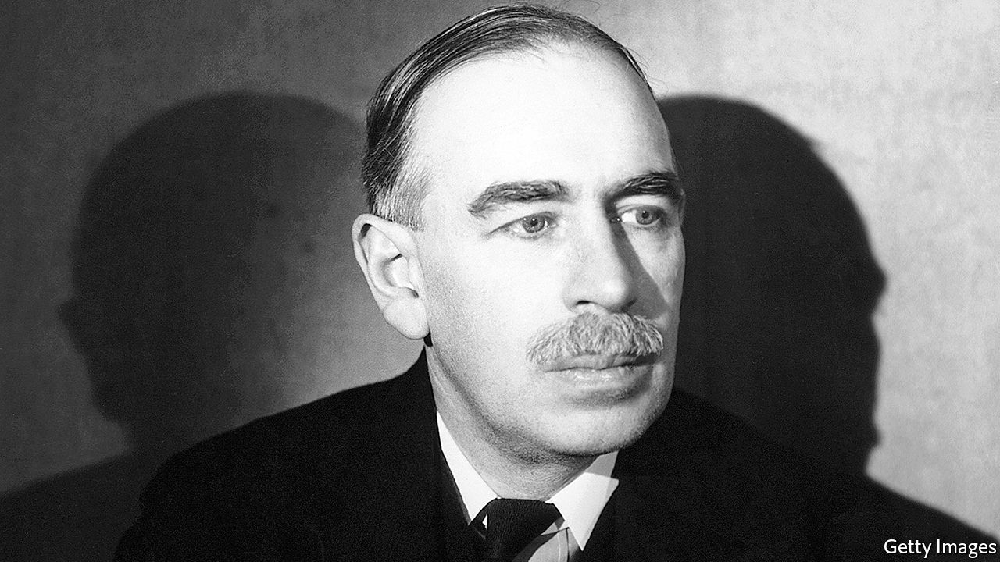

###### Alive in the long run

# The enduring legacy of John Maynard Keynes 

##### It is easy to forget how often his advice was ignored during his lifetime 

 

> May 7th 2020 

The Price of Peace. By Zachary Carter.Random House; 656 pages; $35 and £25.

ANY BIOGRAPHER of John Maynard Keynes must labour in the shadow of Robert Skidelsky’s magisterial three volumes about the great economist. Zachary Carter, a journalist at the Huffington Post, has tackled the problem in an ingenious way, by focusing on the development of Keynes’s ideas and how they fared after his death in 1946. The result is an entertaining summary of 20th-century economic history that will appeal to the general reader.


The key to Keynes, Mr Carter shows, is to place him in his time and class—a well-heeled British intellectual who moved effortlessly between the worlds of academia, government and the arts. Born in 1883, he grew up at a time when the British Empire was at its peak, which, for people like Keynes, was an age of peace and prosperity.

The idyll was destroyed by the first world war and, in part, Keynes’s life was a bid to restore the better parts of that lost world. He first made his name by raging against the terms of the Versailles peace treaty; his economic views were shaped by the experience of Britain in the 1920s, which was marked by deflation and high unemployment. Then came the Great Depression, which seemed to show the folly of the classical view of an economy as a machine which, if left to its own devices, would return to equilibrium.

For Keynes, this was a call to action. He perceived “the real struggle” to be between liberalism, in which the primary objectives of government were peace, freedom of trade and economic wealth, and a militarist school “which thinks in terms of power, prestige, national or personal glory, the imposition of a culture and hereditary or racial prejudice”. In a sense, he wanted to save capitalism from itself. Mr Carter sees Keynes’s career as an attempt “to make the practical risk-averse anti-revolutionary conservatism of Burke fit the radical democratic ideals advanced by Rousseau”.

Given Keynes’s standing today, it is easy to forget how often his advice was ignored during his lifetime. In spite of his opposition, Britain’s Conservatives restored the gold standard in 1925. He backed Lloyd George’s Liberals in the election of 1929, just as the party was descending into irrelevance. While some elements of Franklin Roosevelt’s new deal were Keynesian, the president regarded the economist as an indecipherable mystic. And at the Bretton Woods conference of 1944 many of Keynes’s plans for the post-war economic order were overruled by the Americans.

His greatest influence was exerted after his death, as the economics profession overwhelmingly adopted his ideas in the three decades after the war. As Mr Carter says: “Keynesianism took on a life of its own Keynes himself could scarcely have predicted.” His legacy was affected by the style of his intellect and writing, which had been honed in Cambridge common rooms and Bloomsbury salons; he expressed his ideas more in arresting bons mots than in mathematical equations. Partly as a consequence, his magnum opus, “The General Theory of Employment, Interest and Money”, is a confusing read. Keynes recommended that governments should manage aggregate demand or purchasing power, but did not say precisely how they should do so. He enshrined full employment as the main measure of success but did not define the term.

Instead, Keynesianism was defined by his colleagues, such as Joan Robinson and John Hicks, and intellectuals like J.K. Galbraith. That philosophy was in turn attacked in the 1960s and 1970s by Milton Friedman, Friedrich Hayek and others, who argued that Keynesianism had resulted in government playing too big a role in the economy and a chronic tendency towards inflation. Ronald Reagan and Margaret Thatcher presided over a big shift away from the use of fiscal policy to manage the economic cycle, with monetary policy taking the strain.

Mr Carter is dismissive of these anti-Keynesian reactions. Still, you have to wonder whether Keynes, who relied on his investment income to fund his lifestyle, would have been enthusiastic about the economic policies of the mid-1970s, which in Britain yielded a top rate of income tax of 83% and inflation of over 25%.

For a while, as the profession moved away from his ideas, it looked as if Keynes might become one of the “defunct economists” he once quipped about. But the 21st century has restored his reputation. In 2009, in response to the financial crisis, G20 governments agreed on the kind of co-ordinated fiscal stimulus that Keynes would surely have recommended. The pandemic has led to yet another round of government action to stave off depression. Meanwhile, increasing use of automation has revived interest in Keynes’s thoughts about a shortened working week, which he expounded in “Economic Possibilities For Our Grandchildren”. The world will be debating, and learning from, the work of Keynes for many decades to come. ■

