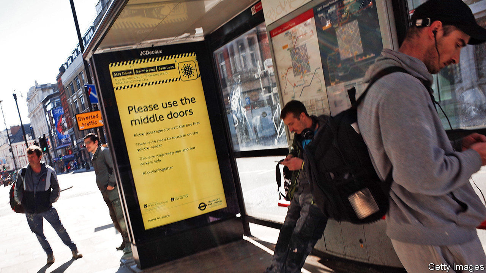

###### Tracing

# Why Britain is ignoring the Google-Apple protocol for its tracing app 

##### The decision makes it a global outlier 

 

> May 9th 2020 

Editor’s note: The Economist is making some of its most important coverage of the covid-19 pandemic freely available to readers of The Economist Today, our daily newsletter. To receive it, register . For our coronavirus tracker and more coverage, see our 

EVER SINCE Apple and Google announced that they would tweak their smartphone operating systems to help digital contact-tracing, governments have been changing their approaches. Germany went along with the tech giants on April 26th, having initially been opposed. Singapore, which built the world’s first nationwide contact-tracing app, is rebuilding atop Google’s and Apple’s technology.

Not Britain. The app which Britain started trialling on the Isle of Wight on May 5th eschews the Apple and Google protocol in favour of a home-grown solution. While the Apple and Google system processes information about people’s contacts on their phones, the British system will store it on a central server controlled by the National Health Service (NHS).


The British approach has problems. There are doubts about whether it will work at all. The point of the Apple and Google protocol update is to allow phones to exchange Bluetooth contact signals in the background. Otherwise, on the latest versions of Android and on Apple’s iOS, the screen must always be on for Bluetooth tracking to take place, with the app in the foreground, killing battery life and making the phone unusable. The NHS says it has found a work-around for this, but it will certainly use more battery power than the tech giants’ own solution; and, given that it is doing something the phone systems are designed to prevent, there is a good chance that it will work poorly. The NHS’s record on tech is not great: in 2011, it pulled the plug on an £11bn IT system that didn’t work.

The Irish border poses a further problem. Ireland, like most European countries, has chosen to use a decentralised system built atop the Google and Apple protocol. The Irish and British apps will therefore be unable to communicate, so the contacts of the 30,000 people who commute across the border with Northern Ireland every day will not be traced on the other side. Scotland is not keen on the NHS app either, and will not push its adoption. The same problem will apply to cross-border tracking of foreign tourists in Britain, or Brits abroad. Apple’s and Google’s protocol allows for national apps built using it to talk to each other. The NHS app does not.

The British approach may also face legal problems. Ravi Naik of AWO, a data-rights agency, says that because centralised systems consolidate individuals’ data in a single location outside their control, they also pose a greater threat to their rights. “To justify that interference, the government will have to provide significant evidence to show that such a system is necessary and proportionate,” says Mr Naik. Matthew Ryder of Matrix Chambers has said that a legal challenge to the app is “almost inevitable”.

The government’s decision to go for a centralised system may in part be the consequence of its tardiness in getting testing off the ground. A system that relies on self-reporting of symptoms requires public-health authorities to make judgments about symptoms; centralisation permits that. The authors of a paper published on April 16th by a group at Oxford University, widely acknowledged to have influenced the government’s decision-making, says that “prolonged test turnaround times and low capacity for testing” limit the use of testing as an indicator.

The decision to go with the centralised version may also have been influenced by the power of the NHS brand. Brits trust it—probably more than they trust Apple and Google. Mr Hancock has called on that brand power in his sloganeering around the app: “Stay at home, install the app, protect the NHS, and save lives.”

Yet getting the app installed on enough phones to be useful requires that it be as energy-efficient and painless to use as possible, something best done with the Apple and Google tools. Many techies expect an about-face on centralisation, despite the potential for bruised egos and the extra work that would need to be done to bring the app in line with Google, Apple and most of the rest of the world. ■

Dig deeper:For our latest coverage of the covid-19 pandemic, register for The Economist Today, our daily , or visit our 

