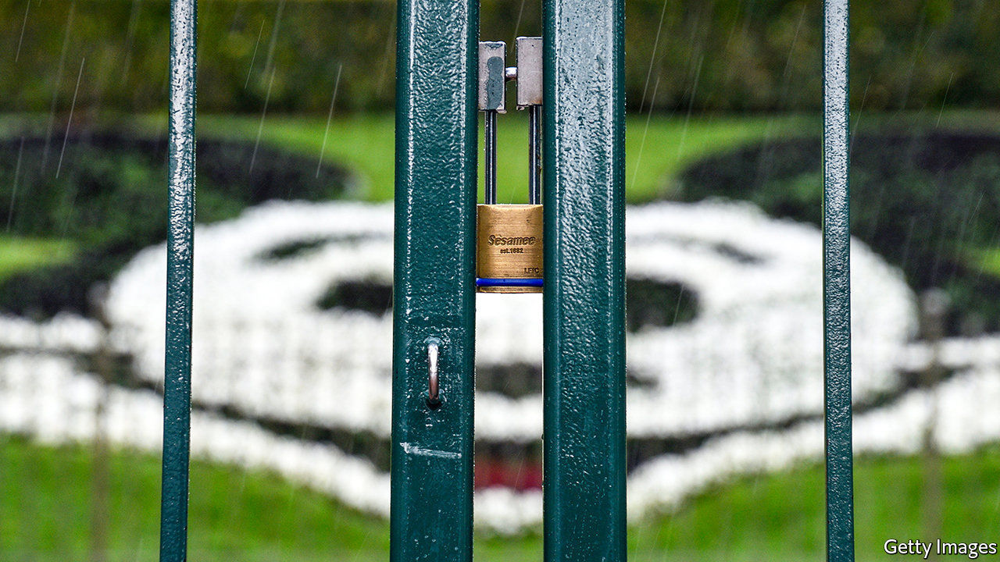
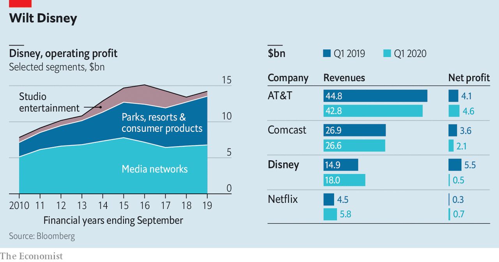

###### Cruising for a bruising

# Parks and resorts powered Disney’s growth. Then came covid-19 

##### Disney has diversified into exactly the wrong businesses for a pandemic 

 

> May 9th 2020 

Editor’s note: The Economist is making some of its most important coverage of the covid-19 pandemic freely available to readers of The Economist Today, our daily newsletter. To receive it, register . For our coronavirus tracker and more coverage, see our 

A  LONG TIME ago in a galaxy far, far away—February, to be precise—Bob Iger quit as head of a wildly successful company. Disney ruled the box office, with seven of the ten biggest hits of 2019. It had just launched a streaming service, Disney+, to take on Netflix. And it had completed a $69bn debt-fuelled acquisition of 21st Century Fox. In Mr Iger’s 14 years in charge, the firm’s share price quintupled. On May 5th he was back, like a Jedi summoned from semi-retirement, to introduce a first-quarter earnings call where Disney suspended its dividend and said covid-19 had caused net profit to fall by 91% from a year ago.

Covid-19 has infected all big media groups. Cinemas are shut; advertising is down; shooting is disrupted and there are no live sports to televise. But few have suffered as badly as Disney (see chart). Netflix is thriving as locked-down consumers sign up. AT&amp;T and Comcast are stabilised by their dull yet dependable cable and mobile businesses. Disney has been whacked for the same reason that for years it thrived: under Mr Iger, the world’s best-known media company grew into far more than a media company. Alas, it diversified into exactly the wrong businesses for a pandemic.


A decade ago Disney’s media networks, which include the Disney Channel, ESPN sports and ABC broadcasting, raked in two-thirds of Disney’s operating profits from its various businesses. Last year they made up half. With pay-TV in decline, Disney has invested elsewhere. One area is its film studios, where profits have been lifted by the acquisition of companies like Lucasfilm (which owns Star Wars) and Fox. That has boosted its consumer-products business, as fans snap up plastic lightsabres and Iron Man toys. But last quarter, with cinemas closed, Disney studios’ profits fell by 8%, year on year. With new releases postponed until July, the next quarter looks worse.

 


The Fox deal apart, Disney’s biggest expansion under Mr Iger was in theme parks and resorts. Capital spending on these was $4.1bn last year—more than Disney paid for Lucasfilm in 2012. Six parks and four cruise ships (plus a private island in the Bahamas) helped generate a third of Disney’s operating profit in 2019, nearly double the share a decade ago. Bob Chapek, who replaced Mr Iger as CEO in February, ran the division. Yet this business is especially vulnerable to social distancing. With parks closed and ships docked, quarterly profits in this segment swooned by 58%.

Disney’s Shanghai park, at least, will re-open on May 11th, at below 30% capacity. Visitors are banned from hugging Mickey Mouse and must wear face-masks. The Disney shop sells those in packs of four, featuring Mickey or R2-D2, for $19.99. ■

Dig deeper:For our latest coverage of the covid-19 pandemic, register for The Economist Today, our daily , or visit our 

