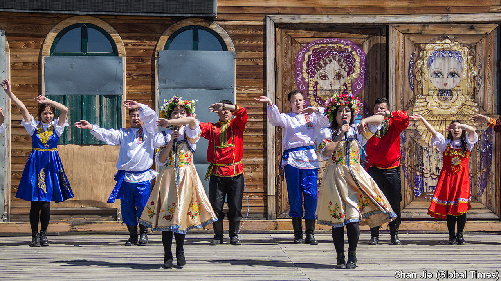

###### Heaven’s outposts

# Near China’s border with Russia, the Orthodox Church regains a toehold 

##### China is wary of religions with foreign links, but it likes Russia 

 

> May 7th 2020 

IN THE CITY of Ergun, about 60km from China’s border with Russia, the feast of Pascha last month was one that Father Pavel Sun Ming will long remember. Because of covid-19, he could not open his Eastern Orthodox church for celebrations of Christ’s resurrection. Police wearing surgical masks stood outside, stopping passing cars to check people’s health. But it is last year’s Pascha in Ergun that will go down in history. For the first time in more than six decades, the church’s midnight service was led by a local. Father Pavel had recently returned from his ordination in Russia. At last, Ergun’s flock had a priest again.

Father Pavel is only the second person to be accepted officially in China as an Orthodox priest since Mao Zedong tried to wipe out religion a few years after seizing power in 1949. The first was Alexander Yu Shi, who was ordained in Russia in 2015 and now serves in Harbin, about 800km south-east of Ergun.


Before the Communist takeover, Russian Orthodoxy had a strong foothold among Russians living in China’s borderlands. They married local Chinese, but some of their descendants, such as Father Pavel and Father Alexander, kept up the faith. These days few of the 15,000 Chinese citizens of Russian ancestry speak Russian or even look like their Russian forebears. But the government regards them as members of an ethnic minority group. It calls them Russians.

Few are devout, but many of them cling to symbols of Russian-ness. The church on the edge of Ergun, in Inner Mongolia, is one such. Atop it are golden crossbeams, the lowest hanging at a slant. It has a green-domed roof and maroon walls trimmed in white. It was built in the 1990s on the ruins of St Innocent of Irkutsk, one of at least 18 Orthodox churches that were once in the city. Today, apart from those in Ergun and Harbin, there are only two others in China—both in the western region of Xinjiang.

The revival of these four, after the dark days of Mao, has not been easy. The government recognises five religions. These are Buddhism, Daoism, Islam and two strands of Christianity: Catholicism and Protestantism. Orthodoxy operates in a grey zone, assigned to none of these. But along with the rapid improvement of Sino-Russian relations since the 1990s, China’s government has fostered stronger unofficial contacts with its giant neighbour, including in the religious realm.

It took years for Ergun’s church to get government approval to import Russian religious artefacts. But in 2009 it was finally consecrated. Four years later the head of the Russian Orthodox Church, Patriarch Kirill of Moscow, made his first official visit to China where he met President Xi Jinping. This paved the way for Chinese to train as priests in Russian seminaries.

But the Orthodox church in China is still treated warily by the government. Only registered members of Ergun’s church are permitted to enter it (even visiting Russian citizens are barred). There is a security camera above its door. As Father Pavel matter-of-factly admits, Orthodoxy in China is a “slightly sensitive” affair. ■

