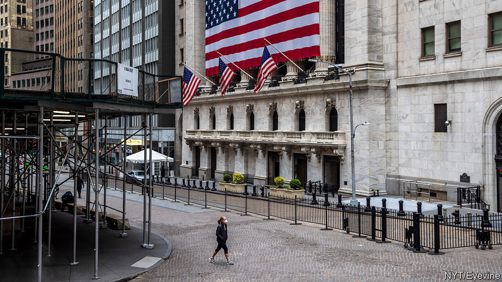
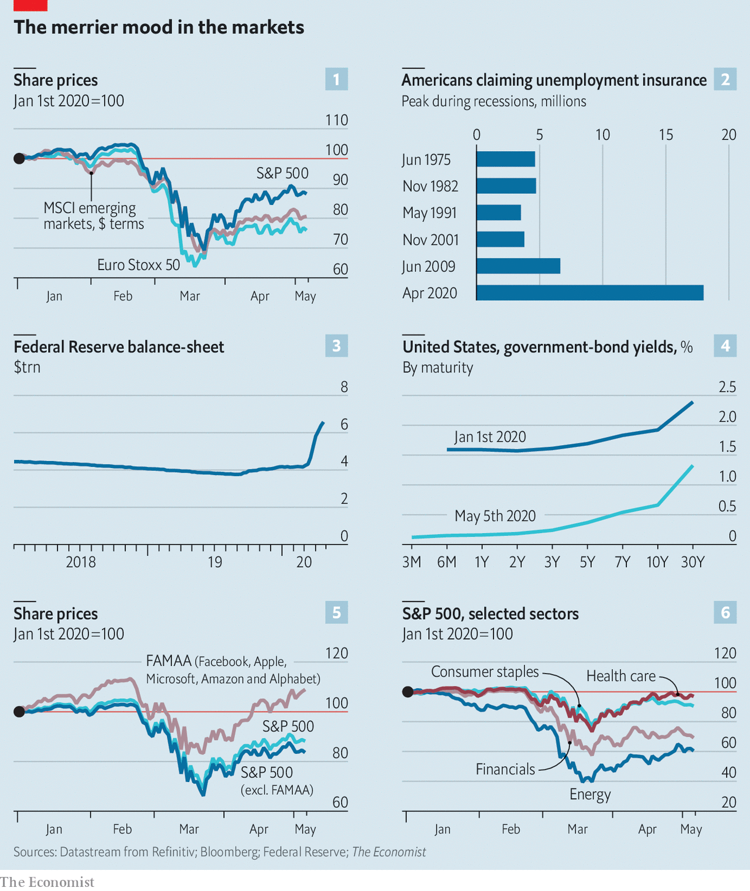

###### Uppers and downers

# A perky stockmarket v a glum economy 

##### Explaining the stockmarket rally 

 

> May 7th 2020 

Editor’s note: The Economist is making some of its most important coverage of the covid-19 pandemic freely available to readers of The Economist Today, our daily newsletter. To receive it, register . For our coronavirus tracker and more coverage, see our 

FINANCIAL MARKETS look forward. Yesterday’s news is stale. What matters is the future, in particular the returns that today’s buyer of securities can expect. So there is some reason to think the S&amp;P 500 share index might trace the near future of America’s economy.

Share prices in America have followed a dramatic V-shape recently. A brutal sell off has given way to a lively recovery (chart 1). Yet a V-shaped path for the economy—a brief recession, followed by a swift recovery—seems unlikely. The scale of job losses suggests the economy is in a hole too deep to climb out of quickly. Claims for unemployment insurance have dwarfed peaks in previous recessions (chart 2).


So why has the stockmarket rallied so hard? In part this reflects the Federal Reserve’s efforts to backstop the economy. It has bought bonds on an unprecedented scale, swelling its balance-sheet (chart 3). Bond yields have also become even paltrier (chart 4). Equities are appealing, if only by comparison.

 


The pattern of share-price changes is revealing. America’s have risen faster than Europe’s. The industry make-up of each market explains much of this. Europe’s bourses are weighed down by cyclical industries—banks, carmakers and energy companies. America’s has a bigger tilt toward technology companies, the relative winners of the covid-19 crash. The five largest tech stocks continue to be market darlings (chart 5). Healthcare stocks and consumer staples have also proved resilient (chart 6). Investors are not looking much beyond stocks they judge to be recession-proof. The market’s recent “V” is not for victory.■

Dig deeper:For our latest coverage of the covid-19 pandemic, register for The Economist Today, our daily , or visit our 

