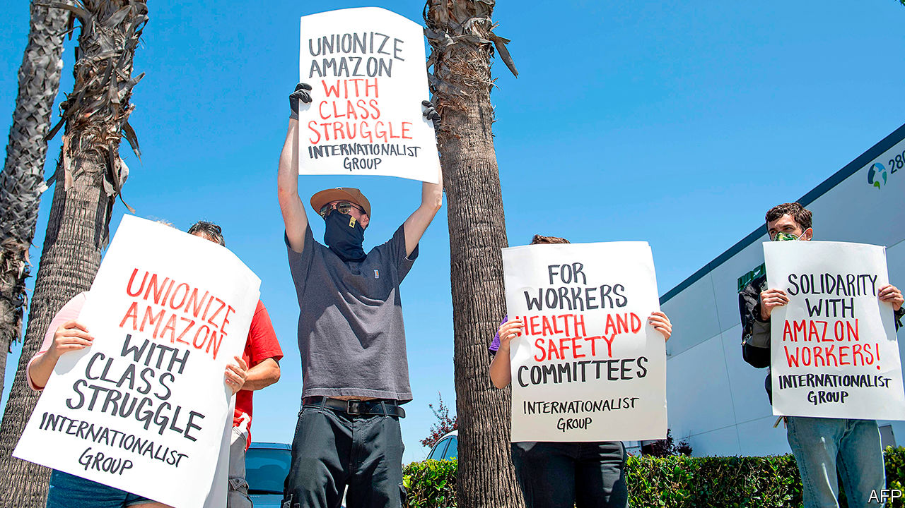
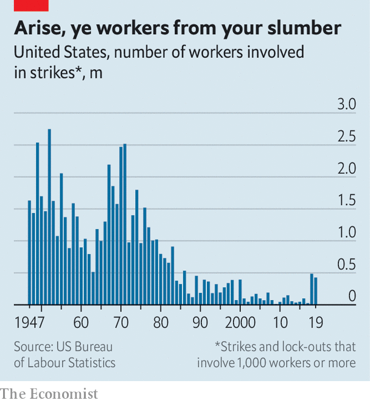

###### All worked up

# Could the pandemic give America’s labour movement a boost? 

##### Gig workers are organising, in tech-savvy ways 

 

> May 9th 2020 

Editor’s note: The Economist is making some of its most important coverage of the covid-19 pandemic freely available to readers of The Economist Today, our daily newsletter. To receive it, register . For our coronavirus tracker and more coverage, see our 

“MAY DAY, ho, ho, billionaires have got to go.” Protesters with slogans and placards, security hovering in the back: the gathering outside an Amazon warehouse in Richmond, California, on May 1st had all the trappings of a proper picket line. One thing was different, though—instead of massing together, participants kept a safe distance. The organisers had even chalked “Stand here” on the pavement at intervals of six feet.

Like much else, collective action is not the same in a time of covid-19. It is also increasingly widespread. The protest in Richmond, which included demands for higher pay, is part of a wave of petitions, walkouts, no-shows and strikes organised by gig workers, factory employees and fast-food servers across America. Coworker.org, a website that helps workers launch campaigns, has seen their number explode to more than 100 new initiatives a week. Mike Elk of Payday Report, a website, counts 45 coronavirus-related strikes in March and 108 in April. Comparing these data with official statistics is not easy, but the rise in strike action that began in 2018 looks likely to accelerate (see chart).


A pandemic would seem an inopportune moment for a revival in organised labour. Figures due to be released on May 8th, after The Economist went to press, were expected to show that America’s unemployment rate exceeded 15% in April, up from 3.5% in February. Many people are grateful simply to have jobs, and do not want to rock the boat. Yet history complicates the picture. Research by Orley Ashenfelter and John Pencavel, labour economists, points to rapid growth in trade-union membership after the Great Depression, when unemployment was about as high as it is today. Other factors, they argue, from “the prevailing attitudes within society” to legislative changes, also help explain the ups and downs of organised labour.

 


Perceptions of unfairness are likely to aid the worker’s cause. The better educated and richer you are, the easier it is to work from home. But many less-skilled workers must venture outdoors, risking their health, even as they realise that the economy would grind to a halt without them.

Demands for higher pay or paid sick leave also seem to be carrying weight with better-off workers and consumers. It emerged on May 4th that Tim Bray, a senior engineer at Amazon, had quit “in dismay” over the firings of workers who had organised protests, and called on the firm to expand sick leave and hazard pay. “The warehouse workers are weak and getting weaker,” he wrote in a blog post. “Any plausible solution has to start with increasing their collective strength.”

One survey suggests that a majority of Americans’ purchasing decisions will be swayed by how firms treat their workers during the pandemic. Investors may agree: a recent working paper for the National Bureau of Economic Research concludes that companies scoring well on indices of social issues, such as employee welfare and human rights, have fared better on the stockmarket since covid-19 struck.

Gig workers had started to organise even before the virus. Having burned through billions of dollars in venture capital, online platforms such as Instacart and Uber are chasing profits. That has often meant less money and tougher conditions for workers, leading them to form such groups as Gig Workers Collective (GWC) and Rideshare Drivers United (RDU). Activists have developed new forms of collective action, such as turning off their apps at a specified time or refusing to accept gigs, the digital equivalent of a work stoppage.

Technology has made organising easier, too. The GWC, explains Vanessa Bain, one of its founders, uses Facebook to get the word out, Telegram for communication and Slack to organise. The RDU’s app, called Solidarity, aims to overcome the difficulties of organising a fragmented workforce, says Ivan Pardo, its developer. It allows activists to schedule calls with disgruntled drivers, organise protests and ask members what their demands should be.

The latest wave of collective action will allow workers’ groups to grow and form new connections, predicts Veena Dubal of the University of California’s Hastings College of the Law. The strikes on May Day were the first to be organised jointly by several of them. Yet a revolution in American industrial relations, as happened after the Great Depression, is not quite on the cards. Gig workers are still far from matching the might of big platforms, whose business models often rely on fragmented labour. Thomas Kochan of the MIT Sloan School of Management argues that, to increase their leverage, labour groups need to redouble their efforts to make sure they are heard by customers, who can then push firms to change their ways. Protesting outside warehouses, however creatively organised, will probably not do the job. ■

Dig deeper:For our latest coverage of the covid-19 pandemic, register for The Economist Today, our daily , or visit our 

