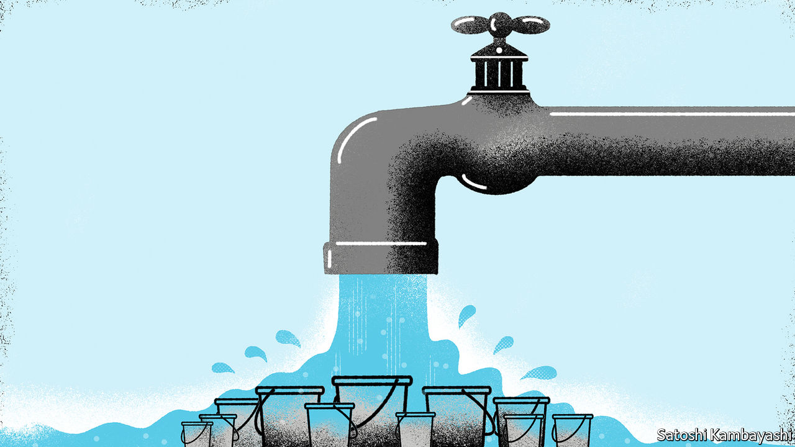

###### Getting on board

# Emerging markets launch QE, too 

##### Unconventional monetary policy is not just for the rich world 

 

> May 7th 2020 

EMERGING MARKETS have long resented quantitative easing (QE). When America’s Federal Reserve began its third round of asset purchases in 2012, Guido Mantega, then Brazil’s finance minister, accused it of starting a “currency war”. In 2013 Raghuram Rajan, then the chief economic adviser to India’s government, expressed his displeasure in the manner of Winston Churchill: “Never in the field of economic policy has so much been spent, with so little evidence, by so few.”

In response to the covid-19 pandemic, much is being spent again. But not by so few. The central banks of America, the euro area, Britain and Japan are set to buy $6trn-worth of assets between them this year, according to Fitch, a rating agency, three times what they bought in 2013, the previous peak. And emerging markets are no longer grumbling on the sidelines. Monetary authorities in Chile, Colombia, Costa Rica, Croatia, Hungary, Indonesia, Poland, Romania, South Africa and Turkey have prepared or begun purchases of bonds of various kinds. Still more are contemplating it. Even in Brazil, congress has passed what it calls the “war budget” law, amending the constitution to give the central bank more freedom to buy government bonds and other assets during this crisis.


The scale of emerging-market purchases is small so far in comparison with the Churchillian appetites of central banks in the rich world. Bank Indonesia, which already owns about 15% of tradable government bonds, may end up adding significantly to its holdings. The National Bank of Poland could end up owning bonds worth about 8.7% of GDP, according to UBS, a bank, if it buys all of the additional debt required to finance the country’s stimulus plan. But no other central bank is poised to buy bonds worth more than 5% of GDP, UBS calculates. By comparison, the Federal Reserve already held Treasuries equivalent to about 10% of GDP at the start of 2020, and is expected to roughly double that percentage over the course of the year.

Critics nonetheless worry that QE is both more dangerous and less necessary in emerging markets than it is elsewhere. It imperils the hard-won independence of monetary authorities that have struggled in the past to keep their distance from big-spending politicians. Brazil’s constitutional limits on the central bank, for example, reflect its history of hyperinflation, when governments resorted to the printing press to finance their populism. And although inflation is now firmly under control in most big emerging markets (exceptions include Argentina, Nigeria and Turkey), many of these countries still worry that monetary indiscipline can lead to destabilising runs on their currency.

QE is also, surely, less needed in the emerging world. In Chile and Peru benchmark interest rates are already about as low as they can go. But in most of their peers, central banks still have room to ease monetary policy by conventional means. In Indonesia and South Africa, for instance, the policy interest rate is still over 4%.

Why then are central banks pressing ahead? They believe their bond purchases serve a distinct purpose. They are neither an unconventional way to lower borrowing costs nor an illicit one to finance the government. The aim instead is to stabilise financial markets. In Brazil the president of the central bank says its bond purchases will resemble foreign-exchange intervention. It will not try to peg bond yields any more than it pegs the real. But it will try to smooth out jumps. The South African Reserve Bank says that its purchases are not meant “to stimulate demand”, but to ensure a “smoothly functioning market”.

In some quarters QE is still a tainted term, associated either with mercantilism, as a weapon in a currency war, or monetary adventurism. But the stigma is fading. Indeed some central banks now say they are doing QE even when they aren’t. The Bank of Korea, for example, has resolved to buy unlimited amounts of bonds from financial institutions that promise to repurchase them after three months. These “repo” operations amount to collateralised loans, not outright purchases. Few economists would describe them as QE. But far from resisting the term, the Bank of Korea has embraced it (“It wouldn’t be wrong to say we began quantitative easing,” noted one official). Never in the field of central banking have so many worried so little about buying so much. ■

