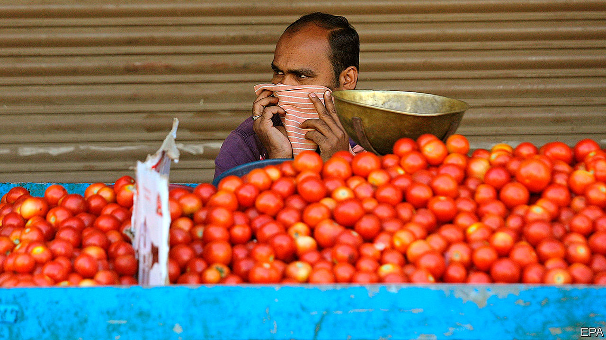
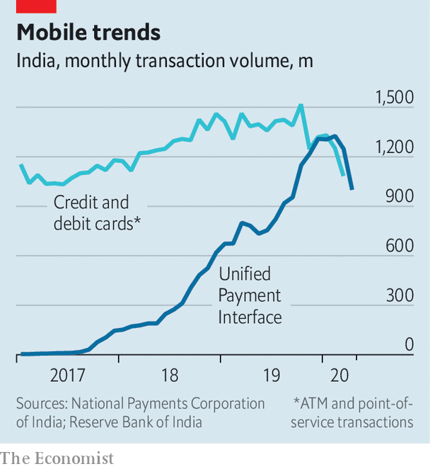

###### Bright spot

# In bleak times for banks, India's digital-payments system wins praise 

##### Digital loans could be next 

 

> May 7th 2020 

WHEN INDIA was hit both by the failure of a big bank and a nationwide lockdown in March, bankers, fearing runs from rattled depositors, rushed to stuff cash machines with notes. In fact the demand for cash was relatively subdued. Activity hummed along the Unified Payment Interface (UPI), an electronic-payments network that is on its way to becoming the country’s financial lifeline.

In the past two years three big banks or shadow banks have imploded. The severe economic disruption caused by covid-19 will only make lenders’ burden of bad loans heavier. Against this grim backdrop, UPI has shone. In November Google wrote to the Federal Reserve urging it to endorse a similar model for America. The Bank for International Settlements concluded in December that India’s digital financial infrastructure has the “potential to transform emerging markets and advanced economies alike”.


Before UPI was set up in 2016, cash reigned supreme. A large share of the population had no bank accounts, limiting card payments. Now hungry passers-by can pay for snacks like dosas and vada pav from street vendors using apps on their phones. At the start of 2020 nearly 1.3bn electronic payments were made each month, more than those using plastic. They accounted for 19% of banking transactions in the year to March 2019. Saurabh Tripathi of the Boston Consulting Group predicts that they will account for 59% of transactions within two years—three times the share of ATM withdrawals.

UPI usage dipped for the first time in March; that was followed by a fall of 20% in April. The collapse reflects the enormous drop in activity as the country shut down. Data for March suggest that the number of credit-card transactions fell further than that of digital payments, suggesting that UPI still gained market share.

The government has also used UPI to make emergency transfers to street vendors. A new programme is expected to be rolled out in June. This will enable companies to give workers vouchers that can be redeemed by labs testing for covid-19.

 


The payment system rests on the Aadhaar card, an identification system with which the fingerprints and irises of more than a billion Indians are registered. Take your card to a bank, as hundreds of millions of Indians have, and you can set up an account; you also become a “known customer”, clearing a regulatory hurdle. You can then, either through your bank or using various apps, send and receive funds instantly from anywhere in India.

Both the identity and the payment layers are controlled by the government, but open to others. As a result, using the system is cheap. Outside India payments tend to be handled mainly by private firms such as Visa, Mastercard, American Express or, in China, Ant Financial and Tencent. These own the pipes through which funds flow, and can charge heavily for their use. Their close relationships with users create high barriers to entry, putting new entrants at a disadvantage. By contrast, UPI is forbidden to charge merchants fees.

India’s set-up enables competition. The heavily regulated banking system still holds all the funds. However, layered on top are a number of lightly regulated private companies, with which customers interact directly. These apps initiate transactions and have access to account information but do not control money or networks. Paytm, a home-grown firm, and PhonePe, owned by Walmart, are big players. So too is Google, perhaps explaining its enthusiasm for the system. But the costs of switching are negligible, requiring just a tap on a phone.

UPI will next step into the realm of lending. Seven “account aggregators’’ are preparing to launch (although covid-19 has delayed their roll-out). Once granted a customer’s permission, these will compile a history of funds received and paid, which can be shared with lenders.

The benefits of such a system are clear. It would break the links between credit and collateral or personal relationships, and allow even small lenders to get loans based on their transaction histories and their income. When combined with cheap transfer costs, the cost of lending to even the tiniest business could fall. These now pay as much as 4% for a one-day loan.

But this is also where the drawbacks of UPI could become most apparent. Only a handful of transactions fail, but glitches have been known to occur. Aadhaar numbers have leaked before. Security matters more when access to credit is at stake. Another concern is the extent of the government’s control over parts of the infrastructure. In related areas it has not been above misusing its clout. In 2019, for instance, it shut down the internet in the troubled territory of Kashmir. Clever as India’s digital financial system is, such risks could mean that, for some, cash retains the edge. ■

