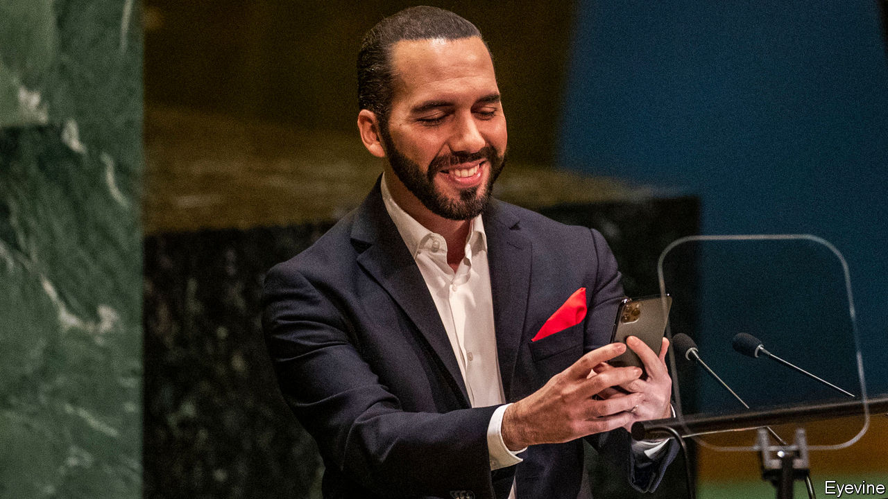

###### My tweet is your command

# Nayib Bukele may want to become Latin America’s first millennial dictator 

##### El Salvador’s young president ignores court orders, bullies lawmakers and brutalises prisoners 

 

> May 7th 2020 

WHEN HE BECAME president of El Salvador last year, Nayib Bukele promised change. A millennial who knows that a selfie is worth 1,000 words, he broke the grip of the two parties that had governed since the end of a civil war in 1992. On their watch El Salvador’s murder rate became the world’s highest and Salvadoreans left the country in droves. Three of the past four presidents have been charged with corruption. “You bastards, return what’s been stolen!” Mr Bukele demanded before the election. He gave his victory speech in jeans and a leather jacket.

But in his 11 months as president he has done more to wreck El Salvador’s democracy than to reform it. In February he entered the Legislative Assembly with soldiers to bully it into financing his crime-fighting programme. With the outbreak of covid-19 his contempt for democratic norms has only grown. Mr Bukele may be on course to become Latin America’s first millennial dictator.


He exemplifies a worrying trend. Until recently democracy seemed established in most of Latin America. The main exceptions were three countries ruled by leftist despots: Cuba, Venezuela and Nicaragua. Now some democracies are wobbling. Honduras’s president, Juan Orlando Hernández, engineered the abolition of a presidential term limit and in 2017 was re-elected in a flawed vote. Protesters in Bolivia forced Evo Morales, another term-limit dodger, out of office (and the country) after he apparently tried to rig his re-election last October. With covid-19 as her alibi the interim president, Jeanine Áñez, is amassing power and seeking to delay an election. Brazil’s populist president, Jair Bolsonaro, eggs on supporters who call for shutting down Congress and the Supreme Court.

Mr Bukele has gone still further (see ). He moved fast to contain the spread of covid-19, imposing a national lockdown on March 21st, when the country had just three confirmed cases. In the name of protecting citizens, he has trampled their rights. Police have arrested more than 2,000 people for violating the quarantine rules and confined them for up to 30 days in conditions that make the spread of the disease more likely.

The Supreme Court has ruled that the state cannot detain people without a law to back it up. Mr Bukele has defied it. “Five people are not going to decide the death of hundreds of thousands of Salvadoreans,” he tweeted. Security forces took his orders to enforce his lockdown, issued via Twitter, as lawful commands. (The legislature has now passed a law authorising detentions.)

Mr Bukele lashed out again when murders jumped last month after a long decline. He encouraged police to use “lethal force” on criminals and ordered jailed members of rival gangs to be confined in the same cells. Mr Bukele’s office released pictures of hundreds of near-naked prisoners, packed together closer than battery chickens while their cells were inspected.

So far, Mr Bukele has paid no price for his brutishness. Citizens believe he is trying to protect them. Nearly 80% approve of his handling of the pandemic. In an election due next February, his New Ideas party will probably gain control of the legislature.

How long he plans to hold on to all this power is unclear. Sitting presidents may not run for re-election. Mr Bukele might try to lift that term limit before the election in 2024. Or perhaps one of his relatives, the main powerbrokers in his government, will be on the ballot. Either way, democracy would suffer.

America should rein him in, but will not. Mr Bukele has ingratiated himself with President Donald Trump by agreeing to stop migrants from other countries from heading towards the United States. A pandemic-induced economic slump might erase Mr Bukele’s popularity. But by then it may be hard to get rid of him. Salvadoreans must find ways to check him now. ■

