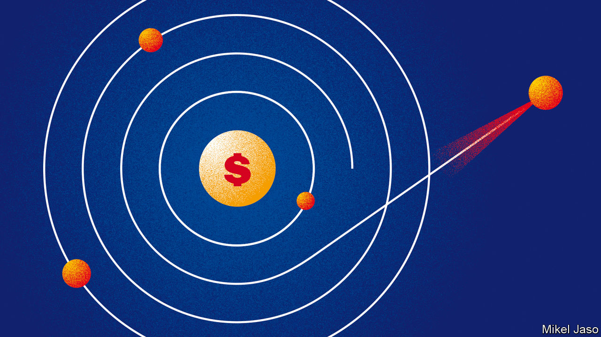
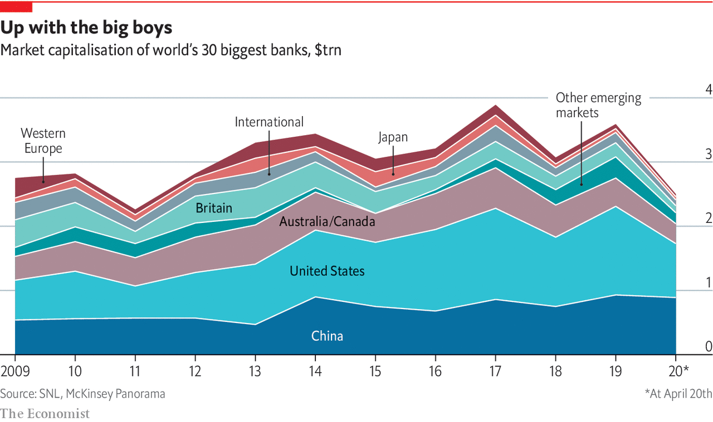

###### International banking

# Geopolitics and technology threaten America’s financial dominance 

##### And now the covid-19 pandemic is precipitating a split, says Matthieu Favas 

 

> May 7th 2020 

IN ANUARY AN American former general spoke at a gathering of senior global financiers. Used to thinking about strategy and hard power, he warned that America is dealing poorly with its most complex array of threats since the cold war—from Iran and Russia to the novel coronavirus. But he also spoke of a much less visible threat: how, through its aggressive use of economic sanctions, America is misusing its clout as the predominant financial power, thereby pushing allies and foes alike towards building a separate financial architecture. “I’m not sure of the decider-in-chief’s appreciation for how the financial system works,” he said. That a former general would be thinking about the global financial system says much about how significant that danger has become.

The system is made up of the institutions, currencies and payment tools that dictate how the invisible liquidity feeding the real economy flows around the world. America has been its pulsating centre since the second world war. Now, though, repeated missteps, and China’s growing pull, have begun to tear at the seams. Many assume the status quo is too entrenched to be challenged, but that is no longer the case. A separate financial realm is forming in the emerging world, with different pillars and a new master.


The hegemon-in-waiting financially, as geopolitically, is China, whose rapid rise is tugging away at the system. The country today accounts for 15.5% of global GDP, up from 3.6% in 2000. Its economy, the world’s second-largest, is deeply woven within the fabric of global trade. Yet it weighs little in the financial system. China sees correcting this asymmetry as crucial to gaining great-power status. “The dollar dominance is being hollowed out from underneath,” says Tom Keatinge of RUSI, a think-tank. The covid-19 crisis threatens to give centrifugal forces a decisive boost.

The system’s first pillar was laid in 1944 with the founding of the World Bank, the IMF and the global monetary order at Bretton Woods, New Hampshire. Having supplied weapons to allies throughout the war, America owned most of the planet’s gold, in which it priced its wares. Much of Europe and Asia lay in ruins. The interwar system of floating exchange rates had proved dysfunctional. It was thus decided that all currencies would be linked to the dollar, and the dollar tied to gold. That made the greenback the world’s new reserve currency. Two decades later the rising economic heft of Japan and Germany, coupled with vast money-printing by America during the Vietnam war, made the pegs untenable. The system disintegrated, but the “dollar standard” survived.

In the 1970s America also gained sway over the plumbing system that underpins global payments. American banks, then barred from operating outside state borders, teamed up to develop interbank messaging systems and nationwide ATM networks. Lenders also clubbed together to form credit-card “schemes”—associations setting the rules and systems through which members settle payments in plastic. Those worlds merged when two major card networks (soon rechristened Visa and MasterCard) bought the two largest ATM firms to expand overseas. By allowing individuals to shop anywhere, cards and cash machines became the dominant infrastructure for moving small sums of money across the world.

A revolution soon ensued in large-value transfers. In the old “telex” system, a cross-border payment between banks required the exchange of a dozen messages in free text, a process prone to human error. In 1973 a group of banks joined to create SWIFT, an automated messaging service assigning a unique code to every bank branch. It became the lingua franca for wholesale payments.

New technology boosted America’s banks, which became better equipped to follow clients overseas, and its capital markets, helped by the digitalisation of paper assets. Having rebuilt, savings-rich Japan and Germany parked their dollars in treasury bonds. A housing boom spawned asset-backed securities. Between 1980 and 2003, America’s stock of securities grew from 105% to three times GDP, forming the international springboard for its investment banks. After a regulatory big bang in the 1990s, they merged with commercial banks. By 2008, 35 firms had become the big four—Citigroup, Wells Fargo, JPMorgan Chase and Bank of America—the last prong of America’s financial dominance.

America’s pull within the system remains huge. When disasters strike, the dollar surges. It is still the world’s safest store of value and its chief means of exchange. That makes the institution that mints it the metronome of global markets. In 2008 America’s Federal Reserve avoided a general cash crunch worldwide by offering “swap lines” to rich-world central banks, allowing them to borrow dollars against their own currencies. When panic gripped markets again this March, the Fed expanded the offer to some emerging countries. In April it widened it further, allowing most central banks and international institutions to exchange their American debt securities against greenbacks, thus stalling the stampede.

The world’s financial plumbing remains under America’s thumb, too. SWIFT’s 11,000 members across the world ping each other 30m times daily. Most international transactions they make are ultimately routed through New York by American “correspondent” banks to CHIPS, a clearing house that settles $1.5trn of payments a day. Visa and Mastercard process two-thirds of card payments globally, according to Nilson Report, a data firm. American banks capture 52% of the world’s investment-banking fees.

All change

Three things are driving change. First, the “push” factor of geopolitics. America’s centrality allows it to cripple rivals by denying them access to the world’s liquidity supply. Yet until recently it refrained from doing so. The financial system was seen as neutral infrastructure for promoting trade and prosperity. The first cracks appeared after 2001, when America started using it to choke funding for terrorism. Organised crime and nuclear proliferators soon joined the list. It persuaded allies by presenting such groups as threats to international security and the integrity of the financial system, says Juan Zarate, a former adviser to George W. Bush who designed the original programme.

 


The arsenal gained potency under Barack Obama. After Russia’s invasion of Crimea in 2014, America punished oligarchs, companies and entire sectors of an economy twice the size of previous targets. “Secondary” sanctions were imposed on other countries’ companies that traded with blacklisted entities. President Donald Trump has since elevated the system for use as a weapon and used it against allies. In December it targeted firms building a pipeline bringing Russian gas into Europe. In March it toughened sanctions against Iran even as others channelled aid to the country. The arsenal hardly feels impartial: since 2008 America has fined European banks $22bn, out of $29bn in total. In 2019 it designated new sanction targets 82 times, says Adam Smith of Gibson Dunn, a law firm.

Sanctions are now increasingly used in conjunction with other restrictions to throttle China. The Department of Commerce maintains a jumble of lists of entities with which other firms cannot deal. One of them, the “unverified” list, bans exports to companies about which the ministry has questions. It has grown from 51 names in 2016 to 159 in March. Chinese entities make up two-thirds of additions. Other departments are also racing to be seen as the toughest on China.

In the short run the opaque nature of the whole system maximises the impact of sanctions. But it also creates a strong incentive for others to seek workarounds, and technology is increasingly providing the tools needed to build them.


Such advances result from the second driver of the new trends: the “pull” factor of attempts to meet the needs in emerging economies. Tech firms have sights on the world’s 2.3bn people with little access to financial services. Helped by plentiful capital and permissive rules, they have created cheap-to-run systems they are starting to export. Some also aim to enable commerce in regions where credit cards are rare but mobile phones common. Propped up by their huge home market, China’s “superapps” run ecosystems in which users spend their way without using actual money.

It helps that many emerging markets, not just China, are keen on a rebalancing. Most borrow abroad, and price their exports, in dollars. America was once the biggest buyer. Whenever the dollar rose, demand would follow, making up for costlier debt. But a stronger dollar now means China, their chief trading partner, can afford less stuff. So demand falls just when repaying loans gets dearer. And the stakes have risen: emerging markets’ stock of dollar debt has doubled since 2010, to $3.8trn.

The third factor helping insurgents is covid-19, which could lead to a tipping-point. Already hobbled by rising tariffs, global trade is likely to fragment further. As disruption far away causes local shortages, governments want to shorten supply chains. That will give regional powers like China more room to write their own rules. The economic fallout in America—not least the fiscal impact of its $2.7trn stimulus measures—could dent confidence in its ability to repay debt, which underpins its bonds and currency.

Most important, the crisis harms other countries’ trust in America’s fitness to lead. It ignored early warnings and botched its initial response. China is guilty of worse—its own missteps helped export covid-19 in the first place. Yet it managed to curb cases fast and is now broadcasting a narrative of domestic competence. America’s ability to guarantee global prosperity is the glue that holds the financial order together. With its legitimacy badly hit, renewed assaults on the system seem inevitable. On the front line are the dollar-system’s foot soldiers, the banks. ■

