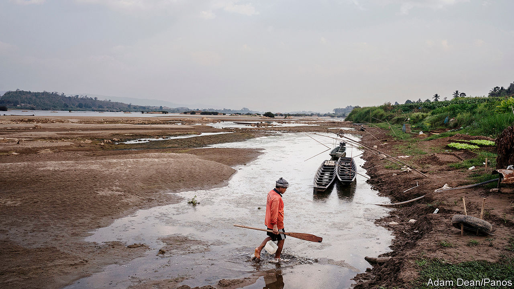
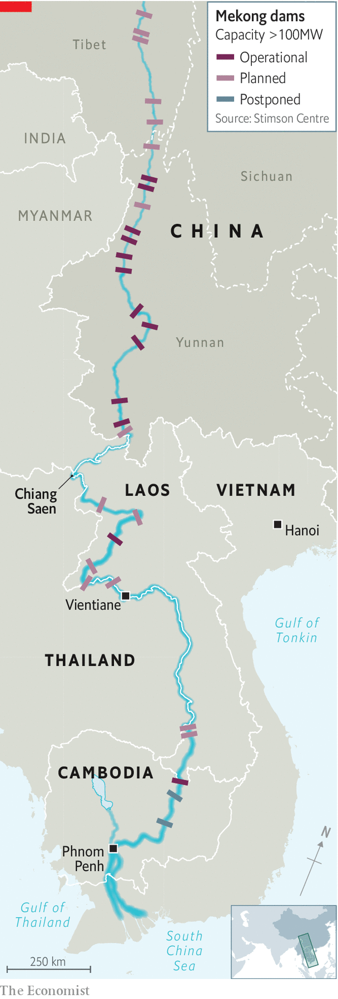

###### The shrinking Mekong

# South-East Asia’s biggest river is drying up 

##### Chinese dams are partly responsible 

 

> May 16th 2020 

FISH WRITHE frantically in the shallow pool, as their schoolmates stranded on the exposed sandbar breathe their last. It is November, the end of the monsoon season, yet the water in the Mekong river is perilously low. On this stretch, in north-eastern Thailand, the bank is so parched the earth has cracked, and once-leafy bushes are bone dry. Visitors have flocked to the desiccated river bed to catch the trapped carp with their bare hands, but their delight does not diminish the disquiet of locals. “These fish were parent fish,” says Ormbun Thipsuna, a local fish farmer, recalling the scene. “No life any more,” she sighs.

The Mekong animates a vast swathe of Asia, from the snow-packed mountains of south-western China from which it springs, to Thailand, Laos, Cambodia and Vietnam in the lower portion of the basin. As it meanders along its 4,500km route, it feeds and waters some 66m people.


Yet the river is ailing. Last year the water in the Mekong fell to its lowest level since records began more than 60 years ago. Cambodia endured months of debilitating electricity blackouts because there was too little water to run a big hydropower plant. Fish catches declined by as much as 80-90% in parts of the country, whose citizens obtain almost two-thirds of their protein from their nets. The parched conditions are thought to have lopped $1.5bn off Thailand’s GDP, according to Krungsri, a local bank. In Vietnam the measly flow spurred saltwater intrusion in the delta, leaving many people with no fresh water to drink. “All the environmental indicators are in the red,” says Marc Goichot of the WWF, a global conservation group.

 


A drought in the lower basin played a big part in the atrophying of the river. But disappointing rains may not have been the whole story. A new study claims that the 11 dams built on the Chinese portion of the Mekong (see map) exacerbated the water shortage. Alan Basist and Claude Williams, of Eyes on Earth Inc, an environmental consultancy, used records of precipitation, snowmelt and water levels before most of the dams were built to develop a model of how much water would normally flow into Thailand under different weather conditions. They then compared this “natural” water level to the actual flow after the dams had been built. During the monsoon season, the lower Mekong normally floods; during the dry season the waters recede. Since the first big dams began operating in 2012, this annual pulse has been tamed: more water is now sent downstream than is typical during the dry season and less is dispatched during the wet season. 

The study also found that in 2019 China’s part of the basin received more rain and snow than normal, despite the government’s claims that China, too, was suffering from drought. Had all that water flowed downstream, the river would have been between seven and eight metres deep as it entered Thailand—higher than usual for that time of year. In fact, it was less than three metres. Just two of China’s dams can store almost as much water as the Chesapeake Bay, an estuary of more than 11,000 square kilometres in America. During the dry season the upper reaches of the basin should contribute about 40% of the water flowing through the lower Mekong. “The Chinese basically shut off the tap,” Mr Basist says. Turning it on, he argues, “would have certainly helped alleviate the drought”.

The study, which was funded by America’s government, has its critics. China’s foreign ministry rubbished it, and even the Mekong River Commission (MRC), which works with the governments of Cambodia, Laos, Thailand and Vietnam to manage the river, has reservations. Anoulak Kittikhoun of the MRC says drought was the main reason for the Mekong’s meagre flow. He does agree, however, that it would be helpful to have a better sense of the part China’s dams played.

“The point still remains”, says Maureen Harris of International Rivers, a pressure group, “that China could have done and can do more to alleviate the conditions being felt downstream.” Indeed, it has done so before. In 2016, when the lower Mekong was afflicted by another severe drought, China released water from its dams at the MRC’s request. “It goes without saying that friends should help each other when help is needed,” said China’s foreign ministry. In January, China boosted the flow again, this time at Thailand’s behest.

The extra water is coming at the wrong time, unfortunately. A damp dry season prevents birds from laying eggs on exposed riverbanks, and farmers from planting crops in the rich sediment deposited during the monsoon. In Thailand sudden torrents of water have washed away boats and entire river banks, reports Pianporn Deetes of International Rivers. Ms Ormbun can no longer sell the fish she raises at the markets that normally spring up on beaches exposed during the dry season. “The river is at its best when it can run its natural course,” says Brian Eyler, author of “The Last Days of the Mighty Mekong”.

China has not signed any agreements about managing the Mekong with the other countries it flows through, so is not obliged to share a particular amount of water with them, nor even provide data on the flow or any warning about the operations of its dams. It does provide the MRC with a trickle of information about water levels and planned releases from dams, which helps with flood-control lower down the river.

Mr Eyler hopes that studies like Mr Basist’s will prompt China to go a bit further. Again, there are encouraging signs. Last November the Lancang Mekong Cooperation, an organisation founded by China in 2016 to promote trade among the Mekong countries, agreed to team up with the MRC to investigate what caused last year’s drought. But as promising as that is, greater transparency will not create more water.

The Mekong is “at breaking point”, says Ms Harris. To save it, the countries that share it need to bin plans for additional dams: China intends to build eight more and Laos seven. Cambodia is moving in the right direction. In March the government declared a moratorium on all hydropower projects on the Mekong for the next decade. Unless other countries follow suit, Ms Harris frets that “the Mekong river basin as it’s been known for thousands of years…will not be the same in the future.” ■

