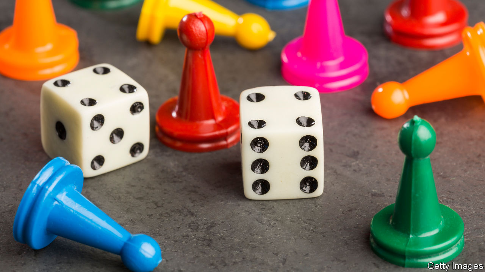

###### Your turn

# For hours of escape, invent a board game 

##### It is a chance to combine the most enjoyable elements of other people’s creations 

 

> May 16th 2020 

Editor’s note: The Economist is making some of its most important coverage of the covid-19 pandemic freely available to readers of The Economist Today, our daily newsletter. To receive it, register . For our coronavirus tracker and more coverage, see our 

ON A DISTANT planet, a rocket crashes. The surviving astronauts—a medic, miner, soldier, scavenger, scientist and engineer—had been on a mission to collect rare minerals and other resources. Now they have to co-operate to rebuild their craft and dig up as many precious rocks as they can shift, all before their dwindling oxygen supplies expire. They also have to cope with landslides, tunnel collapses and attacks from helicopter-like birds, wolf creatures and herds of space-mammoths.

Life is not easy for characters on Planet Ozerdale. But at least they have plenty of opportunity for heroics and energetic outdoor activity, and are able to spend time with a reasonably large social group. For your correspondent’s 14-year-old son, stuck in lockdown with his brother and their parents, the outer-space scenario was alluring. He dreamed up the intergalactic mission a few days after his school closed. Inventing—and typing up—the rules for a home-made game, debating strategy for confronting aliens and working out how to fly away to freedom have offered several welcome hours of diversion.


Designing your own board game lets you combine the most enjoyable elements of other people’s. The best involve both luck and strategy. Intricate and complex battles between armies, as in “Diplomacy”, “Risk” or “Axis and Allies”, tend to be open-ended and last many hours. A hard time limit, represented by the disappearing oxygen, is preferable. Tasks that require some collaboration can be satisfying, as when players in “Pandemic” work together to stop a deadly virus spreading, or when rivals trade resources in “Settlers of Catan”. But vicious competition can be relished, too, especially if it means putting your annoying relatives in their place. On Planet Ozerdale, the different astronauts work together to display a range of talents. Some, if lucky, can outperform the others.

Is it more rewarding to create a new game, calibrate sometimes complicated rules, make hexagonal tiles for the board, set up a website to share the idea and anticipate how others will be entertained—or to get down to the absorbing business of rolling the dice, defeating monsters and dodging asteroids? In your correspondent’s household, the most intense excitement seems to come in the early stages of crafting a new thing.

For the inventor the pleasure is from being a storyteller of sorts, one who introduces a cast of characters, bestows each with attributes (a scientist able to invent new technology; the miner with geological nous) and then dreams up novel scenarios for them. For those who lead others in role-playing games, such as “Dungeons and Dragons”, it may be a small step to put a game on a board. For their audience—especially parents, who are prone to being baffled by many intricate rules—having cardboard tokens in hand helps to keep things simple. The real goal, whether for those trapped at home during lockdown, or astronauts stranded on a planet of wolf aliens, is to have a chance to escape. ■

Dig deeper:For our latest coverage of the covid-19 pandemic, register for The Economist Today, our daily , or visit our 

