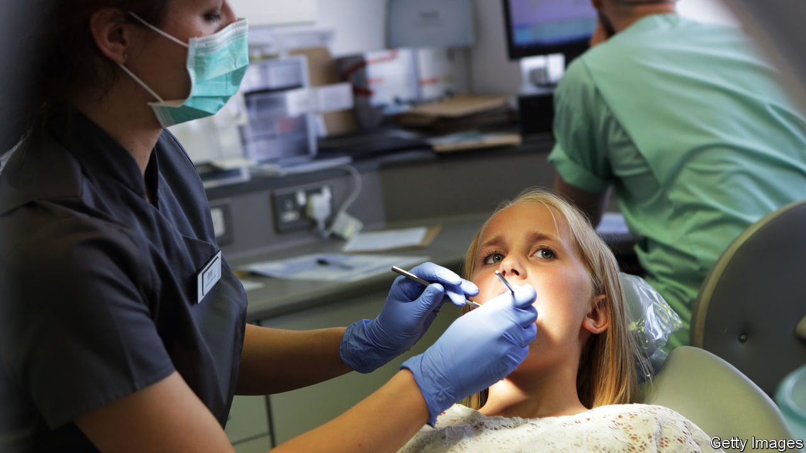

###### Say cheese!

# The alarming popularity of prehistoric dentistry 

##### Unable to see a dentist, people are taking things into their own hands 

 

> May 16th 2020 

“I’VE BEEN using the wax from a Babybel,” admits a sufferer of chronic toothache; she has stuffed cheese-casing into a cavity to replace a lost filling. With most surgeries in Britain out of action due to lockdown, home dentistry has become worryingly common. “People are using needles to burst abscesses,” says James Goolnik, a dentist in London. “They’re using knives and forks to take teeth out, and nail files to cut down broken teeth.”

Britain has long had a reputation for bad teeth, perhaps dating back to the second world war, when American soldiers were horrified by rows of bare gums. Today it is unfair: Americans are more likely than Britons to be missing teeth. But the nation’s teeth are not going to improve in the near future.


Since March 25th, all routine treatment has been cancelled. Dentists offer just the “three As”—antibiotics, analgesics and advice. Someone with a lost crown will be dealt with over the phone. MyDentist, with around 650 practices in Britain, has warned its patients: “DO NOT USE SUPERGLUE or FIXADENT to fit your crown.” A hygienist reports that a patient had become suicidal with pain.

Only those with problems such as breathing difficulties due to swelling or nerve exposure qualify for urgent treatment. The British Dental Association (BDA), a trade union, says the new urgent care system has faced teething problems, with a lack of the protective kit needed for “aerosol-generating procedures” (ie, ones where spit or blood will be flying around). As a result, in some practices the only treatment on offer is teeth removal. “In this day and age that’s pretty prehistoric,” says Dr Goolnik.

Many dental practices either rely entirely or partly on private income, rather than NHS contracts, and are thus facing financial collapse. Some, unlike shops or restaurants, do not qualify for business-rates relief. “I can’t help feeling forgotten when I walk down the street and see the vape shop, which is getting a £25,000 grant and rates relief, painting and decorating,” sighs the hygienist.

When dentists reopen, they will struggle to satisfy the pent-up demand they are bound to face. Safe dentistry in a pandemic is slow. Waiting areas must be kept empty, protective kit procured and surgeries disinfected. At practices that are now doing urgent care, such restrictions mean traffic is down by three-quarters. If there is a similar drop-off in service when others return, care will continue to be rationed. Bad news for anyone with toothache. Good news for Babybel manufacturers.

