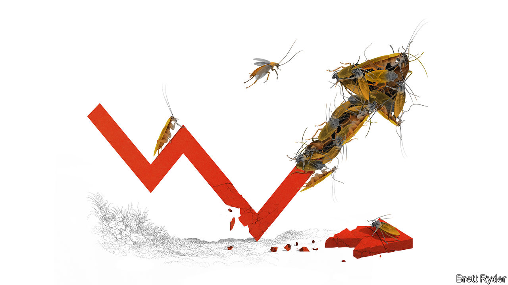
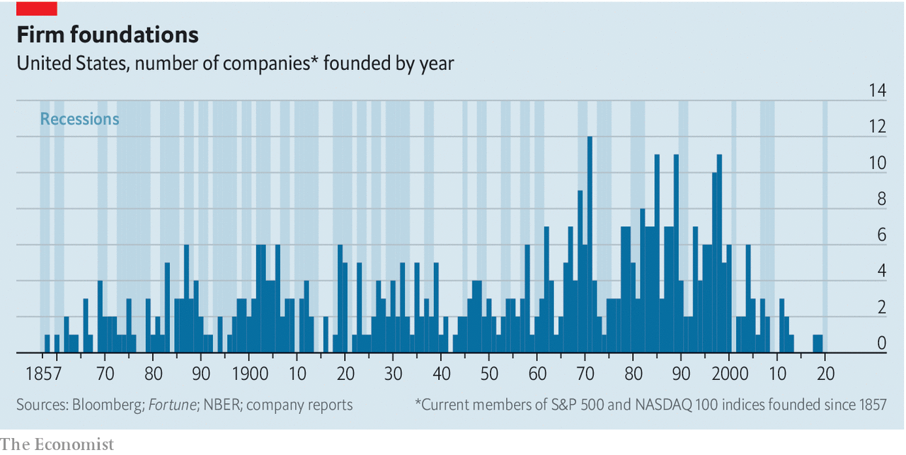

###### Schumpeter

# Creative destruction in times of covid 

##### Is now the time for entrepreneurial true grit? 

 

> May 16th 2020 

Editor’s note: The Economist is making some of its most important coverage of the covid-19 pandemic freely available to readers of The Economist Today, our daily newsletter. To receive it, register . For our coronavirus tracker and more coverage, see our 

A STRUGGLING Airbnb was still called AirBed&amp;Breakfast when its founders decided to bet its future on the Democratic National Committee in Denver in 2008. Their air-bed idea was not popular with the 80,000 people congregated to select a presidential candidate. So they focused on breakfast instead, peddling $40 boxes of cereals called Obama O’s and Cap’n McCain’s (their quip: “Be a cereal entrepreneur”). The timing was as bad as the pun. The event came just weeks before Lehman Brothers collapsed at the height of the financial crisis of 2007-09. Yet shortly afterwards they obtained their first-ever funding. The angel investor who backed them dubbed them “cockroaches” for their survival skills. That may not be the most tasteful way to describe people in the hospitality trade. The founders, though, considered it the best compliment they had ever received.

Like Airbnb, some of the best-known names in business started during steep slumps, including Uber (2009), Microsoft (1975), Disney (1923), General Motors (1908) and General Electric (1890). Disruptive products and services, too, have emerged in times of crisis, notably Apple’s iPod as the dotcom bubble burst in 2000 and Alibaba’s Taobao, an online-shopping mall, during China’s SARS epidemic of 2003.


Such stories loom large in startup folklore as evidence of entrepreneurial true grit. Yet they are rarities. Our calculations indicate that among almost 500 of today’s biggest listed firms in America, whose origins date as far back as 1857, a much larger number started life in expansionary years than during recessions. Of those founded since 1970, more than four-fifths were born in good times (see chart). That, of course, overlooks innumerable firms created along the way that have either not made it to the top, or fallen by the roadside. But it suggests that however hard it is for the enterprising to build a lasting business, it is even harder for those who start off with the economic winds blowing in their faces.

 


Save for a few industries such as health care, it is safe to assume that investment in innovation will plummet during the covid-19 pandemic. It usually does in times of crisis. Venture capital (VC) will also dry up as everyone keeps their heads down and tries to preserve cash. In 2007-09, VC funding in America fell by almost 30%. Yet this column would not be named after Joseph Schumpeter, the father of creative destruction, if it did not believe that following a slump, a burst of entrepreneurial activity will eventually emerge. As he wrote in “The Theory of Economic Development”, published in 1911 (itself a recessionary year), “the very logic of the capitalist system [is that] after some time of depression, new entrepreneurs would emerge. And then there would be a new ‘swarm’ of entrepreneurs. A wave of prosperity would start up and the whole cycle would roll on.” Assuming this remains the case, will the protagonists be tiny startups coming out of nowhere? Will they be better-funded entrepreneurs who have long prepared for such a moment? Or will they be the titans of tech?

With the world in upheaval, enterprising minds are already whirring. Some of them are altruistic: schoolchildren, for instance, have been 3D-printing plastic visors for front-line workers. Some of them are saucy, such as the Thai bodybuilders, put out of work by lockdown, who last month set up Bsamfruit Durian Delivery, promoting it on Facebook not only with photos of durians and mangoes, but of taut abs and bulging bosoms. Some of them will simply be hungry for fame and fortune, believing, like Michael Moritz of Sequoia Capital, a VC firm, that social changes accelerated by the crisis, such as food delivery, telemedicine and online education, will eventually generate lucrative business opportunities. They will also expect the economic slump to wipe out incumbents, muting competition and freeing up space and manpower—provided governments do not interfere with the inevitable by propping up zombie firms.

But even with the best ideas in the world, first-time entrepreneurs will struggle to convince investors to give them capital in the depths of the crisis, not least if they can only pitch to them over Zoom. Instead, the more likely standard-bearers of creative destruction will be existing firms, albeit small ones, which raised enough money before the crisis to survive it and will maintain their flair for innovation throughout, says Daniele Archibugi of Birkbeck, University of London. There may be plenty of such firms. According to Crunchbase, a data gatherer, startups raised about $600bn worldwide in 2018 and 2019. That provides a cushion of support. They will, however, have to be quick at shifting from growth to survival and back again, and at embracing new business plans if their old ones are no longer viable.

Betting on an accumulator

Yet it is not just small, scrappy firms that push innovation forward. Big firms have a critical role to play, too. Alongside creative destruction in times of crisis, Schumpetarian academics point to “creative accumulation” in economic upswings, when incremental innovation is carried out in the research-and-development labs of giant firms. In Europe during the global financial crisis such corporations increased investment into new products and ideas, as did the most innovative small firms. The cash-rich tech giants, such as Microsoft, Amazon, Apple and Alphabet, have become examples of creative accumulation, helping foster innovation during the good times. They will probably continue to do so during the crisis. As they expand into health care, fintech and other industries, they could even be part of a new wave of creative destruction.

That is the optimist’s scenario. A more pessimistic one is that big tech will use its moneybags and muscle to stifle competition, by buying or scaring off more enterprising rivals. What is in little doubt, though, is that the covid-19 crisis, which has turned so many people’s lives upside down, will eventually produce a wealth of new business opportunities. If it attracts swarms of entrepreneurs crawling over cosy oligopolies so much the better. But even if the tech titans prevail for now, they will inevitably find themselves victims of the forces of change. Schumpeter’s “perennial gale of creative destruction” will one day blow them away, too. ■

Dig deeper:For our latest coverage of the covid-19 pandemic, register for The Economist Today, our daily , or visit our 

