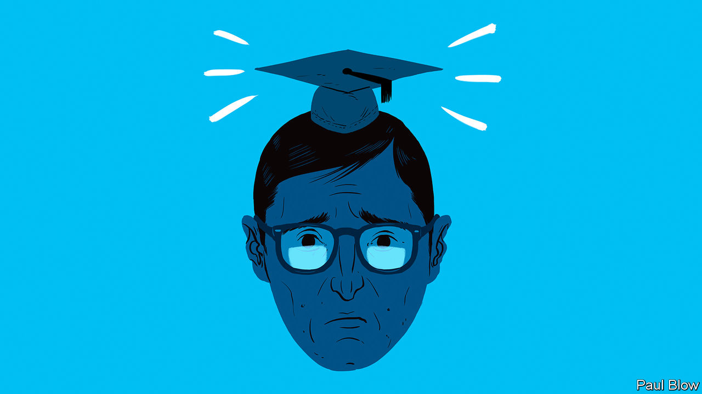

###### Bartleby

# The pandemic increases the challenges facing business schools 

##### Teachable moment 

 

> May 16th 2020 

Editor’s note: The Economist is making some of its most important coverage of the covid-19 pandemic freely available to readers of The Economist Today, our daily newsletter. To receive it, register . For our coronavirus tracker and more coverage, see our 

LOCKDOWN HAS delivered a nasty shock to academia, with universities around the world closing for the summer term, disrupting the plans of millions of students. Business schools are suffering along with the rest, but the shutdown has occurred when the sector is already facing a host of problems. A survey of the deans of American business schools by Eduvantis, a consultancy, found that almost all thought the pandemic would lead to permanent closures.

Bartleby contacted seven leading schools in America, Britain and France to see how they were coping with the crisis. Unsurprisingly, the immediate reaction has been to switch to teaching online. Many are putting a brave face on the issue. Christoph Loch, dean of the Judge school at Cambridge, says: “If we do this right, if we do it strategically, this is going to stay beyond covid.” Meanwhile the INSEAD school in France maintains that it is hard to imagine going back to a world where the successes from online learning will not be combined with person-to-person exchanges.


The pandemic also presents a teaching opportunity. The Wharton School at the University of Pennsylvania has launched a course called “Epidemics, Natural Disasters and Geopolitics: Managing Global Business and Financial Uncertainty”. The London Business School will shortly run a course on “The Economics of a Pandemic”.

Online courses are all very well. But part of the motivation for attending business school is to take advantage of networking opportunities that could last for the rest of students’ careers. Some of this can be done online. At the MIT Sloan School of Management, virtual student networking has included trivia nights, hackathons and a programming boot camp. In keeping with its location, activities at the Haas School in Berkeley, California, have included remote yoga and mindfulness classes. At INSEAD, students gather in virtual break-out rooms for further discussions, with the groups picked at random to ensure interaction with a broader group of classmates.

Nevertheless, just as a friend you made on Facebook is not the same as someone you grew up with, virtual ties are unlikely to be as strong as normal ones. That has led to some dissatisfaction among students. At Wharton, more than 1,000 MBA students have signed an online petition arguing that the school should reduce fees, which run to $150,000 for a two-year course. The petition claims that virtual-classroom technology is “unable to fully replicate” the usual teaching environment, and that other elements of the course, such as foreign travel and extra-curricular activities, “have been essentially cancelled”.

The rapid economic downturn caused by the pandemic is a complicating factor. In the past, business schools have benefited from recessions, as young people have chosen to continue their education rather than risk entering a shaky jobs market. But this time could be different.

First, it is not yet clear when business schools can reopen for traditional teaching. None of the schools had a firm timetable for that to happen. And candidates may wait until they do, rather than pay top dollar for an online course. Another survey, by Poets&amp;Quants, a website for news about business schools, found that 43% of prospective MBA students thought that fees should be lowered, and that a third might defer their courses until normal teaching can resume.

Second, the pandemic is likely further to discourage students from applying to business schools abroad. Around half of all American business schools experienced a decline in overseas applications last year, thanks to anti-immigration political rhetoric and the greater difficulty in getting visas to work once a degree was obtained.

Neither America nor Britain has covered itself in glory in recent weeks. A survey of international students by IDP Connect found that, among Anglophone countries, Britain and America ranked behind New Zealand, Canada and Australia in terms of how they have handled the pandemic. The war of words between America and China over the virus will also have an effect. Students from the People’s Republic may be more inclined to study in their own country.

That is bad news for both universities and business schools, as international students are very lucrative. Things may go back to normal in a few years’ time; the virus may be conquered and international relations may settle down. But as with many other sectors of the economy, there may be a big shakeout among business schools before that happens.

Dig deeper:For our latest coverage of the covid-19 pandemic, register for The Economist Today, our daily , or visit our 

