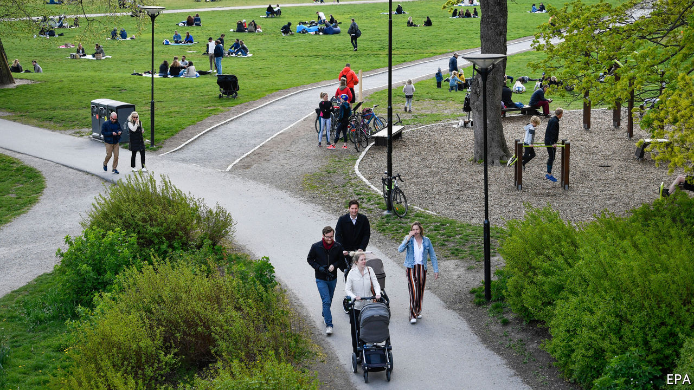

###### Herd on the street

# Is Sweden’s approach to covid-19 wise or reckless? 

##### Its avoidance of a hard lockdown is unusual, but Swedes think it is working 

 

> May 16th 2020 

Editor’s note: The Economist is making some of its most important coverage of the covid-19 pandemic freely available to readers of The Economist Today, our daily newsletter. To receive it, register . For our coronavirus tracker and more coverage, see our 

AS BLEARY-EYED Europeans squint in the sun, freshly released from coronavirus lockdowns, worries about a second wave of infections are on everybody’s mind. Life cannot return completely to normal until a vaccine is available. What sort of semi-normal life might work in the meantime is the big question. Sweden may hold the answer.

In March, when governments across Europe seemed to be competing to impose the toughest anti-viral measures—from closing borders to forbidding people from venturing out even for a walk—Sweden resisted the temptation. It banned gatherings of more than 50 people. But nurseries and schools for children under 16 have remained open (with older students tele-learning from home). Bars, restaurants and gyms also stayed open, though with social-distancing rules. People were asked to work from home if they could. And the elderly, who are most at risk of dying if infected, were told to stay at home to protect themselves.


Sweden chose this path because it looked at the longer term, says Johan Giesecke, an epidemiologist advising the authorities. Full lockdowns are stop-gap measures, he says, and European governments rushed to put them in place without plans for what would replace them.

Swedes have been sensible. Use of public transport has fallen significantly. A third of people say they avoid going to their workplace (by working from home, for example)—up from 10% in mid-March. Daily restaurant turnover fell by 70% in the month through April 22nd. Elisabeth Peters, who is 67 and lives on one of the islands off the west coast of Sweden, believes there has been a “huge change” in people’s behaviour, aligned with official advice. Some people are not seeing their grandchildren at all now, she says. When her children and grandchildren visit everyone stays outside all day and keeps at a distance from her and her husband.

On first glance, Sweden seems to have paid a heavy price for choosing less stringent measures to keep people apart. By May 13th it had recorded 33 covid-19 deaths per 100,000 people, a rate more than three times that of Denmark and seven times higher than in Finland, which had shut schools and restaurants in March. Even so, Sweden’s mortality rate has been much lower than that in Britain, France and Spain. Swedes largely approve of their country’s approach, with two-thirds saying in polls that the government is handling the epidemic well.

Time will tell whether Sweden chose a better strategy than other countries, says Jussi Sane of the Finnish Institute for Health and Welfare, because the costs of lockdowns—in terms not only of economic damage but also harm to people’s mental health—are yet to be tallied. European countries will see more covid-19 deaths when people start moving about, because the share of those infected so far (and thus presumably immune, at least for some time) is still in the single digits. Mr Giesecke reckons that Stockholm will reach “herd immunity”, the 40-60% rate of infection needed to halt the spread of the coronavirus, by June. He thinks that when European countries count deaths a year from now their figures will be similar, regardless of the measures taken and the numbers now. The economic damage in Sweden, however, may be smaller. ■

Dig deeper:For our latest coverage of the covid-19 pandemic, register for The Economist Today, our daily , or visit our 

