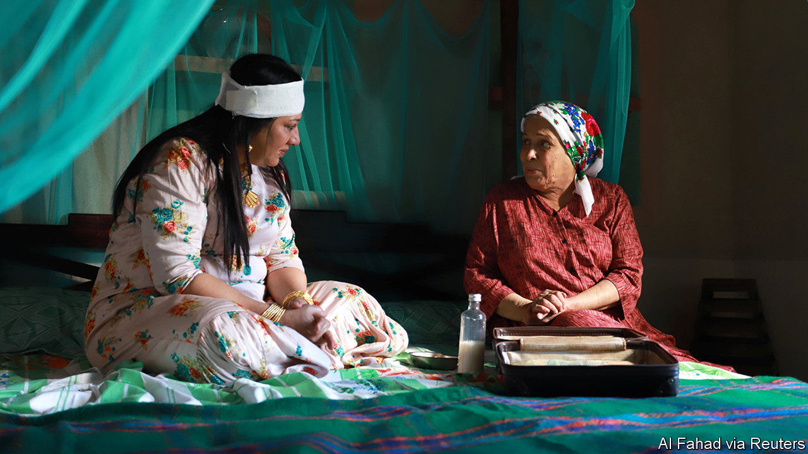

###### Series of changes

# Friendly Jews, female bosses; Saudi TV promotes a new vision 

##### But it ignores the kingdom’s current anxieties 

 

> May 16th 2020 

IN A WORLD flipped on its head, a note of constancy: the Middle East is arguing about Israel. “Exit 7”, a popular series aired on Saudi television this Ramadan, portrays a family led by Nasser al-Gassabi, a Saudi actor. One episode has his son Ziad befriend an Israeli, via an online video game. True to life, the friendship is cause for controversy. But not everyone is perturbed. Mr Gassabi’s on-screen father-in-law describes Israel as a reality and the Palestinians as ungrateful “enemies”.

Autocrats in the Middle East use television to push politics—especially during Ramadan, when big-budget series attract hours of post-prandial viewing. In Egypt scripts are vetted for patriotic themes. Turkey and the UAE, regional rivals, recently made duelling shows about the Ottoman empire: benevolent overlords in the former; unwanted occupiers in the latter. Critics say “Exit 7” and another Saudi show, “Um Haroun”, which features Jewish characters, are attempts to promote normalisation with Israel.


But much of “Exit 7” deals with changing mores in Saudi Arabia. It begins with Mr Gassabi donning a bisht, a ceremonial cloak, before going to receive a promotion. “This is the cloak of responsibility,” he gloats. The twist: not only is he passed over for the job, but his new boss is a woman. Another show, “Ureem”, focuses on a layabout forced to work as a taxi driver, the sort of job once reserved for migrants.

The shows, though, dance around the kingdom’s current anxieties. On May 11th the state announced austerity measures to blunt the budgetary shocks of a pandemic and low oil prices. It tripled the value-added tax. Civil servants lost a 1,000-rial ($266) monthly stipend. Unsurprisingly, the decree was not prime-time television: it came just after dawn.

Muhammad bin Salman, the crown prince, wagers that he can fashion a new society from the top down. Many of his changes, from letting women drive to permitting concerts, were long sought by Saudis. Looming economic changes will be more jarring. Generations of Saudis were insulated from market-based wages and competitive pressures. Some will face lower living standards. A whimsical TV show will not assuage them.

