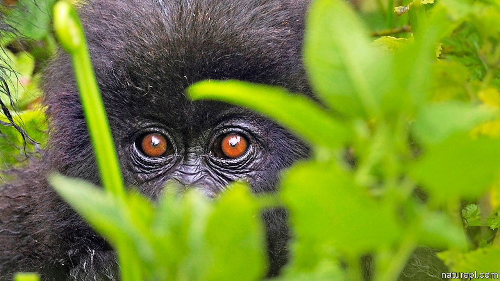

###### The pandemic and wild animals

# Protecting great apes from covid-19 

##### Gorillas are bad at social distancing 

 

> May 16th 2020 

Editor’s note: The Economist is making some of its most important coverage of the covid-19 pandemic freely available to readers of The Economist Today, our daily newsletter. To receive it, register . For our coronavirus tracker and more coverage, see our 

LATE IN 1990, when Paul Kagame was hiding on the Congolese side of the Virunga Mountains preparing to invade Rwanda, his army, the Rwandan Patriotic Front, were not the only formidable inhabitants of that densely forested volcanic range. The Virunga are also home to mountain gorillas. Soldiers are notoriously trigger-happy when it comes to wildlife, but Mr Kagame ordered his men not to shoot the apes. “They will be valuable one day,” he said.

He was right. By 2017, with Mr Kagame now installed as Rwanda’s president, that country’s wildlife-tourism industry, of which gorilla-watching on the Rwandan side of the Virungas accounts for 90%, was worth around $438m a year. But now the world’s gorillas, and also their great-ape cousins, the chimpanzees, bonobos and orang-utans, face another threat from their human neighbours: covid-19.


Great apes share about 98% of their DNA with human beings, and are vulnerable to many of the same diseases. So far, there have been no reported cases of wild apes sickening with the new coronavirus. But some other non-human primates are certainly susceptible. In China, for example, rhesus macaques have been infected deliberately and successfully as part of vaccine trials. Moreover, research done by Amanda Melin of the University of Calgary, in Canada, and her colleagues, suggests that many other primates are at risk. The virus infects people by locking onto ACE2, a protein found on the surface membranes of certain cells—particularly those of the airways into the lungs. The ape version of ACE2 is, Dr Melin has discovered, identical to the human variety, so apes are likely to be particularly susceptible to SARS-CoV-2.

Conservationists are worried. “What’s nerve-racking about covid-19 is its novelty,” notes Richard Wrangham, a chimpanzee expert at Harvard University. But primatologists like Dr Wrangham are already familiar with the harm caused by diseases of human origin. Though conservation efforts have protected many apes from habitat loss and poaching, the Faustian bargain made to do this, says Peter Walsh, an ape conservationist at Cambridge University, is that the apes are then exposed to potentially deadly viruses.

Dr Walsh and a group of colleagues at Thomas Jefferson University, in Philadelphia, and at the University of Louisiana, Lafayette, estimate that Ebola alone is responsible for the deaths of a third of the world’s wild gorillas over the past three decades. Human respiratory viruses are the leading cause of death among chimpanzees at Gombe Stream National Park in Tanzania and Kibale National Park in Uganda. Tony Goldberg of the University of Wisconsin-Madison was “intellectually prepared, but not emotionally prepared” for the devastation caused in 2013 by an outbreak of rhinovirus C at Kibale, which killed 9% of one group of chimps. A covid-19 outbreak would be “another problem that the apes don’t need”, he observes.

Jane Goodall, a pioneering primatologist who began her research on chimpanzees at Gombe 60 years ago, is also worried. Tanzania has not enforced a full anti-covid lockdown, so villagers who live around the park could still spread the disease to the chimps. At Tchimpounga Chimpanzee Rehabilitation Centre in Congo-Brazzaville, where her research institute also works, health checks are mandatory for humans and chimps alike.

The closure of conservation sites because of the pandemic poses another problem for apes. Around 40% of Virunga National Park’s revenue has disappeared overnight, says Emmanuel de Merode, its director. “This will present major challenges to ensuring that conservation efforts continue uninterrupted,” he adds. Dr Walsh fears that if local economies are harmed by the closure of tourism sites, people will turn to poaching.

Some ape populations will cope with covid-19 better than others. Though chimpanzee troops are generally controlled by a dominant adult male, there are usually plenty of subordinates willing and eager to step in, should he die or be incapacitated. Mountain-gorilla groups, however, are normally harems that have several females but only a single adult male. If this silverback were to die of covid-19, the females—likely to have been infected as well—would probably disperse to join other groups, spreading the virus further.

Mr de Merode says that if a gorilla tested positive for covid-19, his park “would consider a veterinary intervention to isolate and treat the individual, but we would be in unknown territory”. Most primatologists think isolating a sick ape would be unfeasible. Rather, laments Dr Wrangham, “we would just have to sit back and watch.”■

Dig deeper:For our latest coverage of the covid-19 pandemic, register for The Economist Today, our daily , or visit our 

