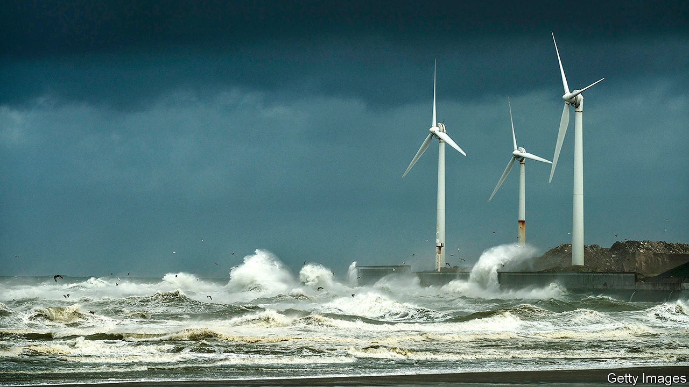

###### Industrial standards

# Which way a wind turbine turns might not seem to matter 

##### But it does 

 

> May 16th 2020 

IF THE HANDS of dial clocks swept over their faces the other way around, that would be the direction known as “clockwise”. And they would tell the hour just as faithfully. It is convenient to have all clock hands turn in the same direction, but it is an accident of history which direction that is. Similarly, it seems an arbitrary but efficient choice by wind-turbine makers that the blades of almost all of those devices turn clockwise. However, a study presented on May 4th to the General Assembly of the European Geosciences Union (held online, instead of in Vienna, as planned), suggests that in the northern hemisphere, where 96% of these turbines are found, universal clockwiseness may be bad.

For a single turbine it does indeed not matter. But turbines are usually planted in groups. If, in such a group, one turbine is behind another then it does matter, according to Antonia Englberger of the German Aerospace Centre, in Oberpfaffenhofen, and her colleagues. They have built a computer model which simulates the flow of air over a turbine turning in either direction, and then calculates the effect this has on a second turbine, downwind of the first. By day, the team conclude, there is no difference. But at night the power output of the downwind device may be up to 23% higher if its upwind colleague is turning anticlockwise.


The reason lies in the nocturnal behaviour of the bottom few hundred metres of the atmosphere, known as the boundary layer. By day, the sun’s rays heat the ground, which heats the nearby air, which rises in whorls of turbulence, resulting in a well-mixed boundary layer that behaves in the same way at all altitudes. The consequence, for a wind turbine, is that its rotor blades feel the same wind speed and direction whether they are at the top or the bottom of their rotation.

At night, however, the ground cools. The whorls therefore often go away and the boundary layer stops mixing. Friction with vegetation or buildings now means that air close to the ground moves more slowly than air higher up—an effect known as altitude-related wind shear. And the amount of shear, given the blade-span of modern turbines, is large enough for Earth’s rotation to come into play. This pushes moving air to the right in the northern hemisphere and to the left in the southern, a phenomenon called the Coriolis force. The faster the airflow, the larger the deviation. Thus wind shear begets wind veer, a gradual change in direction with height.

That matters for turbine pairs because the air that pushes against the blades of the upwind device, and thus gets them to rotate, say, clockwise, is itself deflected by those blades in the other direction. This turns it into a turbulent wake with a rotation (in this case) going anticlockwise. This anticlockwise rotation conflicts with the Coriolis-induced veering tendency of the undisturbed wind around the wake. And that hampers the wake’s ability to pick up energy from this surrounding, undisturbed wind and then go on to hit the second turbine with renewed vim.

In the case that the first turbine rotates anticlockwise, the wake will be clockwise, thus matching the northern-hemisphere wind veer. This lets it gain energy from the surrounding air to deliver to the next turbine—the opposite of what now happens. And in the southern hemisphere this all works the other way around, so conventional, clockwise turbines do best.

Retooling factories in light of Dr Englberger’s discovery, to make turbines run anticlockwise instead, would certainly be expensive. Whether the extra power that could be squeezed out of the wind by doing so would make that worthwhile would require a lot more investigation. Her result does, however, show neatly how even apparently arbitrary decisions can have unintended consequences.■

