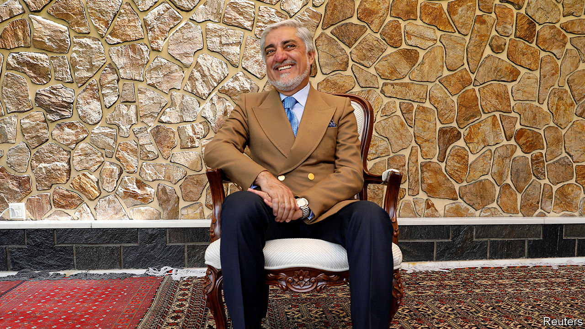

###### Titles all round

# Afghanistan’s two rival presidents reach a deal 

##### One will take the equally thankless job of head peace negotiator instead 

 

> May 23rd 2020 

ASHRAF GHANI remains president of Afghanistan, while his eternal rival for the job, Abdullah Abdullah, who disputes the result of the election held last September, gets yet another consolation prize. That, it seems, is the upshot of a deal finally agreed on May 17th, after months of posturing and haggling, including an absurd moment in March when both men had themselves sworn in. Dr Abdullah’s new job, fittingly enough, is to advance the peace negotiations he has been distracting attention from over the past few months.

It is all grimly reminiscent of the deal struck five years ago, when Mr Ghani narrowly defeated Dr Abdullah for the top job, amid similar acrimony. Once again Western governments, fearing that the row would ruin their plans for peace, had to twist the arms of the two rivals into sharing power. America, exasperated by the haggling, cut aid by $1bn in the hope of focusing minds.


Mr Ghani, a former World Bank economist, will remain president for a second and final term, ending in 2024. Dr Abdullah, a sharp-suited former eye specialist and foreign minister, will choose half the cabinet and take a new role overseeing talks with the insurgents of the Taliban, in the hope of ending the long civil war.

That is a notional demotion from 2014, when a power-sharing deal brokered by America gave Dr Abdullah the title of “chief executive”. That post put him at the heart of government: he was to be consulted by the president and he chaired the council of ministers. Those responsibilities have now gone. Instead, he will chair a new high council for national reconciliation that will run whatever negotiations are undertaken with the Taliban. This will give him a high profile, but less of a role in day-to-day government. Instead, his fortunes will depend on the outcome of the talks.

There will be plum jobs for some of Dr Abdullah’s backers, too. Most notably, General Abdul Rashid Dostum, an ethnic Uzbek warlord with a reputation for ruthlessness, will become a field-marshal, despite accusations, which he hotly denies, that he had an adversary sexually abused with a rifle.

Relations between Mr Ghani and Dr Abdullah got so bad during the previous presidential term that they barely spoke to each other, say diplomats. The smiles in photographs of the signing ceremony for the new deal look sickly. Amid routine congratulations, international reaction has mixed relief with frustration. The Americans were furious that the government in Kabul was paralysed during the impasse, when it should have been preparing for talks with the Taliban. Under an accord struck by the Americans and the Taliban in February, representatives of the Taliban and the Afghan government should be in discussions about Afghanistan’s future by now. Instead the process has been held up by a row over prisoner releases—and by the impasse in Kabul. Zalmay Khalilzad, the American envoy who has been shuttling between the two rivals, chided them for their stubbornness even as he congratulated them. The compromise formula had been on the table for ten weeks, he tweeted.

Afghans also resented the haggling. The UN says the Taliban killed or injured 208 civilians in April, while Afghan government forces caused 172 casualties. On May 12th unidentified gunmen stormed a maternity clinic in Kabul, killing 24 people, including babies, mothers and nurses. Covid-19 and food shortages are adding to the misery. Yet Afghans see their leaders as concerned mainly with carving up power. ■

