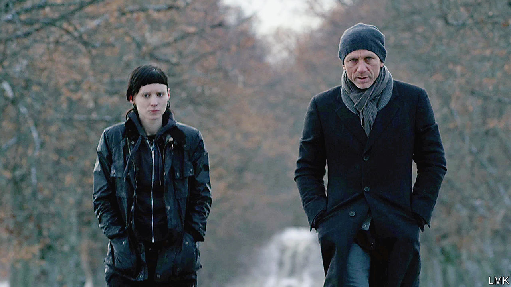

###### Ice-cold cases

# Investigating the mysterious appeal of Scandi noir 

##### An enthusiast tours the region to explain the genre’s rise 

 

> May 23rd 2020 

Scandinavian Noir. By Wendy Lesser. Farrar, Straus and Giroux; 288 pages; $27 and £20.99.

THE BIGGEST mystery of Scandinavian crime fiction is how five countries with a combined population of around 27m produced so many hit novels that the region’s noir has become a genre in itself. Jo Nesbo, creator of the lugubrious Norwegian detective Harry Hole, has sold over 45m books worldwide. The Kurt Wallander novels, by Henning Mankell, have been turned into dozens of films and television episodes.


One answer is that although, for some outsiders, Scandinavia is a beacon of social democracy, the reality of life is darker and more complicated. Social pressure to conform, the near-endless winters, the poverty and depression behind the sleek prosperity, rising xenophobia—all these drawbacks and more are explored by Wendy Lesser in her lively, perceptive guide to Scandi noir. Sweden’s smugness, she says, conceals a murky past. Its post-war wealth is rooted in wartime trade with Nazi Germany, to which the Swedes sold steel to make Panzer tanks and the ball-bearings on which their tracks turned.

The book begins with a breezy, well-informed tour of the genre. Ms Lesser, the editor of the Threepenny Review, a literary magazine, is especially sharp on the detective series written by the Swedish couple and co-authors Maj Sjowall and Per Wahloo in the 1960s and 1970s, widely regarded as the beginning of the trend. Its hero, Martin Beck—the model in part for Wallander and Hole—shone a light into the shadiest crevices of Swedish society. After that comes an actual travelogue through Norway, Denmark and Sweden (Ms Lesser elects to skip Finland and Iceland, too, even though that tiny nation produces lots of distinguished crime fiction).

She peppers the book with observations on Scandinavian life and writing, from the treatment of domestic space—“the Swedes, Danes and Norwegians seem to occupy their interiors…more cosily than [Americans] do”—to the copious sexual antics of the fictional protagonists. Beneath the romps lie more sinister themes. These books have a disturbing predilection for child abuse, she notes. A history of sexual abuse motivates Lisbeth Salander, heroine of Stieg Larsson’s bestselling “Millennium Trilogy”. “In almost every series”, Ms Lesser calculates, “some child or teenager is sexually or psychologically abused by adults.” Others are murdered: kidnapped from parks, sold to paedophiles. As in reality, the abuser often turns out to have been abused.

This is a rich subject. But instead of probing deeply into the Scandinavian psyche, Ms Lesser moves on to discuss the weather. She might profitably have woven the two halves of her book together, introducing authors as she wanders around their countries and riffing off the people and places she encounters. The travelogue is needlessly written in the third person (“the first time she sees Stockholm, she feels she is coming home”). Her chatty voice sometimes slips into banality.

Still, Ms Lesser is an engaging and amiable guide to a cultural phenomenon that has swept much of the planet. She visits Ystad, the pleasant but unremarkable Swedish town which, in Mankell’s stories, is home to Wallander. Its streets are thronged with tourists following in the detective’s footsteps. Here, perhaps, is the answer to the mystery of Scandi noir’s appeal: Wallander, like Hole and Salander, offers safe passage into a bleak and dangerous world, one which readers in other countries may enter and leave at their pleasure. ■

