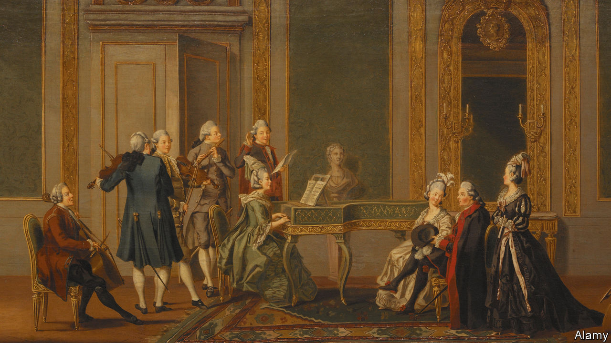

###### Home Entertainment

# Trio sonatas are the ideal music for the lockdown 

##### Warm and uplifting, they are built for the spare room, not the concert hall 

 

> May 23rd 2020 

“A  SYMPHONY MUST be like the world,” the Austrian composer Gustav Mahler wrote; “it must contain everything.” Today, however, the world seems remote. Everything might be too much to bear. So put aside those all-encompassing operas and immersive string quartets and instead choose the music built on a scale for life under lockdown: the trio sonata.

People don’t write them any more—they haven’t for over 150 years. But in the second half of the 17th century, trio sonatas spread from Italy across northern Europe, still reeling from the Thirty Years War. They were partly a vehicle for the violin, the new musical phenomenon prized for its ability to sing like the human voice. The Italians, says Rachel Podger, a British violinist, “were extravagant in their style and not shy to show what they could do.”


“Trio sonata” is a capacious term. Some were written for the church, others to play at home. Despite being called trios, there are usually four players—two upper lines, often violins but sometimes winds; a bass part, often a cello or a bass viol; and an instrument to fill in the harmony, a harpsichord, say, or a lute. But all rules are made to be broken. Johann Sebastian Bach’s trio sonatas comprise three strands of exquisite music written for the organ alone.

Early exponents included the Venetians Dario Castello (1602-31) and Giovanni Legrenzi (1626-90). The form was picked up in Germany by Georg Philipp Telemann (1681-1767) and Bach’s sons, including Carl Philipp Emanuel (1714-88) and Wilhelm Friedemann (1710-84), and in Britain by Henry Purcell (1659-95), George Frideric Handel (1685-1759) and William Boyce (1711-79). But the trio-sonata king was Arcangelo Corelli (1653-1713), a rock-star violinist like Antonio Vivaldi, whose perfectionism honed a powerful economy. “There’s never any hot air,” Ms Podger says of his compositions. “You know exactly what he means.”

To his contemporaries, he was a giant. Roger North, an English writer, thought that “if musick can be immortall, Corelli’s consorts will be so.” Yet today his work ranks low in the pantheon, overshadowed by later sonatas and string quartets. In the 18th century fashion shifted from counterpoint to melody. The lower strings became subordinate to the top line. Keyboard players wanted more than to add blocks of harmony. Audiences grew. By the time Haydn established the string quartet, trio sonatas were in decline.

Time to rediscover them. Their twisting counterpoint and sparkling clarity help clear the quarantine fug. Their dance rhythms and harpsichord beats are uplifting. Made for the spare room, not the concert hall, they are warm and life-affirming.

Ms Podger compares the instruments in a trio sonata to contrasting but co-operative housemates. “You might agree, you might disagree.” The form “reflects the intimate nature of being at home and digging in the garden and cooking and conversing around the table.” It is music for now. ■

For a playlist, go to 

Editor’s note: Some of our covid-19 coverage is free for readers of The Economist Today, our daily . For more stories and our pandemic tracker, see our 

