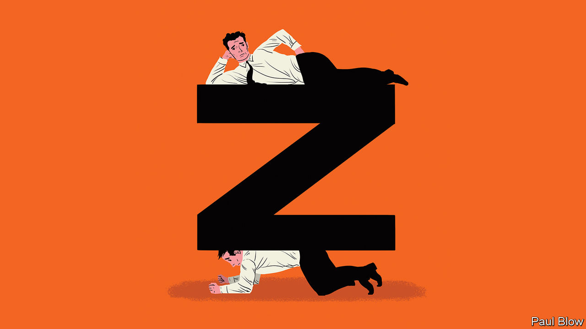

###### Bartleby

# Zoomers, zeros and Gen Z 

##### The pandemic has widened two divides in the labour market 

 

> May 23rd 2020 

COUNTRIES ARE beginning to emerge from economic lockdown. As they do, the statistics show how different segments of the population have been affected by the pandemic. And the evidence is clear that the virus has widened existing divides between professionals, low-paid workers and the young.

Start with the most fortunate. Many professionals can easily work at home, replacing one-to-one meetings with phone calls and group meetings with Zoom gatherings or Google hangouts. These “Zoomers” are mostly working on full pay and are currently being spared the daily commute. For them, the lockdown may be an inconvenience (particularly if they have children) but it is not a threat to their standards of living.


For many others, however, the pandemic is a serious threat. Some are key workers, who have to attend their jobs and are at more risk from the virus. Others cannot work from home and have either lost their jobs or seen their incomes cut (despite help from government schemes). Many in this group were already in a weaker position than the Zoomers, because they were in jobs with lower wages or less security.

Some people in this less fortunate group can be dubbed the “zeros”. In Britain, almost three-quarters of those on zero-hours contracts are key workers or work in shut-down sectors, says the Resolution Foundation, a think-tank.

A further clue to the toll on the low-paid came from the latest American non-farm payroll figures. Average hourly earnings rose by 4.7% in April, the biggest monthly gain on record. That sounds like good news but isn’t. It is the result of low-wage workers losing jobs in sectors like hospitality. The same trend can be seen in Britain, where the average wage of those in shut-down sectors is less than half of those working at home, according to the Resolution Foundation.

The mortality rates make even grimmer news. The low-paid (and ethnic minorities) have suffered most. Figures from Britain’s Office for National Statistics showed that death rates of security guards, care workers and bus drivers were much higher than average, while those in “professional occupations” had death rates well below the mean.

Another great divide is between those already established in the workforce and Generation Z—those born in the late 1990s and early 2000s who are now coming of age. They are entering a job market extremely hostile to their prospects. Around 30% of British employees aged under 25 worked in one of the shut-down sectors, according to the Institute for Fiscal Studies, another think-tank, compared with 13% of those aged over 25.

Those in university education are also badly affected. For a start, it is harder to get work experience. In America 22% of employers have cancelled internship offers, according to the National Association of Colleges and Employers. In the first week of May just under 2,500 internships were posted on Monster.com, a recruitment website, compared with over 18,000 in the same week last year. Many of the remaining internships were in roles which could be done remotely. In Britain firms have cut entry-level jobs by 23%, says the Institute of Student Employers, a recruiters’ association.

The short-term shock of the pandemic will leave long-term scars. The Resolution Foundation estimates that the pandemic means those emerging from education this year will be less likely to have jobs in three years’ time. The likelihood of being in employment would fall by 13% for graduates and 37% for those with the fewest qualifications.

The effect could last into the 2030s. A study of the effect of recessions on younger workers by Bart Cockx of Ghent University in Belgium found that it takes about ten years for cohorts that enter the labour market during a downturn to catch up with cohorts that did not.

At least young people are far less likely to suffer severe symptoms from the virus than older generations. But the economic hit comes at a time when many already worry about the burden of student debt and the lack of well-paying jobs: a survey last year by Deloitte, a consultancy, found that a third of Gen Z-ers who planned to move jobs felt there were not enough opportunities to advance in their careers.

That the low-paid and the young are the hardest hit economically by the pandemic is a dark echo of the King James Bible: “But whosoever hath not, from him shall be taken away even that he hath.” The social and political consequences may be huge.

Editor’s note: Some of our covid-19 coverage is free for readers of The Economist Today, our daily . For more stories and our pandemic tracker, see our 

