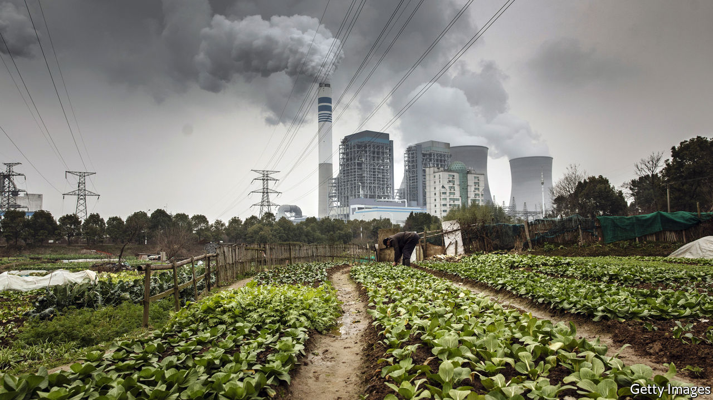
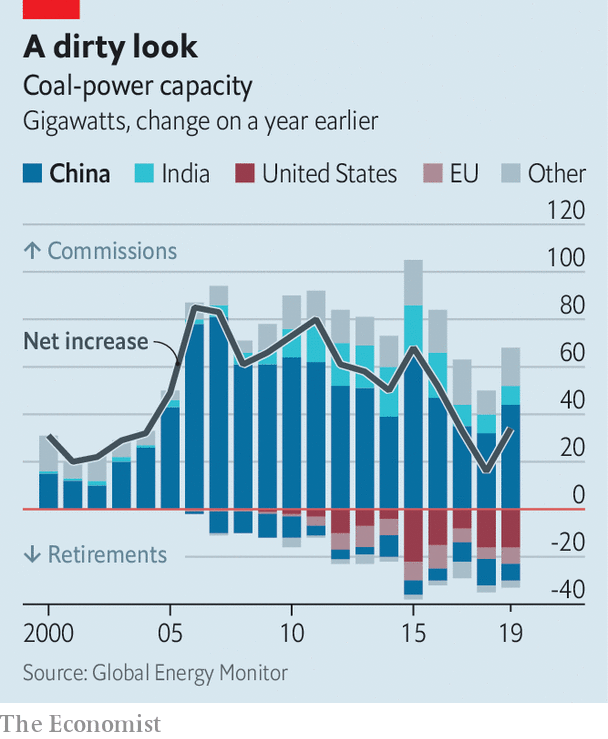

###### Brown elephants

# A glut of new coal-fired power stations endangers China’s green ambitions 

##### Why build them when they struggle to sell their electricity? 

 

> May 21st 2020 

CHINA IS HOME to half the world’s coal-fired power stations, the most polluting type of generator. Their share of the country’s electricity market is shrinking as nuclear plants and renewables slowly elbow them off the grid. But Chinese investors and local governments are still keen on them. Last year coal-fired generating capacity expanded in China by 37GW (factoring in plant closures)—more than the amount by which it grew globally. China has been relaxing curbs on building such plants. That suggests more to come.

Work on many of the new coal-fired stations began after the central government gave local officials greater freedom to approve construction at the end of 2014. The aim was to cut red tape, not to ramp up the burning of coal. But it resulted in a blizzard of new permits. Within about a year provinces had approved enough new plants to expand China’s coal-powered generating capacity by a quarter.


China does not need a lot more power. Its economy is growing less energy-intensive as it relies less on manufacturing and construction. Lately coal-power plants have been able to sell less than half the electricity they are able to produce, down from 60% a decade ago. But local governments see any big construction project as a potential boost to growth. Some also have coal-mining industries to protect.

 


 In 2016, recognising its mistake, the central government began clawing back the authority it had devolved to the provinces. But it worried that halting projects would threaten local economies, so it allowed many of those under way to proceed. Soon it began to relax curbs on the approval of new stations. In January China had 135GW of coal-power capacity either permitted or under construction, says Global Energy Monitor, an NGO in San Francisco. That is equal to about half the total coal-power capacity in America.

The new power stations will not be put to full use. They will face fierce competition from renewable energy. China’s capacity for producing this is also growing fast. Plants using coal risk limits on their output imposed by governments to improve air quality. Instead of increasing the total amount of electricity China gets from coal, new stations may simply pinch operating hours from existing ones.

That would be a problem for power-firms’ balance sheets. But the world may also suffer. China’s targets to reduce carbon emissions remain too low. The economic blow it has suffered as a result of covid-19 will deter it from making new pledges that could restrain its freedom to boost growth with the help of large and dirty building-projects. The glut of underused, debt-laden power stations could further weaken China’s emissions-cutting resolve.

By building so many new coal-fired plants, China has wasted money that could have been spent more greenly, and given vested interests more reason to try to delay its energy transition. The big state-owned firms that operate coal-burning generators are also being relied upon by the government to produce much of China’s renewable energy, notes Lauri Myllyvirta of the Helsinki-based Centre for Research on Energy and Clean Air. But they would rather not hasten the closure of carbon-spewing power stations that they had intended to keep working for a good three decades. ■

