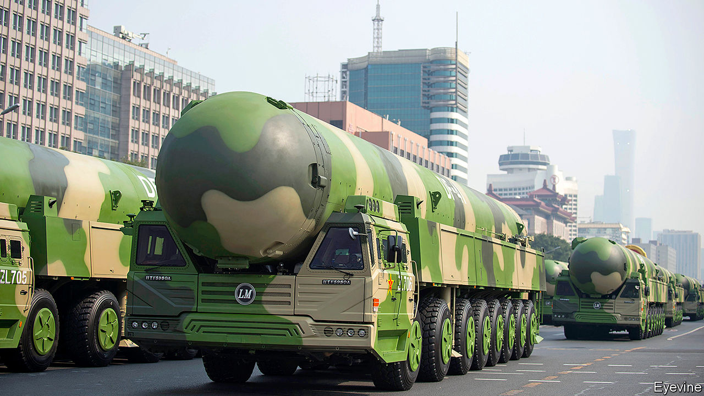
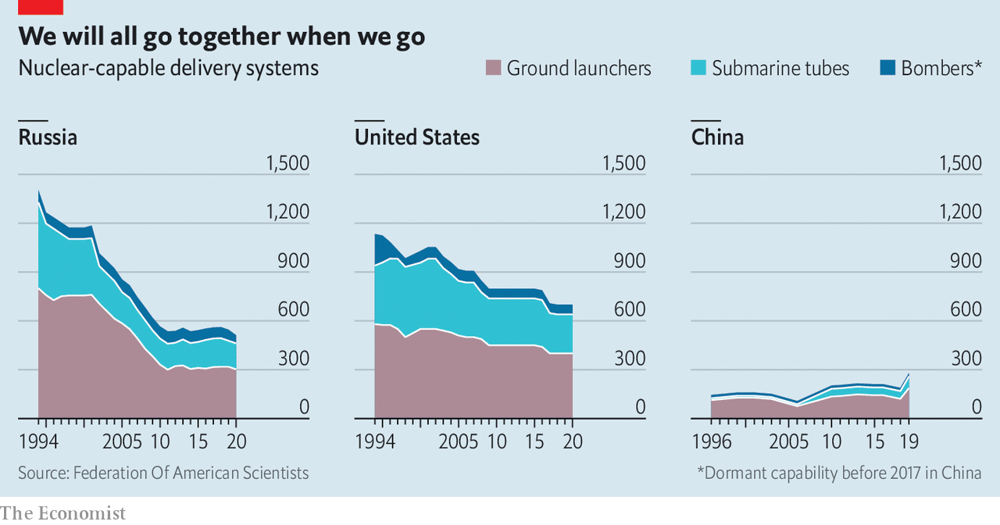

###### Three’s a crowd

# Donald Trump wants China to join a nuclear-weapons pact 

##### Why prospects look dim 

 

> May 23rd 2020 

SINCE TESTING its first nuclear bomb 56 years ago, China has never revealed even a ballpark figure for the size of its arsenal. So recent debate on Chinese social media about the number of warheads the country ought to amass has been striking for its specificity. It began on May 8th with a suggestion by the editor of a nationalist tabloid in Beijing that China should expand its stockpile to 1,000 nuclear weapons. These, he said, should include 100 DF-41s, a new kind of intercontinental missile capable of hitting anywhere in America. Thousands of commentators have cheered him on. A few have called for more restraint.

America, while not welcoming such a build-up, would like it if China were to make its intentions so clear. It wants the country to end its obsessive secrecy and join America and Russia in setting limits to the size of their nuclear arsenals. The DF-41s, first displayed in public last October at a National Day parade in Beijing (see picture), are one reason why America is growing ever more keen to get China talking. They are China’s first missiles with such a range that can go on roads, making them more difficult for American weapons to knock out than ones fired from silos or fixed launchers. They can probably carry multiple warheads, making it even harder to protect America from their devastation.


By calling for such a build-up, Hu Xijin, the editor of the Global Times, appeared to give credence to Western estimates that China has far fewer than 1,000 warheads—about 300 is widely considered to be a reasonable guess. By contrast, America and Russia have around 4,000 apiece. But whereas those two countries, over the decades, have signed pacts to prune their arsenals, China has sat out arms-control. Its nuclear forces have been growing in size and sophistication, in part to ensure that they could survive a surprise strike from America’s increasingly accurate weapons. If America’s Defence Intelligence Agency is right, Mr Hu’s goal may not be far off. Last year the agency’s head, Lieutenant-General Robert Ashley, said that in the next decade China was likely to “at least double” the size of its stockpile in “the most rapid expansion and diversification” ever of its nuclear arsenal. Some experts believe that the growth rate is not as fast as he claims.

Last year America pulled out of a treaty with Russia banning medium-range missiles fired from land. It did so ostensibly because of Russian cheating, but the Pentagon made no secret of its desire to match China’s unchecked build-up of such weapons. Now China casts a shadow over the one nuclear pact that still binds America and Russia, the New START treaty. Signed in 2010, it caps “strategic” (ie, long-range) weapons and allows each side to inspect the other’s 18 times a year. It expires in February, but could be renewed if both agree.

Vladimir Putin, Russia’s president, says he is game. But Donald Trump and many of his advisers want China to sign up first. “The administration’s goal is to keep China’s stockpile from growing,” says Tim Morrison of the Hudson Institute, who served in Mr Trump’s National Security Council until October. American officials believe that if they renew the treaty too quickly, or for too long, China will feel no pressure to join. But neither America nor Russia wants to slash its arsenal to China’s level. That would leave the improbable idea of an unequal treaty—a phrase that in China recalls the reviled pacts that the country was forced to sign with colonial powers in the 19th and early 20th centuries.

In a recent report by the Institute for Peace Research and Security Policy at the University of Hamburg, David Santoro, Alexey Arbatov and Tong Zhao, experts from America, Russia and China respectively, suggest ways of breaking the impasse. Mr Zhao, who is a senior fellow at the Carnegie-Tsinghua Centre for Global Policy in Beijing, says a three-way deal could start with a cap on intermediate-range missiles, where China’s advantage in land-based rockets is offset by America’s edge in air-launched ones. Or it could cover all delivery systems (ground launchers, submarine tubes and bombers) with a reach longer than 500km. All three countries possess these in roughly equal numbers, unlike warheads, of which America and Russia have many more.

One incentive for China to agree to negotiate is the risk that, if it does not, New START will unravel. Mr Zhao says this would not only end limits to the American arsenal but also shroud it in secrecy. Each of the three countries might then base its actions on worst-case estimates of the others’ forces. That could drag China into a nuclear-arms race with the other two, says Mr Zhao—an economic burden that would be keenly felt by China as its economy slows.

There may also be diplomatic dividends for China should it enter talks. Doing so would “raise China’s status as a major global military power on a par with the two former superpowers”, says Mr Zhao. China may benefit in such negotiations by having Russia, a strategic partner, in the room. Both countries are deeply wary of America’s efforts to build missile defences.

 


The problem, however, is that neither China nor Russia is keen on trilateral talks. On May 15th China again rejected the idea. This week Russia said that if America wanted to engage China on nukes, it should leave Russia out of it. In the past, Russian officials have said that if China were to join in, then Britain and France—American allies with 485 nuclear warheads between them—should be involved, too. In February Mr Trump agreed to a Russian proposal for a meeting of all five permanent members of the UN Security Council to discuss strategic matters. American officials said they would use the opportunity to press for new arms control. Such a forum would conveniently rope in China, as well as Britain and France. But if a trilateral dialogue would be hard, a pentalateral one would be a nightmare. None is scheduled.

Many experts think a more realistic approach would be for America and China to begin exploratory talks by themselves. America has long proposed such a “strategic nuclear dialogue”. China has demurred, for several reasons. It complains that whereas America accepts “mutual vulnerability” with Russia—an acknowledgment that each side can inflict terrible nuclear harm on the other—it refuses to do so with China. Many Chinese officials also fret that revealing the size or other details of their modest arsenal would make it even more vulnerable to a bolt from the blue.

One way to allay these fears would be to start small. All three countries could begin discussing the risks that arise from emerging technologies, from cyber-attacks on nuclear command-and-control networks to the use of artificial intelligence in early-warning systems. Rose Gottemoeller, a former American official, says America could invite China to a mock New START inspection to show how verification works. Or the two countries could agree to notify one another of missile tests, as America and Russia have done for decades. But it will be a long road. As Mr Zhao notes, China’s tradition of military secrecy is “deeply rooted”. Opening up will require trust. What little there is between China and America is being threatened by the pandemic. ■

