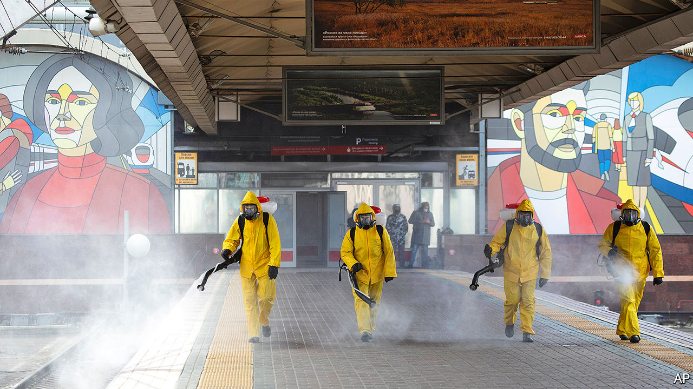
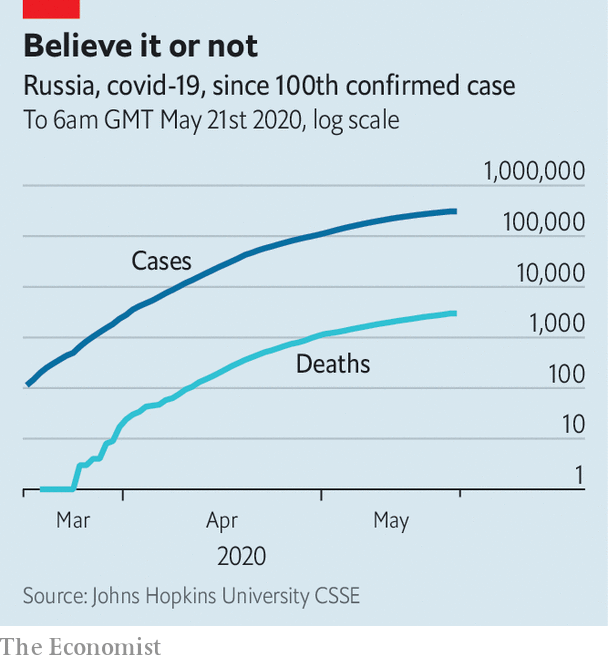

###### Anatomy of lies

# Russia’s covid-19 outbreak is far worse than the Kremlin admits 

##### Like its Soviet predecessor, Vladimir Putin’s system is steeped in falsehoods 

 

> May 21st 2020 

Editor’s note: Some of our covid-19 coverage is free for readers of The Economist Today, our daily . For more stories and our pandemic tracker, see our 

RUSSIA IS MORE successful in fighting covid-19 than the West, thanks to its superior health-care system and excellent leadership. Though faced with one of the highest rates of infection, its fatality rate is a seventh of that in most countries. That is, if you believe Russian statistics.

Few independent experts do. Russia has officially recorded just over 300,000 cases of covid-19 and 2,900 deaths, which makes its fatality rate less than 1%, compared with 4.5% in Germany and 14% in Britain. Yet the fatality rate among Russia’s front-line health professionals, who keep their own records, is about 16 times as high as in comparable countries, which suggests that the official figures are much too rosy.


Nonetheless, these were the figures that on May 11th led Vladimir Putin, Russia’s president, to order an end to a period of “non-working days”, a euphemism for a national lockdown that he never officially declared. Although he transferred responsibility for retaining restrictions to regional authorities, he signalled that Russia was through the worst. “We must give thanks to our doctors and our president, who works day and night to save lives,” Vyacheslav Volodin, the speaker of the Duma, declared.

The Russian government was upset when, on the same day, the Financial Times reported that the real death toll could be 70% higher; the New York Times quoted an expert as saying it could be nearly three times the official tally. These estimates were derived by calculating excess deaths. One member of the Duma demanded that the journalists’ accreditation be revoked. Kremlin mouthpieces denounced what they called an orchestrated attack on Russia by the West.

Meanwhile, some Russian doctors on social media say they were told to keep numbers low by including in the covid statistics only those who died directly of the disease, not those who had underlying conditions that might have contributed to their demise. Victims’ relatives are furious.

Adding weight to the suspicion are the improbable figures posted by some regions. For example, in Krasnodar, a region with 5.2m people, the number of reported infections has fluctuated only minutely, between 96 cases and 99 cases a day for the past two weeks. Statistically speaking, that is extremely unlikely.

Several other regions have produced odd statistics. They show the number of infections recorded in regional centres and those recorded in adjacent territories fluctuating in opposite directions, thus balancing each other out and producing a straight line of cases across the region.

The official numbers reveal less about covid-19 than they do about Russia’s political system, which, like its Soviet predecessor, is saturated with lies. Russian elections throw up similarly strange graphics. Many Russian athletes during the Sochi winter Olympics in 2014 took performance-enhancing drugs, and their cheating was covered up by secretly swapping urine samples with official connivance.

Konstantin Sonin of the University of Chicago says the problem is not that the Kremlin hides or distorts figures, but that it often does not have them in the first place. Most regional bigwigs are not accountable to voters but are entirely dependent on the Kremlin for status and money. They file rosy reports so as to appear to be meeting official targets. The aim is to please the president, not the people. “The Kremlin does not even need to tell them what figures to report; they know to report what the Kremlin likes to hear,” he says.

 


Over the past few weeks Russian state television has provided a perfect illustration of this system. In the West officials have at least tried to communicate with their electorates and the media. On Russian television people see their officials reporting to the self-isolated Mr Putin via a videoconference screen. The screen resembles a Russian Orthodox icon: Mr Putin is displayed in a large central box, surrounded by 12 “apostles” in smaller boxes.

Yet this manufactured image is starting to crack. Mr Putin’s ratings have dropped to historic lows in recent weeks. On May 17th the health minister in Dagestan, a Russian territory of 3m people in the North Caucasus, told a local blogger that the true number of infections on his patch was four times that reported, and that outbreaks of pneumonia had killed 657 people, not the officially recorded 27. Fully 40 medics had died of it. Mr Putin blamed citizens for trying to treat themselves at home.

Some big cities have been more open than the Kremlin. Moscow admitted that the real number of cases could be significantly higher than officially reported, and retained a lockdown.

The Kremlin’s handling of the crisis reminds some of the cover-up of the Chernobyl nuclear disaster, which prompted Mikhail Gorbachev, the Soviet leader, to launch glasnost, a campaign for more openness. “The whole system is penetrated by the spirit of bootlicking, persecution of dissidents, clannishness, window-dressing. We will put an end to all this,” Mr Gorbachev told his politburo at the time. Mr Putin, who began his presidency 20 years ago by covering up the sinking of the Kursk submarine, is determined not to repeat the glasnost experiment, which helped to bring the whole system crashing down. ■

