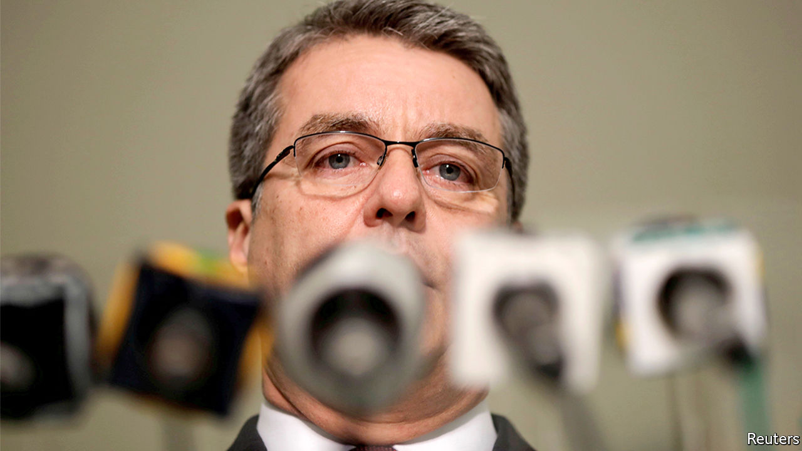

###### Trading places

# A memo to candidates for the WTO’s next boss 

##### What Roberto Azevêdo’s prospective successor should expect 

 

> May 23rd 2020 

SO YOU WANT to be the next director-general of the World Trade Organisation (WTO). If successful, you will lead one of the world’s big multilateral institutions and rub shoulders with heads of state. The tax-free salary and benefits are cushy. But that is where the perks end. Here is what you can expect from the job.

Trade in goods could fall by as much as a third this year. Even before covid-19, the trade rule book was in tatters. The pandemic seems set to make protectionist barriers rise even faster. Australia and China are squaring off (see ). This, you might think, is your moment to shine. You might hope to broker grand deals, or, at the very least, to fix the WTO’s system of settling disputes.


We suggest you manage those expectations—all the way down. Roberto Azevêdo, the departing director-general, was respected by members. But he found his diary emptying faster than a shipping broker’s order book. “There’s nothing happening in terms of regular work” at the WTO, he told Bloomberg recently. He is leaving a year before his term’s up. Forget building a new architecture of the global trading system, or haranguing members into lowering tariffs. If the WTO’s members do not want something, it will not happen. Your job instead is to focus on the smaller fry. Talks to limit subsidies for fisheries were the only ones going anywhere in recent months. Full steam ahead? Afraid not. They stalled on May 7th.

You will discover that the WTO would be a marvellous institution were it not for its members. The poor ones want exemptions from rules that have not yet been written. The rich ones are loth to make the concessions needed to get anything done. Some of America’s lawmakers want to withdraw from the organisation (a “relic”) altogether. You might find yourself wishing they just got on with it. But their heft makes them useful, when they choose to be.

Be cautious, like Mr Azevêdo, and you will be accused of getting too little done. Be ambitious, and, like his predecessor Pascal Lamy, you will be attacked for alienating members—and also for getting too little done. Best to expand your definition of success to include vaguely worded joint statements calling for free and fair trade.

To become a candidate, a member must put you forward before July 8th. The winner must be agreeable to America, Europe and China. If such a person even exists, it probably won’t be one of their own. Perhaps that clears the way for the first African boss. Names being floated include Amina Mohamed, Kenya’s former WTO ambassador, and Yonov Frederick Agah, a Nigerian and Mr Azevêdo’s deputy.

The Americans and the Europeans say they want to arrange a speedy replacement for Mr Azevêdo, who leaves on August 31st. But if the WTO’s past trade rounds are a guide, resolution won’t be swift. Many members will stall, in case Donald Trump loses America’s presidential election. Prepare to wait for months, even years.

A quick approval, against those odds, could mean that members want to save the institution. Or it could mean that you are bland enough that no one could rouse themselves to object to your appointment: a sorry form of comparative advantage. ■

