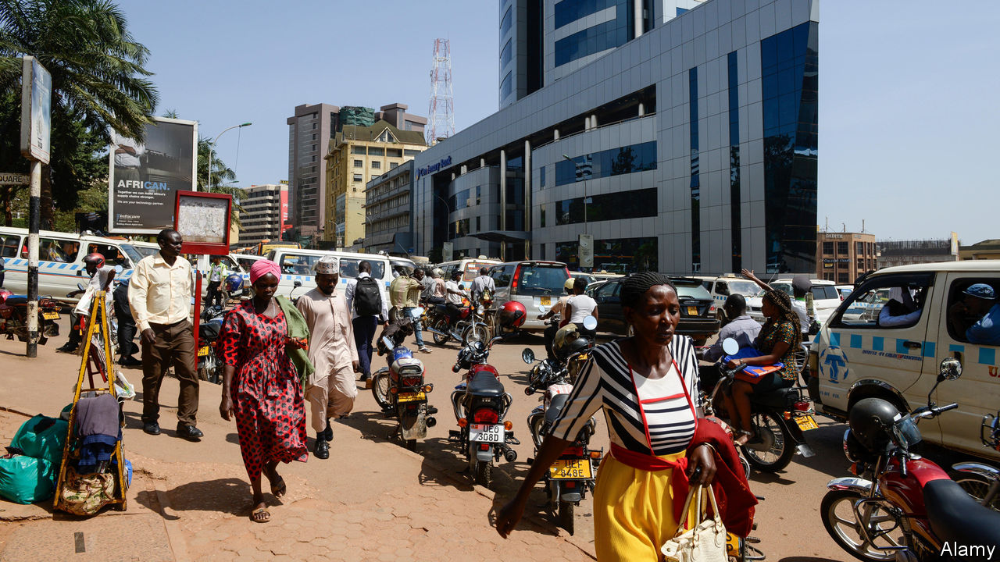

###### Borrower beware

# Why interest rates are so high in Africa 

##### Banks generate high returns, but have steep costs 

 

> May 23rd 2020 

WHEN ROBERT MATSIKO was a young man his grain-milling business in Sheema, western Uganda, was destroyed by fire. These days, after building it back up from the ashes, he is being burned by high interest rates. To buy a new machine he must borrow from a bank at an annual rate of 22%. “You fear to do that,” he says. Many other entrepreneurs feel the same, which stops their businesses from growing.

Just as Mr Matsiko funnels grain from farms to supermarkets, banks are the bridge between savers and borrowers, paying interest on savings and charging it on loans. And in sub-Saharan Africa, the gap between deposit and lending rates is higher than anywhere else. In 2017 net interest margins in the median African country were 6.8%, according to the World Bank. That healthy mark-up in part helps cover overheads that are chunkier than those in other regions. But it also allowed African banks to generate a 17% return on equity for shareholders. On that measure, Africa’s banks are the most profitable in the world—while also being the least efficient.


Last year Uganda’s central bank estimated that half of banks’ interest margins are swallowed by operating costs. “Opening up a branch probably costs half a million dollars,” says Patrick Mweheire, who heads east African operations for Standard Bank, the continent’s biggest lender. Smaller banks are ground down by the cost of electricity, data storage or simply moving money, he adds. “If you look at a highway you will see six cash-in-transit trucks, one for each bank, all a quarter full.”

In some countries, high inflation can help explain high interest rates, albeit less so than in the past. Interest rates also price in risk. Assessing borrowers is hard when they often lack credit histories. Chasing up bad loans is a struggle. Creditors can only expect to recover one shilling in every five they have lent to a business that goes insolvent in Tanzania, according to the World Bank. In Niger, the resolution process takes five years, on average.

Many bankers save themselves the hassle by lending to the state instead. The double-digit interest rates that the government pays set “a floor” on the rates paid by everyone else, says Adam Mugume of Uganda’s central bank. In the average African country, according to the European Investment Bank, lenders’ holdings of public debt increased from 14% of their assets in 2008 to 19% by 2017.

Critics say that banks are abusing their market power to rip off customers. The World Bank estimates that the banking system in the typical African country is no more concentrated than in Europe or Latin America. But the fact that banks can sustain high profits could suggest they have some market power. And in some smaller countries, the market is more concentrated. Competition for small business loans is weaker than for corporate deals.

Governments have tried and failed to bring rates down. In 2016 Kenya capped commercial-loan rates at four percentage points above the central bank’s policy rate. The move backfired. Bankers slashed credit to small businesses, reasoning that the rewards of lending no longer matched the risks. The cap was scrapped last year.

In Nigeria the central bank penalises banks that do not meet lending targets. But it also pushes up interest rates through tight monetary policy, intended to keep the naira strong. Banks must hold lots of liquid assets, such as cash and treasury bills, and keep on hand at least 27.5% of their deposits, one of the highest ratios in the world.

New models could spur change. Joshua Oigara, the boss of KCB bank and chairman of the Kenya Bankers Association, says that mobile banking, credit-information sharing and, before the pandemic, a stable economy helped to bring down lending costs. Others are saving on bricks and mortar by enlisting local agents, such as shopkeepers. Barely 18 months after adopting this model, Standard Bank’s Ugandan subsidiary processes more transactions through agents than at branches.

Innovation can bring down costs, but it cannot loosen demographic constraints. It costs more to borrow locally when there are fewer savings to go around, notes Charles Robertson of Renaissance Capital, an investment bank. African households save less than those in Asia, say, in part because workers support more dependants. “If you’ve got six kids you’ve got no savings, whether you’ve got a mobile phone or not,” he argues. Until birth rates fall, interest rates will stay relatively high. ■

