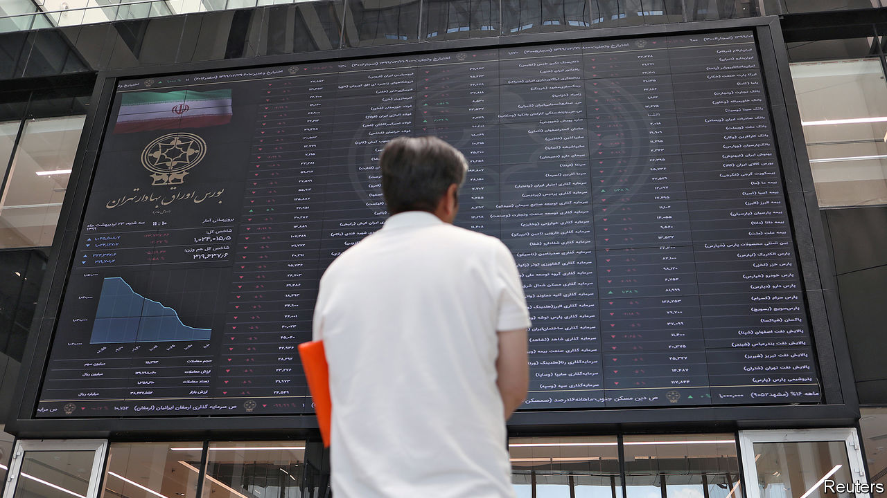

###### A bizarre bazaar

# Why Iran has the world’s best-performing stockmarket 

##### Investors don’t seem to mind sanctions, disease or a shrinking economy 

 

> May 23rd 2020 

THERE SEEMS to be no end to Iran’s suffering. It has struggled with one of the world’s worst outbreaks of covid-19. As it opens back up there are signs that it is being hit by a powerful second wave. Last year the economy shrank by almost 8%. It may do worse this year. American sanctions had largely cut if off from the global market. The coronavirus has just about finished the job.

Yet, somehow, the Iranian stockmarket is booming. Its main index, the Tedpix, has soared tenfold in two years in local currency terms, and doubled since Iran declared a lockdown on March 27th. Even when measured in hard currency it is the world’s best-performing index. “In three years we’ve tripled our euro value,” says Maciej Wojtal, who manages Europe’s only fund focused on Iran’s market.


The main reason it is booming is that Iranians have few other places to put their cash. With inflation above 30% and the value of the Iranian rial dropping, there is little incentive to open a savings account at home. The government makes it hard to buy foreign currencies; American sanctions put stockmarkets abroad out of reach. Some Iranians buy land or cars, but prices are too high for most.

Even novices are getting in on the action. In April the authorities allowed Iranians to trade their “justice shares”—holdings in state firms which the government gave to poor people years ago. Daily trading volumes have risen from around $100m to $400m in two years.

Iran’s leaders encourage the activity, anxious to sustain hope in an otherwise dire situation. They also see an opportunity to raise state revenues hit hard by sanctions. The government recently listed an exchange-traded fund with government stakes in banks and financial institutions and may soon do the same with its mining, steel and petrochemical holdings. (None of this actually improves the companies, mind.)

Hassan Rouhani, the president, sees the boom as a matter of national pride. “As Iran’s bourse has developed, [our enemies] become nervous,” he says. But experienced investors and even some officials worry about a bubble that could burst and lead to unrest. Mr Wojtal sold half his holdings in March.

