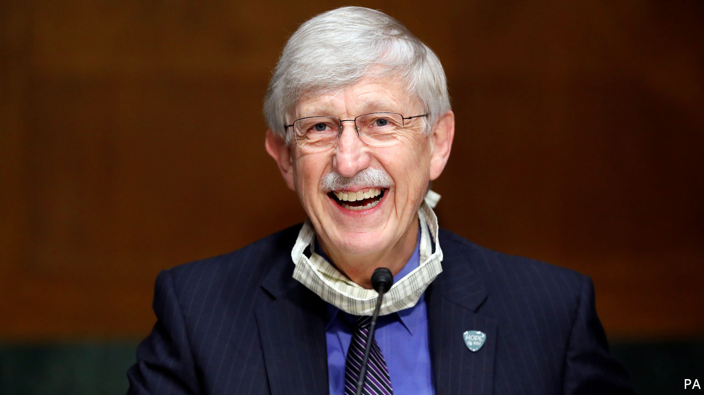

###### Jesus is not his vaccine

# Francis Collins on science and faith 

##### The eminent geneticist is also an evangelical Christian 

 

> May 23rd 2020 

AN EVANGELICAL Christian claiming that science is not in contradiction with the Bible might normally get short shrift in the smarter salons of Washington. But what happens when the speaker is the man who led the sequencing of the human genome and now heads attempts to find a vaccine for covid-19 ? Such is the case of Francis Collins, who on May 20th was awarded the Templeton Prize, perhaps the world’s most prestigious gong for those trying to bridge the gap between science and faith. Recent laureates have included Marcelo Gleiser, a physicist, Alvin Plantinga, a philosopher, and Martin Rees, Britain’s astronomer royal.

Dr Collins is the director of the National Institutes of Health (NIH), the largest supporter of biomedical research in the world. Appointed by Barack Obama in 2009, he is the longest-serving director since the job became a presidential appointment. He is one of the few people to have maintained credibility with both sides in the culture wars.


Born into a staunchly secular family in 1950, Dr Collins gained his doctorate from Yale at 24. Then, as a medical student in North Carolina, he was struck by how often patients he cared for looked to God when facing death. He began reading C.S. Lewis and, “seeking to dismiss the faith perspective, I was stunned to discover a rich vein of philosophical and theological thinking.” At 27, he experienced a religious conversion.

At the University of Michigan he was called the “gene hunter”; in 1989 his team identified the gene that causes cystic fibrosis. In 1993 he succeeded James Watson as director of the National Centre for Human Genome Research. He led the team which, in 2003, announced it had mapped the entire human genome.

As a scientist who is a Christian he often finds himself at the vortex of a culture war that does not readily allow intersection. Yet he does not believe America is as divided as it is often painted. “The culture wars have been portrayed as irreconcilable, making a conversation impossible, so making a solution impossible,” he says. Dr Collins urges believers to trust more in the power of science, saying that it answers the “how?” questions, while Christianity answers the “why?” questions. He has annoyed fundamentalists with his commitment to “evolutionary creation”, and criticism of claims that “Jesus is my vaccine.” He worries that the motivations of evangelicals, which traditionally were more about spreading the gospel and helping the poor and the sick, have too often been eclipsed by politics.

As for the search for a covid-19 vaccine, he is cautious but optimistic. “We are further on than we thought we would be in mid-May,” he says. Meanwhile he spends every hour of lockdown to that end, breaking off only on a Sunday to join his church on Zoom. To him, that is a continuation of the day job. “Science is a form of worship,” he says.

Editor’s note: Some of our covid-19 coverage is free for readers of The Economist Today, our daily . For more stories and our pandemic tracker, see our 

