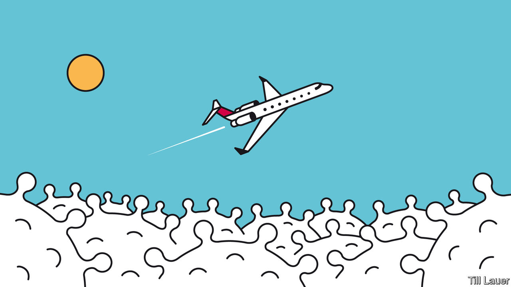

###### Banyan

# Asian countries try to build travel “bubbles” 

##### These will not be as carefree as they sound 

 

> May 30th 2020 

IN CONTRAST TO most of Europe and America, still buffeted by covid-19, swathes of East Asia and the Pacific have climbed through the worst of the turbulence and can glimpse blue skies again. Testing and tracing, prompt social distancing and swiftly mobilised health-care systems have brought impressive results: Vietnam claims no deaths, Hong Kong only four and Taiwan just seven. Japan has brought new daily infections down below 40 and has lifted a state of emergency. Local transmission is close to or at zero in Hong Kong, where offices and schools have reopened, South Korea, Taiwan, Vietnam and, of course, China. Down Under, Australia and New Zealand are also blinking in the sunlight.

But the ascent to blue skies remains purely metaphorical. As economies start to normalise, the glaring exception is international air travel. When Banyan recently returned on one of only two flights a day from Tokyo to Hong Kong, where he is resident, crew outnumbered passengers. On his last evening in Japan, when an Airbus flew over the neighbourhood, a thousand heads craned in awe to see it. At Hong Kong airport, every scrap of apron is taken up with Cathay Pacific’s grounded fleet.


The pressing question is how to restart international travel safely. Compulsory two-week quarantines, such as the one for returning Hong Kongers, are unfeasible for tourists and business travellers. One answer is “bubbles” or “air bridges” joining jurisdictions that have all but banished the virus and believe in each other’s testing and honesty. But setting them up is far from simple.

Australia and New Zealand lead the way with a proposed “covid-safe travel zone”, better known as the trans-Tasman bubble. It should make a big difference. Tourism used to generate a fifth of New Zealand’s foreign earnings, and the 1.5m Australians who travelled across the ditch last year made up nearly half of all visitors. Kiwis flocked the other way, too, visiting families and friends. Winston Peters, New Zealand’s deputy prime minister, hopes the bubble will be running in time for the looming ski season. Ann Sherry, co-chair of the Australia New Zealand Leadership Forum, thinks a trial might be ready for the school holidays in July. 

The devil is in the details. New Zealand is close to eliminating covid-19. Australia’s “aggressive suppression” is still finding a few new cases daily. There is no decision yet on whether local transmissions should be quashed completely before trans-Tasman travel can resume. Meanwhile, confusion reigns over a hodgepodge of different rules across Australia’s eight states and territories. Some, such as Queensland, ban incoming travellers; others force them to quarantine for 14 days. New Zealand’s prime minister, Jacinda Ardern, says “it matters” whether travellers can move freely once inside Australia. Another snafu involves the smartphone apps both countries use for contact tracing—how to get them to talk to each other? Not easy, says Jill Slay, a cyber-security expert at La Trobe University.

Whether the bubble can be expanded quickly is also unclear. Small countries in the Pacific including Fiji and the Cook Islands, which have kept the virus at bay, are keen to join. Many islanders live and work in Australia and New Zealand, which in turn supply a big chunk of the tourists who are the islands’ other main source of cash. But Pacific countries worry that Australian tourists might bring the disease with them. They lack testing facilities. Workers may be allowed to travel first.

Other covid-conquerors such as Hong Kong, South Korea and Taiwan would like to enter the bubble. But working out all the necessary protocols could take months or years and could be derailed by a second wave of infections. Other approaches are being discussed. Singapore proposes “green lane” arrangements with a handful of countries with equivalent or lower risks of community transmission. The travel would have to be essential, and numbers strictly limited.

Meanwhile, Taiwan is pioneering work with Stanford University, first reported by the Financial Times, to create a “safe-travel protocol”. Next month 500 human guinea pigs will travel from San Francisco to Taipei. Passengers will be tested before a preflight period of quarantine. They will then be tested every two days in quarantine when they land. The aim is to find the shortest safe quarantine period for brief business trips, rather than the typical two weeks. But for anything other than essential travel, the regime is no bundle of fun: more decompression chamber than bubble.

Editor’s note: Some of our covid-19 coverage is free for readers of The Economist Today, our daily . For more stories and our pandemic tracker, see our 

