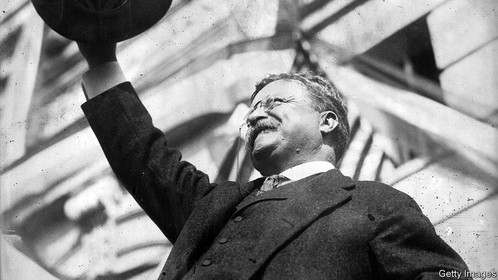

###### Clash of the titans

# When Theodore Roosevelt took on John Pierpont Morgan 

##### Two giants of American history do battle, and co-operate, in “The Hour of Fate” 

 

> May 30th 2020 

The Hour of Fate. By Susan Berfield. Bloomsbury; 416 pages; $30.

MOST AUTHORS might be content to write about either John Pierpont Morgan, possibly the world’s most famous banker, or Theodore Roosevelt (pictured), one of America’s best-loved presidents. But “The Hour of Fate” by Susan Berfield is richer for tackling them together. Set during Roosevelt’s first term, which saw the pair locked in battle, then co-operate to resolve a national crisis, her book vividly brings both men to life.


The story begins with the assassination of President William McKinley, which ended his business-friendly administration on September 14th 1901. Mark Hanna, a steelmaker, senator and adviser to McKinley, had warned that if Roosevelt became vice-president there would be “only one life between that madman and the presidency”. Bosses and financiers across America, including Morgan, echoed that concern when he inherited the top job. “I am afraid of Mr Roosevelt because I don’t know what he’ll do,” the banker reportedly said. “He’s afraid of me because he does know what I’ll do,” reckoned Roosevelt.

The book focuses on two linked events that thrust them together. In the first, Roosevelt shines as he doggedly dismantles Northern Securities, a coal and railroad behemoth that Morgan and other bigwigs put together in 1901 (the president used the new Sherman Antitrust Act, which has vexed big business ever since). The zenith of Roosevelt’s first term, in which he earned his stripes as a trustbuster, was the Supreme Court’s decision in 1903 to uphold the break-up.

Tales of hubristic tycoons being brought to heel often make for enjoyable reading. But Ms Berfield’s second event demonstrates how all-mighty Morgan had become. The coalminers’ strike of 1902 dragged on for months, despite Roosevelt’s desperate interventions. Ms Berfield describes how, as fuel supplies ran out, a school burned oil-soaked railroad sleepers to keep its pupils warm. New Yorkers sheltered in their homes; a shivery winter loomed. In October, when Roosevelt’s only remaining option seemed to be to send in the troops, Morgan went to Washington and—in an “hour of fate” that gives the book its title—brokered a peace.

Not long ago, this description of a crisis that closed schools and factories would have seemed an outlandish relic; today, the parallels with the pandemic-stricken economy are stark. Meanwhile, in her epilogue the author notes that although Roosevelt’s rhetoric about “malefactors” might sound outdated, his message of the need for corporate oversight might have been delivered by Elizabeth Warren. Wisely, Ms Berfield resists the temptation to dwell on such analogies. Her stories make her case.

