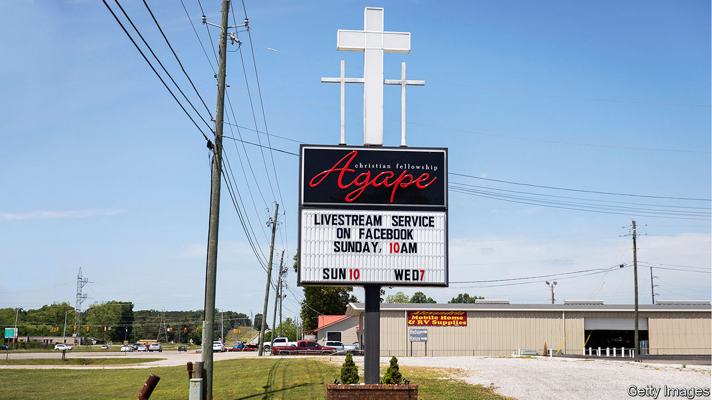
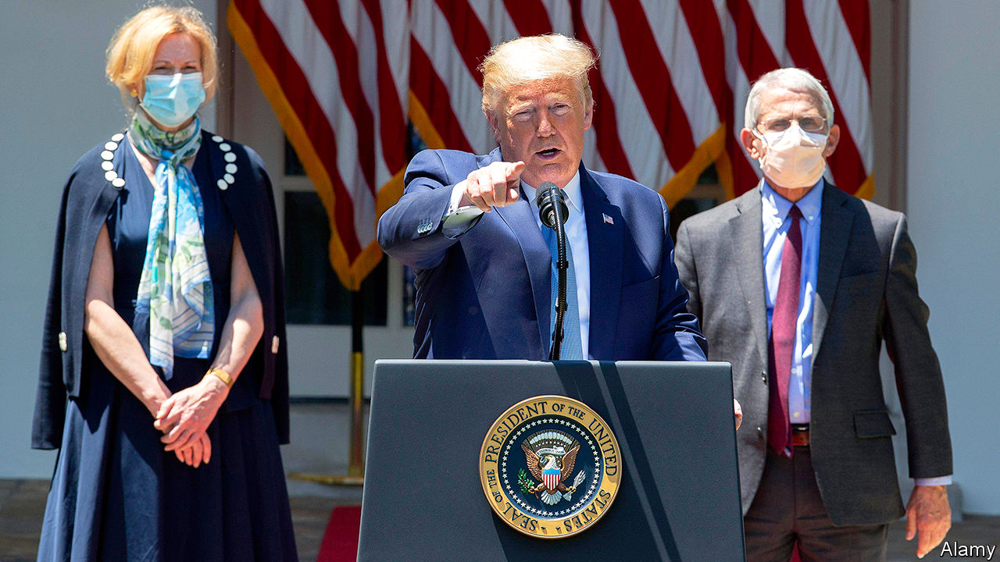
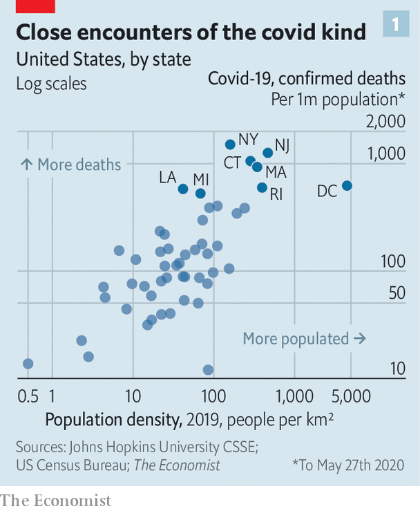
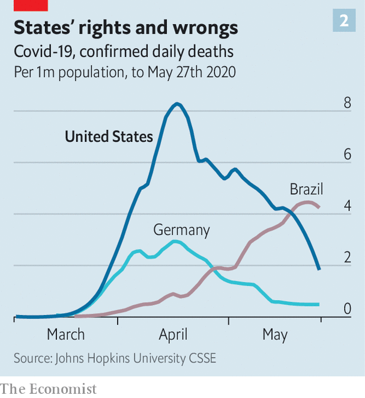
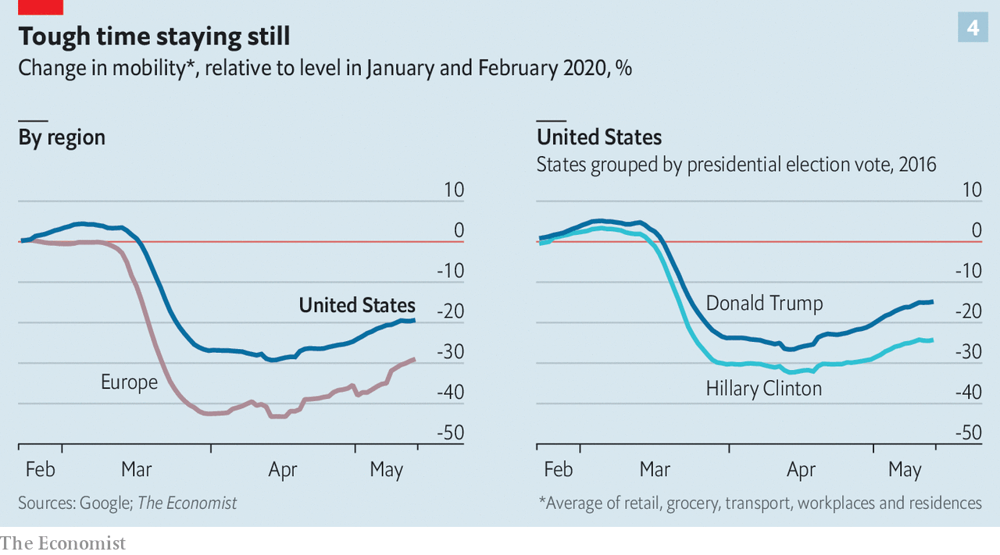
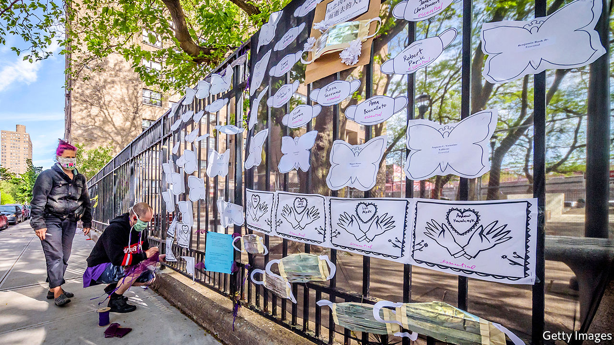

###### 100,000 and counting

# America’s covid-19 experience is tragic but not that exceptional 

##### The epidemic could get worse 

 

> May 28th 2020 

Editor’s note: Some of our covid-19 coverage is free for readers of The Economist Today, our daily . For more stories and our pandemic tracker, see our 

IN ABSOLUTE TERMS, America has been the country worst affected by the coronavirus pandemic. Nearly 1.7m of its inhabitants have been infected, a number which is still growing by around 20,000 every day. On May 27th the country passed its 100,000th confirmed death. Such official death tolls do not necessarily capture all of the lost, and the real tolls in some other countries may be much higher than they seem. But America’s official figure is more than 20 times that, say, of China, the country where the disease originated. China is unlikely to have managed to hush up 95% of its deaths.

In most countries such a national tragedy would bring with it a wave of unity. And in many places across America that is what has been seen. All sorts of communities have been suffused by a spirit of mutual aid. People have stopped their ordinary lives to flatten the infection curve, pooled cash to feed unemployed restaurant workers, clapped and banged on pots nightly to celebrate health workers, and held drive-in church services for socially isolated spiritual succour.


On the national stage, though, no such luck. President Donald Trump has done little if anything to bring the nation together or to provide effective leadership to the government’s executive branch. He has used the exceptionally prominent bully pulpit he engineered through daily prime-time press briefings to spread confusion, misinformation and folly.

To get beyond the spectacle of Mr Trump’s shortcomings, and the hatred and disdain with which all his actions are greeted in some quarters, requires seeing America’s experience of the epidemic for what it is: highly uneven geographically; disproportionately harmful to some minorities; but, in terms of its death rate, not as yet particularly bad when compared with many countries in Europe.

There were a number of structural reasons to imagine that America would be hit particularly hard by an epidemic such as this. Its health infrastructure is set up principally to maximise profits, and such a system’s incentives are not well aligned with pandemic preparedness. One cannot bill an insurer for surge-capacity ventilators, let alone spare intensive-care beds, for specialists in infectious diseases whose expensively acquired expertise is not normally needed or for stockpiles of personal protective equipment (PPE).

The health-insurance system is patchy and expensive, leaving many Americans with too little or no coverage. Researchers speculate that African-Americans may have had a particularly deadly experience of the virus in part because, being less likely to have adequate insurance than their fellow citizens, they tended to seek treatment later in the course of their disease, which typically leads to worse outcomes.

 


America, like China, has a younger population than Europe’s. Other things being equal, that should have helped. But other things were not equal. Americans have high levels of conditions that make the virus more lethal, such as diabetes, hypertension and obesity. Roughly 11% of Americans are diabetic, compared with 5% in Italy or France; more than one-third of adults are obese, compared with less than a quarter in Germany. The burden of cardiovascular and respiratory disease in America is substantially higher than it is in western European countries.

Different in many ways

Despite all this, the statistics to date do not show America doing particularly badly. As of May 27th it had seen 301 deaths per million citizens. The 27 countries of the EU have between them seen a death toll of 125,000; 279 deaths per million people. But seven EU countries (including Belgium, France, Italy, the Netherlands and Spain) currently rank above America in their mortality rate. So does Britain, where the official rate is a shocking 559 per million. America thus looks to have fared better, so far, than most major European states, despite significant structural disadvantages when it comes to its people’s health and the system meant to maintain it.

 


Against this, though, should be counted two other factors. The first is that America is less densely populated than Europe, and much less densely populated than the western European states that have been very badly hit. The pandemic has in general been worse in densely populated places. The parts of America which have been worst hit are those with western European population densities (see chart 1).

The second is that the infection began to spread in at least some parts of Europe significantly earlier than it did in America. Italy passed the 100-confirmed-deaths milestone on March 4th, almost two weeks before America did; South Korea had logged 3,000 cases before America’s first death was reported. There was thus a short grace period during which America might have shored up its response.

Current evidence suggests that the best thing to have done with that time would have been to get into lockdown sooner. Researchers at Columbia University have estimated that if America had implemented its social-distancing measures just one week earlier it could have reduced nationwide infections by 62% and deaths by 55%.

In America’s federal system the timing of shelter-in-place orders and other population-wide measures aimed at stopping the spread of the virus was always going to be a matter for states and cities. Those that went earlier can now be seen, in general, to have done better. A team of economists studying the differences in timing of shelter-in-place orders among states found that the average effect of social-distancing orders in America was to reduce caseloads by 44% within three weeks—with better results for high-population-density states.

The divergence between the East and West Coasts of the country shows the difference vividly. Seattle and San Francisco were early hotspots but shut down fast—which seems likely to be part of the reason that they avoided a meltdown like New York’s, where the unwillingness of Bill de Blasio, the mayor of New York City, to adhere to the advice of his public-health agency may have lost valuable time. San Francisco has seen just 40 deaths, compared with New York’s 21,000.

Some states might have shut down earlier had they had enough testing capacity to properly evaluate the spread of the virus. Alas the Centres for Disease Control and Prevention (CDC) botched the manufacturing of the test for the virus that it had created in January. Its failure might have been made good, at least to some extent, by private industry. But the Food and Drug Administration (FDA) was unwilling to license their efforts. Thus much of the head start which might have made America safer was lost.

Special in some sort of way

This was not Mr Trump’s fault. He did not set the timing of the lockdowns, sabotage the CDC or fetter the private labs. But that does not exonerate him. His public statements in the early stage of the pandemic sought to minimise the threat that it posed to America well after scientific advice was making it clear that it would hit America hard. A clear, realistic warning from the White House might have concentrated the minds of state governments. And the jostling with the FDA could have been avoided had Mr Trump’s administration banged agency heads together and insisted on a co-ordinated, purposeful response.

America’s public-health services are a remarkable resource in terms of brainpower, analytic capability and experience, but they are also numerous and disparate. There are at least a dozen federal ones; local agencies number in the thousands. During the Ebola crisis of 2014 President Barack Obama appointed a tsar to keep the various necessary efforts aligned with one another. Mr Trump has done nothing similar. Nor does he feel he should have. On March 13th, when talking about the failure to get a serious testing infrastructure in place early on, he said, “I don’t take responsibility at all.”

There was no wartime management of the supply chains for testing reagents, swabs and other needed kit. Rather than acting as a co-ordinator, the federal government encouraged an internecine competition between states for PPE and ventilators. A federal agency outbid the commonwealth of Massachusetts for 3m medical-grade face masks, dramatically seizing them after they had been delivered to a New York port. Larry Hogan, the Republican governor of Maryland, was so worried about the federal government muscling in on an order of 500,000 testing kits from South Korea that state police spirited them away to a secret location straight from Baltimore airport.

 


In assessing this friction, it is worth having a look at the fortunes of two other federated republics during the pandemic (see chart 2). In Brazil Jair Bolsonaro, the president, thinks that containing covid-19, which he once likened to “sniffles”, is not worth the economic cost (see ). He has tried, unsuccessfully, to prevent some states from locking down. When tasked with enforcing those lockdowns which have gone ahead, the police, who are generally sympathetic to the president, have been dilatory. Brazil’s death toll has been climbing steeply.

Germany provides a counter-example. Its states quickly set the country’s many private labs to work on testing; this wealth of testing capacity in the early stages of the epidemic allowed local public-health officials to trace contacts and close hotspots of transmission. Angela Merkel, the chancellor, clearly communicated the risks to the public. She and the heads of Germany’s states collectively agreed to shutter the economy just a day after the country had recorded its tenth death.

The degree to which Mr Trump’s denial of the problem and lack of engagement with the response made America’s epidemic worse is unknowable. But it is hard not to imagine that the country might have been better served by an approach more like Mrs Merkel’s. Germany’s overall death rate has remained considerably lower than that of other comparable European countries; it is one-third that of America’s.

In one area, though, Mr Trump’s mere presence has been integral to America’s outperformance of comparable countries, indeed of any countries: stimulus spending. The states’ actions have hit America’s economy hard. The official unemployment rate, 3.5% in February, was 14.7% in April. Almost 40m Americans have now filed for unemployment during the epidemic, roughly a quarter of the pre-crisis labour force. “Absent a historically unprecedented burst of hiring, the unemployment rate could remain in double digits [until some time in] 2021,” economists from the Federal Reserve Bank of San Francisco recently concluded.

The federal response to this incipient depression has been remarkably generous. Congress has provided ample unemployment benefits and a grant-and-loan scheme for big and small businesses. Its fiscal stimulus has so far amounted to something like 14% of GDP—higher than most European countries. Of the $9trn the IMF estimates to have been spent on fiscal stimulus globally, $2.8trn has been American. There has been a one-time grant of $1,200 to most Americans and a temporary $600 boost to weekly unemployment benefits, which means many of those laid off will be receiving more than they did in work until payments sink back to where they were on July 31st.

Nothing works for everybody

There have been difficulties in getting some of this money out fast enough—state unemployment offices had few staff and run on antiquated software—and gaps in provision remain. Since the start of the crisis, food banks have distributed nearly 1bn meals, 20% more than usual. A recent survey found that more than one in six young children were not eating enough because of their parents’ loss of income. But there is more money in the hands of the unemployed than there might have been.

To get a sense of the counterfactual, compare the prompt generosity of this year’s action to what Congress provided in the wake of the financial crisis of 2007-09: $840bn. The difference is nothing that Mr Trump has done—co-ordination with Congress has been the treasury secretary’s task—but the simple fact of his election-year incumbency. Republican lawmakers are much more willing to loosen the purse strings under Mr Trump, not least because of the effect of the economy on his election prospects, than they were under Mr Obama. Had covid-19 struck late in President Hillary Clinton’s first term, rather than Mr Trump’s, it is a fair bet that there would have been similar hostility this time round, too.

Spending may ease the pain; but many states are nevertheless reopening businesses and easing restrictions on work and social gatherings. Thirsty patrons are snaking around the block to get into reopened bars in Dallas; vacationers at Missouri’s Lake of the Ozarks filled up swimming pools over the holiday weekend.

Again, it is the states which are doing this, not Mr Trump—despite his various attempts to undermine the shelter-in-place orders while they were in force. But the politics of Mr Trump’s presidency are a key part of how things have unfurled.

 


This is because the geographical underpinnings of covid-19 epidemiology and electoral politics are correlated. Low population density predicts both a low covid-19 death rate and a propensity for supporting the Republican Party. Places where Mr Trump has the most support tend to have atypically low experience of the medical effects of the epidemic (see chart 3). Recent polling by YouGov has found that only 9% of Republicans have had a family member, friend or acquaintance die of covid-19, compared with 15% of Democrats. Many Republicans in sparsely populated areas feel entirely justified in their exasperation with blanket stay-at-home orders.

 


But the partisan divide on reopening is not just a matter of population density. Researchers at Stanford, Harvard and NYU, armed with location data from mobile phones, have found that throughout lockdown Republicans have been less likely to adhere to social-distancing orders than Democrats, even when living in places with similar levels of infection and similar official constraints on activity. This is in line with research by The Economist on movement during lockdown in America and elsewhere (see chart 4).

The tyranny of the blood test

The right-wing media, which give their audiences a sense that lockdowns, mask-wearing and calls for greater testing are weak-willed coastal liberalism, have also played a role. Economists estimating the causal effect of watching Fox News, the television channel in closest alignment to the views of the president, find that it may have persuaded one-third of its viewers not to comply with stay-at-home orders. Nearly 4m Americans watch the network’s prime-time opinion shows each night.

America is not an outlier in the fact of its reopening; the same is happening in western Europe. But there is a crucial difference. European reopenings have been preceded by clear indications that the rate of infection was falling. The same is not true for all of America.

An epidemiological analysis published by researchers at Imperial College London, found that, as of May 17th, “the epidemic [was] not under control in much of the US”. In 24 states the number of further cases to be expected as a result of each new case remained above one. The situation has improved since then, but not by leaps and bounds. New York and surrounding hard hit states are showing declining levels of infection. In other states, such as Alabama and Mississippi, infection rates do not appear to be under control, perhaps because their lockdowns were not that well observed. Outside New York, New Jersey and Connecticut, hospitalisation rates have not changed since the start of May.

 


Part of the point of a sustained lockdown is to take the time it buys to build the capacity to deal with later recurrences with well-thought-through and resourced testing and contact-tracing programmes. These are not in place nationwide. “We had time to develop these capabilities that required a national co-ordinated effort, and we have not used this time,” says Leana Wen, a former health commissioner of Baltimore. “And I’m afraid that as a result, the sacrifices that people have made are in vain.” Anthony Fauci, the director of the National Institute of Allergy and Infectious Diseases since 1984, testified before the Senate that, should states skip guidelines and open prematurely, “There is a real risk that you will trigger an outbreak that you may not be able to control.” Local spikes in new cases, if they go unnoticed, will allow community spread to re-establish itself.

Experts have recommended that a disease-surveillance scheme up to the task of nipping such recurrences in the bud would require testing rates of at least 1m per day. Some want a rate double or triple that. But today’s rate is reported to be less than half the desideratum—about 400,000—and that is probably an overstatement. Some states are juicing their numbers by reporting the results of antibody tests (which reveal that someone has had the disease) alongside diagnostic tests (which reveal current infections), an apples-for-oranges mistake.

In spite of this, as far back as May 11th a barefaced Mr Trump triumphantly told a Rose Garden of mask-wearing journalists that the testing mission was accomplished: “We have met the moment and we have prevailed.” If that is by happy chance the case, it is no thanks to Mr Trump. But re-openings which feel premature after lockdowns which were sketchily observed suggest it may not be the case at all. There may be more sad records yet to be set. ■

