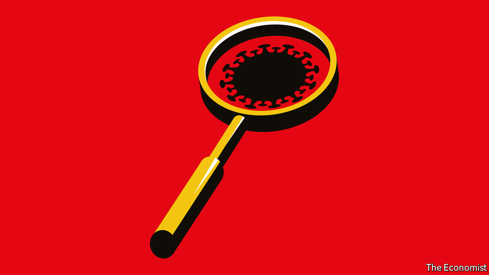

###### The virus detectives

# Germany’s contact tracers try to block a second covid-19 wave 

##### A low-tech technique that worked in Asia is working in Europe, too 

 

> May 30th 2020 

IF YOU HAD fallen asleep three months ago in Germany and woken up today you might not immediately notice much amiss. In much of the country shops are bustling, museums have reopened, and any bar that can pass for a restaurant is pulling in custom. If the shuttered theatres and conference halls dampen the spirits, consolation may be found in the beer gardens, in full swing under the spring sun.

New covid-19 infections in Germany are now consistently below 500 a day. But as German states lift restrictions they must try to prevent a second wave. Masks are compulsory on public transport and in shops, and social-distancing rules remain in place (if often ignored). Borders and schools are partially shut. But perhaps most important in fighting contagion are Germany’s phalanx of contact-tracers—part detectives, part social workers, part medical auxiliaries and part data clerks.


Their work has three elements. First, to obtain from people who have tested positive for covid-19 a list of their recent contacts, and to categorise them. (Spending 15 minutes face-to-face with an infected person, for example, places you in a high-risk bracket.) Second, to alert those people and instruct them, if needed, to self-isolate for 14 days. Third, to check in with them periodically and get them tested, in some cases even if they show no symptoms.

In some countries contact-tracers work from home or outsourced call centres. In Germany they are housed in one of 375 Gesundheitsämter (public health offices), such as one in north Berlin recently visited by your correspondent. In a light-filled room lined with maps and charts, two dozen people (of a total staff of 98) were managing various aspects of the pandemic, from manning phones to tapping in data. Doctors were on hand, ready to be dispatched to administer tests. The work has changed in recent weeks, says Lukas Murajda, head of the office: 80% of the contacts his team follows up are now in care homes for the elderly or other residential centres.

The Robert Koch Institute (RKI), a federal health agency, provides local offices with guidance and basic software to crunch their data. It has also recruited and helped train 500-odd “containment scouts” to help overloaded areas. But the offices retain considerable leeway to organise their own work. Some struggle to co-operate or share information, a task already hampered by data-privacy rules. (Certain information may only be shared via fax.)

But the advantages of decentralisation far outweigh the drawbacks. Health workers who know their regions are better placed to chase down infection chains in potential hotspots like meat-processing plants. Better-off health offices often ditch the RKI software and build or buy their own. “That’s the beauty of it,” says Peter Tinnemann, an epidemiologist at the Charité University Hospital in Berlin. “Local workers adapt solutions to local circumstances.” Some regions are struggling to meet the federally mandated target of five contact tracers per 20,000 inhabitants. But if they have seen no new cases for a week or more, they may see no reason to try.

There are valuable lessons in the history of contact-tracing, a technique long deployed to manage outbreaks of tuberculosis and sexually transmitted diseases. “People underestimate the nature of the work,” says Marcel Salathé, a Lausanne-based digital epidemiologist. Inexperienced tracers may be unprepared for interviewees who react defensively to intrusive questions, or who fear their answers will send friends to quarantine. The two-day training of Mr Murajda’s recruits is limited to technical matters, though psychologists are on hand to help. Offices need multilingual staff to reach non-German-speakers. Most tracers read to their charges from prepared scripts, but the better-trained may deviate from it. Rather than ask directly about contacts, for example, they might jog interviewees’ memory by asking general questions about their social networks.

Having abandoned contact-tracing in March, only this week did Britain kick it back into gear. American states have also struggled to up their efforts. In Germany the Gesundheitsämter have long been underfunded; many in particular lack doctors, who can earn more in hospitals. Yet most offices maintained contact-tracing throughout the pandemic, even if understaffed spots in rural areas struggled when daily infections were in their hundreds. Many pulled in furloughed colleagues, like teachers or librarians. Some called on the army. Baden-Württemberg, an especially hard-hit state, ramped up contact-tracing staff from 500 to 3,000 and never saw infections spiral out of control, says Manne Lucha, its social-affairs minister.

Manual contact tracing has its limits: even the most helpful patient will struggle to identify fellow passengers on a train. Like other countries, Germany hopes to automate some tracing with a mobile app using Bluetooth. Yet its development has been plagued by technical and data-privacy woes; officials now hope to launch it in mid-June. Even then, technology can only support manual contact tracing, not replace it, says David Holtgrave, dean of the school of public health at the University of Albany, in New York state. Germany’s virus detectives have plenty of work ahead. ■

Editor’s note: Some of our covid-19 coverage is free for readers of The Economist Today, our daily . For more stories and our pandemic tracker, see our 

