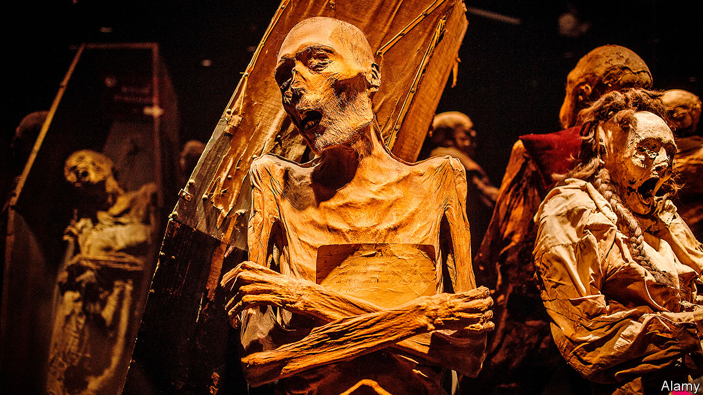

###### Death and taxes

# Mexico’s missing mummy mystery 

##### Heedless of curses, The Economist goes to investigate 

 

> May 30th 2020 

WITH ITS steep hills, candy-coloured buildings and winding passageways, Guanajuato has a claim to be Mexico’s most beautiful city. Its main tourist attraction may be the country’s most ghoulish. The Museum of Mummies, set underneath the city’s Santa Paula cemetery, contains 117 specimens. They are encased in glass, some standing, some recumbent, clothed and naked, their faces alive with agony. When local media reported in May that 22 mummies had gone missing, the city’s living residents grimaced.

The claim comes from Paloma Reyes Lacayo, who was the museum’s chief between 2015 and 2018. Mistrustful of its current managers, she requested an inventory. Some of the mummies did not appear on it. Locals suspected that someone in the city’s hierarchy had purloined its patrimony. Nonsense, says the city’s cultural director, Jesús Antonio Borja. The mummies are all present and accounted for.


They are the offspring of Guanajuato’s dry, hot climate and Mexico’s political history. After the country’s government separated church and state in the 1850s, towns created their own cemeteries. To defray the cost of Santa Paula cemetery the local government levied a burial tax on survivors, payable every five years. If the money did not come, the cemetery disinterred the remains. Not many years after its founding workers began to discover that Guanajuato’s arid heat had preserved some of the bodies that had been buried above ground in Spanish-style wall vaults. “Mexico is so generous that its wonders happen by accident,” mused Juan Villoro, a writer, in a recent newspaper column. “Egypt dedicated centuries to the art of embalming. Here the mummies appear without effort.”

They have slowly gained fame. In “Las Momias de Guanajuato”, a wrestling film released in 1972, they come alive and attack El Santo, Mexico’s most popular luchador. In the film’s thrilling climax he prevails by choke-slamming them in Santa Paula cemetery. The museum, now in a pandemic pause, draws 620,000 visitors a year, three times the city’s population. It is the city’s second-biggest source of revenue after property tax.

The late El Santo’s son, who wrestles as El Hijo del Santo, rejoiced when the city issued a press release claiming that no mummies had gone missing. “I am sharing great news,” he tweeted. Mr Borja has invited more sceptical observers to come to Guanajuato to confirm his headcount.

The Economist accepted. Our tally: 59 mummies on display in the main museum, 22 in storage and 36 in a separate exhibition space in the nearby town of Sangre de Cristo. No absentees. The inventory Ms Reyes had requested had listed only the mummies on display.

That may not be the end of the spat over Guanajuato’s mummy management. Ms Reyes, who has degrees in biochemical engineering and cultural management, accuses Mr Borja of irresponsibly sending mummies for exhibitions in other cities. A similar museum in Sicily never lends out its mummies. Mr Borja answers that Ms Reyes failed to deal with a fungus that infected a mummy in 2016.

The two are at odds over plans for a new museum, which will cost 200m pesos ($9m). Mr Borja says it will relieve crowding and provide space for mummy maintenance. Ms Reyes says Guanajuato’s pro-business government wants a new site for the museum because shops are more profitable neighbours than gravestones.

No one questions the power exerted by the mummies themselves. To some residents, they are ancestors rather than display objects. Some visitors see in their arrested decomposition a sign that life refuses to surrender fully to death. Ms Reyes calls the time she spent caring for them “the best years of my life”. The fuss she helped create at least gives them more time in the sun.■

