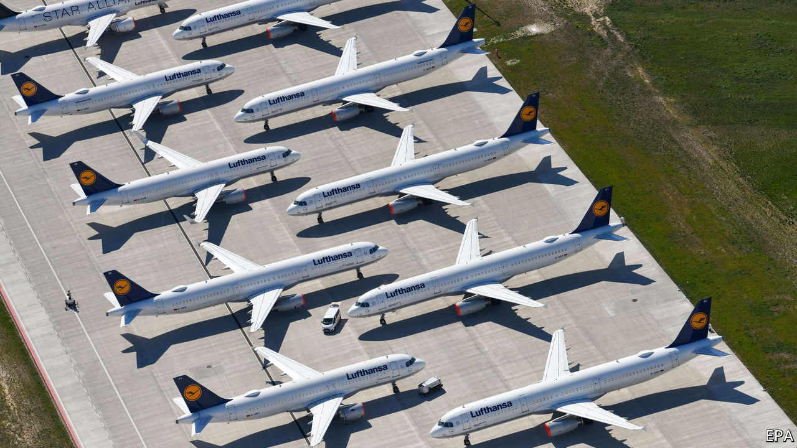

###### 

# Business this week 

#####  

 

> May 28th 2020 

The German government offered to bail out Lufthansa, with an equity injection of €6bn ($6.6bn) and loans worth €3bn. The government, which would own a fifth of the airline, will nominate two people to sit on the company’s board. The board, however, initially refused to back the deal, after the EU required Lufthansa to give up slots at Frankfurt and Munich airports. Ryanair, Europe’s biggest discount carrier, said it would appeal against the bail-out (it is also protesting against the rescue of Air France-KLM), arguing that it would “strengthen Lufthansa’s monopoly-like grip on the German air travel market”. See . 

Macron in the driver’s seat


In France the government said it would supply €8bn ($8.8bn) in aid to the country’s carmakers. Emmanuel Macron, the French president, hopes the money will “transform” the industry, providing incentives to produce electric and hybrid vehicles and increasing subsidies to motorists who buy greener cars. Some said the deal was merely old-fashioned dirigisme. The government is also finalising a separate €5bn loan for Renault. See .

Aston Martin shook up its management team, and said Andy Palmer had agreed to step down as chief executive. The British maker of sports cars had a disappointing IPO in 2018; its share price has fallen by 90% since then. The changes in leadership were driven by Lawrence Stroll, a businessman and part-owner of a Formula One racing team, who put together a consortium to rescue Aston Martin earlier this year, becoming its chairman. The new CEO will be Tobias Moers, who is currently in charge of Mercedes-AMG. He starts his new job in August.

The pandemic claimed another high-profile business failure, when Hertz filed for bankruptcy protection in America. The car-hire company, which also owns the Dollar and Thrifty brands, saw its sales collapse when business travel and tourism came to a virtual halt. With a debt burden of at least $17bn Hertz had been struggling before the outbreak.

Uber decided to cut a quarter of its staff in India as part of the restructuring of its business that it recently announced. It is also closing its office in Singapore, as it considers a broader retrenchment of its ride-hailing services in Asia.

Amazon was reportedly in talks to buy Zoox, a startup that is developing electric-powered robotaxis. Amazon’s interest in autonomous-vehicle technology so far has focused on how it might enhance the delivery of its goods.

Latin America’s largest airline and its affiliates in Chile, Colombia, Ecuador and Peru filed for bankruptcy protection because of covid-19. Latam has its headquarters in Santiago, Chile’s capital, and also operates subsidiaries in Argentina, Brazil and Paraguay. It filed for bankruptcy protection in New York, where it has a listing.

China’s securities regulator sharply criticised legislation in America that would require companies to delist from American exchanges if they do not open their accounts to national audit rules. A bill passed the American Senate recently in the wake of an accounting scandal involving Luckin Coffee, a Chinese Starbucks, and is to be reviewed by the House of Representatives. But China’s regulator warned that the measures target China, have “clearly departed from professional considerations” and were “politicising” securities.

Buoyed by the further easing of lockdowns and an unexpected rise in American consumer confidence, stockmarkets retained their fizz of the past few weeks. The S&amp;P 500 closed above the 3,000 mark for the first time since early March. Share prices in American banks have started to recover. JPMorgan Chase’s stock is up by 21% since mid-March, Bank of America’s by 25% and Citigroup’s by 43%.

Back to work

The New York Stock Exchange partially reopened its floors to traders. Around 100 were allowed to return if they promised not to use public transport to get there and not to sue the exchange if they contract covid-19. The traders were allocated desks behind screens and given strict instructions on social distancing.

Retail sales in Britain plunged by 18.1% in April from March, the largest drop on record since the data began in 1988. Sales of alcohol continued to rise.

Carluccio’s, an Italian-dining chain that was one of the first casualties of Britain’s lockdown, sold 30 of its restaurants to the group that owns Giraffe, which serves an eclectic menu.

Warner Music launched plans for an IPO on the Nasdaq exchange. The music company’s vast stable of artists includes Ed Sheeran and Bruno Mars. It used to be part of what is now WarnerMedia until it was bought out by Sir Len Blavatnik’s Access Industries in 2011. If it is in tune with market sentiment, the listing could value the company at up to $13bn, well above the $3.3bn that Sir Len paid for it.

