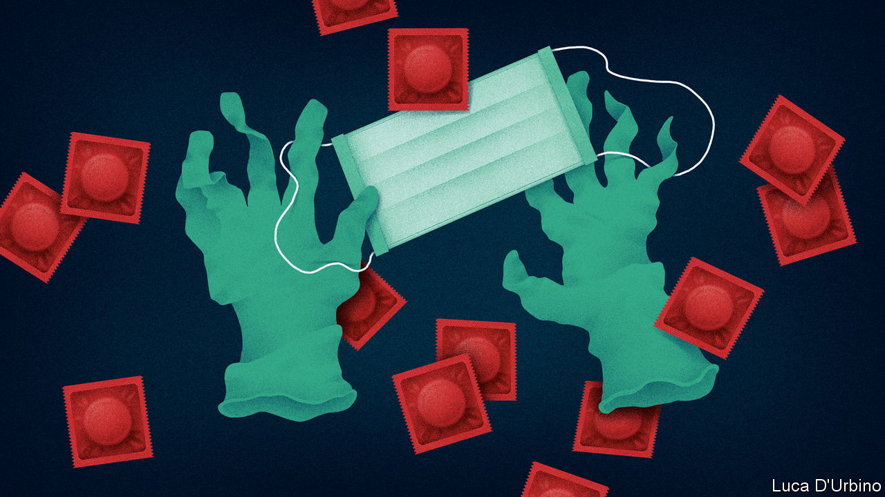

###### Social distancing and prostitution

# Germany helps sex workers idled by covid-19 

##### But they are still much worse off than before the pandemic 

 

> Jun 4th 2020 

THE EVENING sun is beating down on a small crowd gathered in Schöneberg, a district of Berlin, to mark the 45th International Whores’ Day. But Isabelle, a Macedonian transgender prostitute, is gloomy. “I remember how it was before,” she says. Cis women walked the streets north of the railway bridge, trans women to the south. Not these days. “I feel depressed,” says Isabelle. “It’s our job, you know?” Colleagues describe overbearing police, price-gouging hotels and clients seeking outrageous “corona-discounts”.

Few industries have been as pummelled by covid-19 as sex work, which in Germany is legal and regulated. Like many workplaces, brothels had to close in March. Yet although massage parlours and nail salons have reopened, prostitutes have been left in limbo. Some, such as Undine de Rivière in Hamburg, are innovating with hands-off services like fetish videos or erotic-hypnosis recordings. But it is hard to make a living that way, and few have the skills to try. Many migrants from eastern Europe, who are thought to make up more than half of Germany’s 400,000-1m sex workers, went home before the borders closed.


Others have been forced underground. Emma, a recent arrival from America, got a tongue-lashing from two regulars she suggested meeting after the ban took effect. “I’m trying to keep food on the table,” she says. Some have drug habits to feed, or families abroad to support. The state has offered one-off grants of up to €9,000 ($10,000) to freelances, and unlike in most countries sex work is covered. But foreign prostitutes are typically ineligible and many others do not know how to apply, or do not want to, says Andrea Hitzke of the Dortmund Midnight Mission advice centre. Most are self-employed, and so cannot get furlough pay. Lobby groups like the Professional Association for Erotic and Sexual Services (BesD) have set up funds for sex workers facing penury.

Politicians who think legalisation fosters trafficking and violence spot an opportunity. In May 16 MPs called for Germany to adopt the “Nordic” model, which criminalises the buying, rather than the selling, of sex. Many prostitutes hate this idea, since it pushes them into the shadows. Sex-worker groups want the state to allow them to work again.

The BesD’s proposed hygiene code would ban prostitutes from kissing or other “oral services”, oblige them to wear gloves during certain acts and to keep their heads a forearm’s distance from their clients’ at all times. Face-masks would be obligatory. Customers would have to leave contact details, perhaps in sealed envelopes. Similar rules will apply in Austria if its brothels reopen on July 1st, as planned. “It’s not very sexy,” admits Ms de Rivière. “But it’s necessary.”

Editor’s note: Some of our covid-19 coverage is free for readers of The Economist Today, our daily . For more stories and our pandemic tracker, see our 

