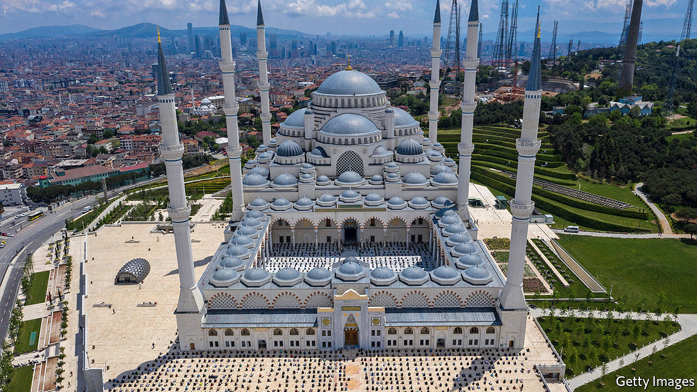

###### Strength in numbers

# What Turkey got right about the pandemic 

##### It helps not to keep old people in nursing homes 

 

> Jun 4th 2020 

Editor’s note: Some of our covid-19 coverage is free for readers of The Economist Today, our daily . For more stories and our pandemic tracker, see our 

IN EARLY MARCH, before Turkey had formally registered its first case of covid-19, Sabah, a pro-government newspaper, praised the country for setting a “leading example” in the fight against the novel coronavirus. Some 160,000 confirmed cases later, the fanfare is rather quieter. Still, as the country emerges from lockdown, there is some cause for cheer. Turkey’s government has a reputation for throttling dissent and picking fights with its European and American allies. But it has handled the pandemic better than many.

Turkey has defied lockdown orthodoxy. Rather than place the whole economy in a coma, the authorities ordered the young and the elderly to stay at home and asked everyone else, aside from those in consumer-facing businesses, to show up for work. The biggest cities were placed under a blanket curfew on weekends and holidays. Some domestic flights resumed on June 1st, and cafés, restaurants, beaches and parks reopened, but children and people 65 and over are still not allowed outdoors for more than a few hours a week.


The strategy seems to have worked. The most vulnerable escaped the worst of the pandemic, while those infected, mostly working-age adults, generally recovered. Despite a high number of cases, the death count (under 4,600 as of June 2nd) has been low, even given the likelihood of serious underreporting. New cases have plateaued at around 1,000 a day since mid-May, down from a high of over 5,000 a month earlier. Deaths have never topped more than 127 in a single day. Turkey has ended up with roughly the same testing rate as France and a death rate ten times lower than Britain’s. Demography mattered. Among OECD countries, only Mexico and Colombia have a lower proportion of people aged 65 and over than Turkey does. Few elderly Turks live in nursing homes, which became breeding grounds for the virus in Europe and America.

Any country that keeps its factories open during a pandemic had better make sure its health system can cope with the consequences. Turkey’s rose to the challenge. Over the past couple of decades, Mr Erdogan and his governments have poured tens of billions of dollars into health care, most recently by building a network of hospitals the size of international airports. The latest of these opened on May 21st, boasting nearly 2,700 beds, about a sixth of them in intensive-care units. Some of the contracts were awarded to cronies, and the hospitals may end up bleeding cash. But the extra capacity has helped. The wave of covid-19 infections never came close to overwhelming the health system and medical supplies never ran out. Credit is due not just to Mr Erdogan and his impressive health minister, Fahrettin Koca, but also to opposition mayors, especially in Istanbul and Ankara, who have raised funds and organised the distribution of masks.

Mr Erdogan muzzles the media, locks up critics and flouts some of the most basic norms of democracy. But there is another reason why he and his ruling AK party have not lost a general election in almost two decades. As even its critics acknowledge, AK works hard and gets things done. If opposition parties were ever to take power—and whether Mr Erdogan would allow such a thing is the biggest unspoken question in Turkish politics—they would have to prove they can work just as hard. ■

