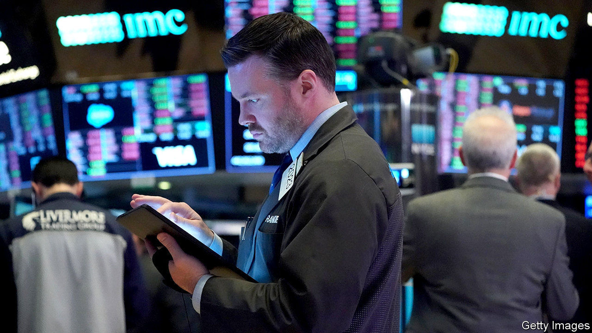

###### Counting the cost

# America’s public-pension funding crisis worsens 

##### Funding ratios have fallen and the cost of provision has risen 

 

> Jun 4th 2020 

SHARE PRICES may have rallied from the depths they plumbed when the coronavirus pandemic was spreading rapidly around the world. But the S&amp;P 500, America’s main stockmarket index, is still below its level at the start of the year. That is bad news for pension funds, which rely on their investments to pay out benefits to retired people.

Unless markets recover fully, the Centre for Retirement Research (CRR) in Boston estimates, the average funding ratio of American state and local-government pension plans for the fiscal year ending in June 2020 will be 69.5%. That is the lowest level this century. Back in 2000 the average plan was fully funded.


Even that measure relies on the generous way that public-sector plans can calculate their pension liabilities. The cost of paying pensions stretches decades into the future; those expected payments must be discounted in order to calculate the current funding cost. The higher the discount rate, the lower the current cost appears to be. Private-sector pension funds must use corporate-bond yields, currently low, as a discount rate; public-sector funds are allowed to use the expected rate of return on their investments. Many assume a rate of 7-7.5%, which makes the current cost of funding pensions look lower.

In the long run, however, accounting conventions cannot lower the actual cost of providing pensions. Many companies in the private sector have abandoned offering pensions linked to workers’ final salaries because of the increased expense. The CRR figures show that the cost has been steadily rising for public-sector funds as well. Back in 2002 they paid an average of 7.8% of payrolls to fund pensions; in 2020 that contribution is likely to be 19.7%, the highest so far this century. If a more conservative accounting treatment were used, closer to the private-sector approach, that rate would double. Even assuming public pension funds continue to use their current approach, the CRR estimates, the contribution may rise to 29.1% of pay by 2025 if markets are slow to recover.

This is a slow-motion crisis, precisely because the liabilities stretch out over many decades. But by 2025 eight funds may have only enough assets to cover less than four years of benefits, the CRR estimates; three of these funds—Chicago Municipal, Dallas Police and Fire, and New Jersey Teachers—will have a mere two years’ worth. If that happens, taxpayers will simply have to stump up more money to keep benefits flowing. ■

Editor’s note: Some of our covid-19 coverage is free for readers of The Economist Today, our daily . For more stories and our pandemic tracker, see our 

