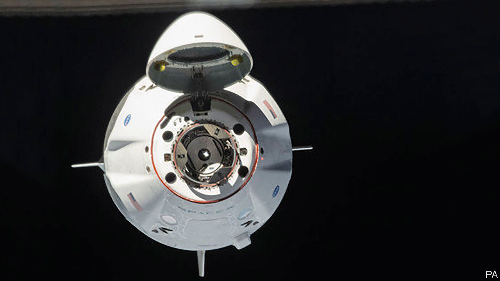

###### Orbital liberties

# SpaceX is making human space travel a routine form of commerce 

##### And a model of public-private partnership 

 

> Jun 4th 2020 

AT AN ALTITUDE of 400km, with both vessels travelling at 7.7km a second, the Crew Dragon capsule took orbital advantage of a freedom denied to the socially distanced on Earth to come within two metres of the International Space Station. After a final 20 seconds of stately approach the Endeavour’s capture ring made contact with the station’s docking adaptor. The short voyage’s simple, straightforward end belied its significance.

In May 2012 SpaceX, a Californian firm founded by Elon Musk, started using its spacecraft to make cargo deliveries to the space station built by America, Russia, Europe, Japan and Canada. (They started being used to bring the station’s rubbish back down a week later.) The mission it launched on May 30th, though, used a completely revamped version of the firm’s Dragon capsule to carry up something much more precious: two astronauts, Robert Behnken and Douglas Hurley. They were the first Americans to reach orbit in an American spacecraft since the last flight of the space shuttle Atlantis in 2011. They were the first astronauts of any country to reach orbit in a vessel designed and operated by a private company.


This feat is good news for astronauts, for American taxpayers and for the world at large (see ). The astronauts get a ride in a spacecraft that is spiffier than the Russian Soyuz capsules which have been Hobson’s choice for the past ten years. The Crew Dragons were designed afresh in the 2010s, rather than being updates of a workhorse from the 1960s. They seat up to seven people, not three, and even have toilets. American taxpayers get space flights which cost much less than they would if the government had overseen every detail of the spacecraft’s design and operation, as it used to. And the world at large gets the opportunity for people to fly to orbit not just as civil servants—albeit rather dashing ones—headed for far-flung government establishments, but as private daredevils, tourists and entrepreneurs heading, in the long run, who knows where.

It would be wrong to see this as simply an example of the private sector outperforming the public sector. Admittedly NASA, America’s space agency, has a disastrous history of over-expensive space-flight projects—such as the shuttle—developed with an eye to keeping money flowing to contractors and NASA facilities rather than in order to do the job at hand expeditiously. But SpaceX’s success is not a matter of outcompeting NASA so much as a matter of NASA learning how to do things better.

The government did not just go to SpaceX with an open chequebook, order a ride and sit back. It provided thought-through contracts that helped the firm develop the technologies it needed, first for its rockets, then for uncrewed capsules, then for crewed ones. It also promised to provide a market once the capsules were ready. This gave SpaceX’s engineers the resources they needed to do the job at a fraction of what old-fashioned procurement costs: a model of public-private partnership.

And it is not only NASA that benefits. The Crew Dragon is available to anyone who can pay. To date, almost all human space flight has been governmental, but it does not have to be. SpaceX has already signed up with companies offering Crew Dragon trips to the space station and to an orbit around the Earth. It has also made a deal to fly a Japanese billionaire around the Moon once its next spacecraft, Starship, is ready. Some intrepid, wealthy souls have already visited the space station as tourists. More can now follow.

In themselves, such very high jinks may not matter much. But in the long run, if there is to be a future for humans in space, humans will need to be able to get there. Being able to do so just by buying a ticket to orbit is a crucial step in that direction.

And there could be further such steps. Parts of NASA’s programme for a human return to the Moon are now being run in the same commercially focused way as the Crew Dragon programme was. All of the programme should be run this way, thereby producing an infrastructure available to the private sector, too. Even with such infrastructure, profitable lunar ventures seem unlikely. But if private companies want to try to prove the contrary, it is good that they should be free to do so.■

