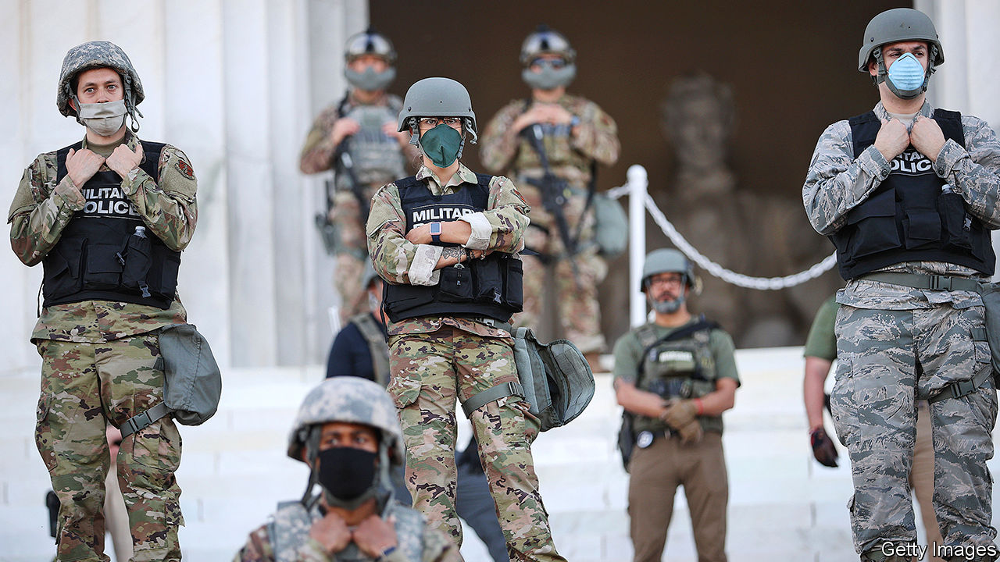
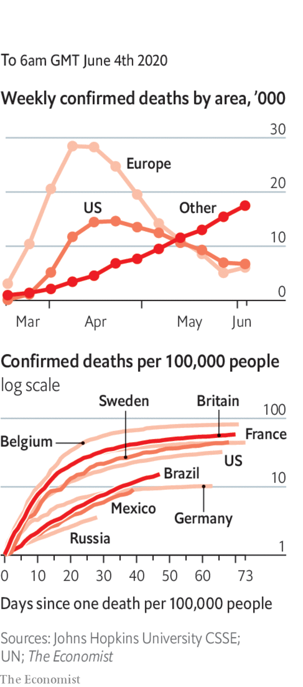

###### 

# Politics this week 

#####  

 

> Jun 6th 2020 

Both riots and peaceful protests spread across America in response to the death of George Floyd. It was the country’s worst unrest for decades, prompting many states to call out the National Guard and cities to impose curfews. Looting accompanied the chaos; shops in midtown Manhattan were ransacked. The policeman who knelt on Mr Floyd’s neck for nine minutes was indicted for second-degree murder; the three officers who failed to stop him were charged with lesser offences. Donald Trump suggested sending in the army to restore order. Mark Esper, the defence secretary, said soldiers should only be deployed as a last resort. See .

NASA launched astronauts into space from American soil for the first time since the end of the shuttle programme in 2011. A capsule carrying two astronauts to the International Space Station was propelled by a SpaceX rocket, marking the first time a private company has sent humans into orbit. See .


Steve King, a Republican congressman from Iowa, who once questioned whether white supremacy was offensive, was booted out by voters in a primary election.

In response to China’s move to impose a new national-security bill on Hong Kong, Donald Trump said his administration would “begin the process” of scrapping the “full range” of policies that treat the territory differently from the rest of China. He also said he was “terminating” America’s relationship with the WHO, citing China’s “total control” over the body, and banned Chinese airlines from flying to the United States from June 16th, a tit-for-tat measure. China’s aviation regulator indicated that it would allow limited flights to resume. See .

Britain’s prime minister, Boris Johnson, suggested that if China enacts the national-security law in Hong Kong, Britain could make it easier for up to 3m Hong Kongers to go to Britain to live and work and eventually become citizens. Beijing told Mr Johnson to stop interfering in its affairs. See .

Bangladesh,India and Pakistan ended lockdowns intended to slow the spread of covid-19, even as all three countries continued to register record numbers of new cases. See . 

Taiwan’s constitutional court struck down a law that criminalised adultery, as an unwarranted invasion of personal privacy. Most of the people convicted under the law were women.

The Philippines retracted its decision in February to end a treaty under which American troops visited the country to conduct joint exercises and train Filipino troops.

As schools started to reopen the British government faced a backlash from teachers’ unions and local authorities, who claim it is still unsafe. Social distancing has meant that class sizes have been halved.

The German government unveiled a €130bn ($145bn) stimulus package that includes a cut to value-added tax, aid for local authorities and incentives to buy electric cars. It will also issue a one-off €300 boost to child benefit in order to raise household spending.

After years of fixing the petrol price close to zero, Venezuela’s government raised it to near market levels. For cars the first couple of tankfuls a month will continue to be nearly free, but refills after that will cost 50 cents a litre. The government hopes to alleviate chronic fuel shortages and reduce a massive budget deficit. Venezuela’s economy has shrunk by two-thirds since 2013.

Bolivia’s electoral tribunal agreed with political parties to hold a national election by September 6th. The vote will be a re-run of the one held in October, in which the president, Evo Morales, claimed victory but left office, and the country, after protesters accused him of electoral fraud.

Israel told thousands of students and teachers to go into quarantine for covid-19. Almost 250 people tested positive for the virus in schools, which reopened last month. Dozens have closed again.

Iran, which has had one of the worst outbreaks of covid-19, reported its highest daily number of cases in the past two months. The government warned of a second wave, even as it attempts to reopen businesses, schools and mosques. “People seem to think the coronavirus is over,” said the health minister; it “may come back stronger than before”.

Governments in the Middle East began opening some of the most important sites in Islam, such as the al-Aqsa mosque in Jerusalem. Worshippers had their temperatures checked and were asked to observe social distancing and wear masks. Islam’s holiest site, the Grand Mosque in Mecca, remained closed.

The UN said Libya’s warring parties have agreed to restart talks over a possible ceasefire.

A court in South Africa ruled that a ban on the sale of cigarettes and alcohol was unconstitutional. The ban was part of the government’s lockdown regulations to fight covid-19.

A militia leader in the Democratic Republic of Congo was arrested for the murder three years ago of two UN experts, one of whom was beheaded, and their interpreter. They had been investigating abuses of human rights.

Coronavirus briefs 

 


South Korea temporarily closed some schools that had only just reopened after recording the highest spike in new cases in two months.

The Chinese city of Wuhan tested all of its 10m residents for covid-19 over ten days. The campaign identified just 300 infections, all of which were asymptomatic.

The head of Britain’s statistics agency criticised Matt Hancock, the health secretary, for data published on testing, saying the distinction between actual testing and posting test-kits was “too often elided” during official presentations. 

Mexico, which has the second-largest number of deaths from covid-19 in Latin America, loosened lockdown measures.

French cafés and restaurants reopened after 11 weeks of lockdown. The joie de vivre is still subject to social-distancing restrictions.

