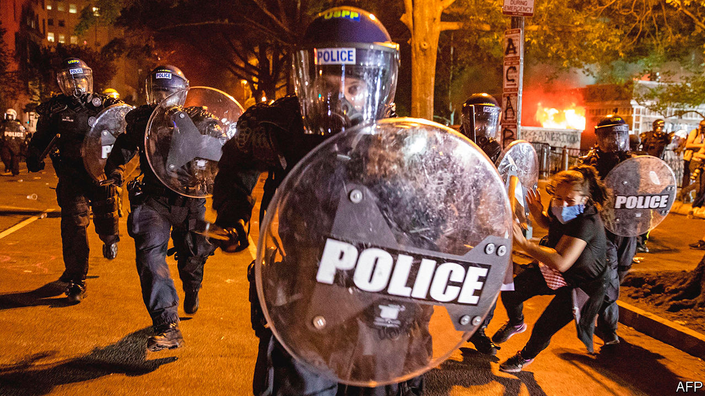
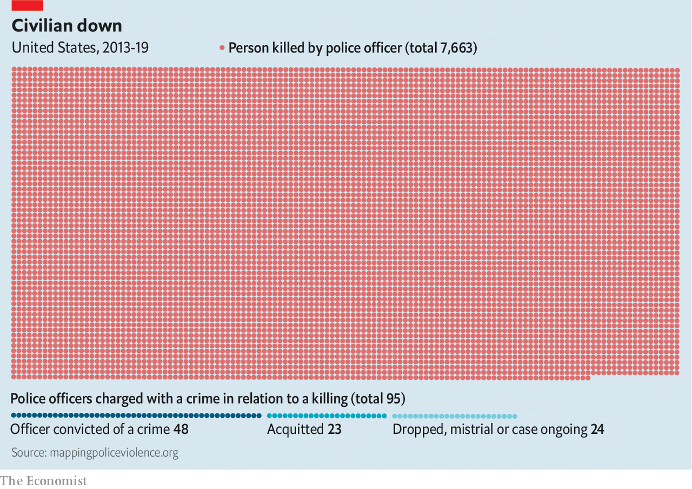
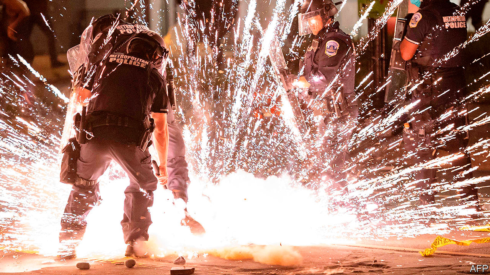

###### Order above the law

# How to fix American policing 

##### The country’s forces kill too many of those they serve. Here is how to change that 

 

> Jun 4th 2020 

AMERICA IS engulfed in its most widespread, sustained unrest since the late 1960s. It was sparked by an act of police brutality caught on camera. George Floyd, an African-American, allegedly used a counterfeit $20 at a convenience store on May 25th. Derek Chauvin, who has since been fired by the Minneapolis police force and charged with murder, handcuffed Mr Floyd, who, citing claustrophobia, refused to get into a police car. Mr Chauvin, who is white, shoved him to the ground and pressed his knee into Mr Floyd’s neck for almost nine minutes—nearly three of them after Mr Chauvin’s fellow officers failed to detect Mr Floyd’s pulse.

In the days since, Americans have seen their police forces look and act less like public servants sworn to protect their fellow citizens than like an invading army. A policeman in Brooklyn yanked off a protester’s mask to pepper-spray him in the face. One day earlier, also in New York, a police officer reportedly called a young protesting woman a “stupid fucking bitch”, before hurling her onto the pavement hard enough to leave her concussed, with a seizure. A phalanx of police storming down a residential street in Minneapolis paused to shoot paint canisters at a woman on her own front porch. Police across America have tear-gassed peaceful protesters and, according to the Committee to Protect Journalists, there have been around 250 incidents of reporters being punched, attacked with tear-gas canisters and shot with pepper balls.


Such actions have helped fuel and further legitimise the unrest, in which at least 11 people have been killed, hundreds injured and nearly 10,000 arrested across America. In a widely read article published on June 1st, Barack Obama argued that the protests “represent a genuine and legitimate frustration over a decades-long failure to reform police practices”. He is right. But recognising that frustration is much easier than reforming the fiendishly complex institution of American policing.

One reason for that complexity is that, unlike policing in most European countries, American policing is mostly local. There are almost 18,000 law-enforcement agencies, most of them small, only 65 of them federal. All told, they employ around 800,000 officers. Chiefs appointed by mayors head most big-city departments. Elected sheriffs head most county forces.

Also unlike most police forces elsewhere, American police patrol a heavily armed country. That can make their job dangerous—between 2000 and 2014, 2,445 died on duty, compared with just 25 in Britain. But police also return fire, killing around 1,000 people each year. African-Americans are nearly three times likelier than whites to be killed by police. In fact, being killed by police is now the sixth-leading cause of death for young black men. African-Americans are likelier to be convicted, and serve longer sentences than whites convicted of the same crime; they comprise 13% of the adult population, but 33% of the imprisoned population.

Many have cited these disparities as evidence of systemic racism in American policing—and indeed, calls for reform often start with recognising and working to root out such bias. Not everyone is convinced. Robert O’Brien, President Donald Trump’s national security adviser, told CNN on May 31st that though “there are some bad cops that are racist” he did not think there was “systemic racism”. But systemic racism does not mean that all officers are racists or bad people; it means that the system operates in a racially biased manner regardless of individual motivations. Mr O’Brien is doubtless correct that not all officers are racists, but given the vast racial disparities across the criminal-justice system—for which police are the intake valve—his scepticism is difficult to justify.

 


Some argue that education can help root out officers’ implicit biases. But evidence that this works is mixed, not least because many react as Mr O’Brien did, by treating discussion of implicit bias as an attack on individual officers’ character. Phillip Atiba Goff, who heads the Centre for Policing Equity, a think-tank, puts his faith in data and in training.

Unfortunately, reliable data about policing and racial bias are hard to come by, as Mr Goff noted in a paper in 2012, co-written with Kimberly Barsamian Kahn, entitled “Racial Bias in Policing: Why We Know Less than We Should”. The problem is not just that data-collection practices vary widely among law-enforcement agencies. It is also that the data collected are rarely dispositive. As Mr Goff asked in that paper, “If Latinos are arrested at twice their representation in a given population, does that mean that there are too many or too few officers in their neighbourhoods? Similarly, if blacks are stopped at twice their representation in a given population, is that because they are committing more crimes (as those who face discrimination in employment, housing, health care, wealth accruement, and education might), or because the police are biased against them?”

In April the Audacious Project, which funds ambitious ideas, announced it would give Mr Goff’s institute $30m to expand its Compstat for Justice project (Compstat is a statistics-driven management programme used by many police departments), which will track police data, when and where police stopped people or used force, and overlay them with census and geospatial data. Mr Goff hopes to determine when and where changing police policies could improve outcomes.

As an example, he recalls working in Minneapolis, where he found that a disproportionate number of incidents in which police used force involved addicts or the mentally ill. “This doesn’t mean that police policies are targeting folks with serious mental illness,” he explains. Nor does it evince police animus. “To some degree,” Mr Goff says, “we know that it was 911 calls that targeted them, and [when those calls come in], law enforcement can’t say, ‘I think you’re racist; we’re not coming’.” Without better social services, police have to respond, and improving their training for dealing with the mentally ill should lead to fewer uses of force, resulting in fewer injuries and better relations between police and the communities they serve.

Another Camden afternoon

Some police forces have taken it upon themselves to improve community relations. Many police chiefs—and even more unusually, police unions, which tend not to criticise rank-and-file officers—condemned Mr Chauvin’s actions. In Flint, Michigan, and Camden, New Jersey, senior officers even joined the marchers. “Before Saturday,” when Camden’s march took place, said Joseph Wysocki, the city’s police chief, “I had never done the peace sign ever.” Now, he says, officers and residents flash the sign to each other.

Camden, a city of around 74,000 people just across the Delaware river from Pennsylvania, took an unusual approach to police reform. For years it was among America’s most violent cities, with the country’s fifth-highest murder rate in 2012, when 67 people were killed. The next year it disbanded its 141-year-old police department and reconstituted it as a county-wide force, hiring back most of the officers it had laid off, at lower salaries and with fewer benefits. But the new force expanded—it has over 400 officers, compared with 175 in 2011—and stressed community relations and training, particularly in how to calm a volatile situation without using force.

In some places de-escalation training, like implicit-bias training, has become a box to tick: take a one-day course, and suddenly an officer knows how to de-escalate, or overcome all implicit biases. But, Mr Wysocki stresses, “You constantly have to reinforce training.” His force has a detailed use-of-force policy to which officers are held. When an officer uses force, the watch commander reviews bodycam footage of the incident, as does the internal-affairs department, which briefs Mr Wysocki. The officer and a senior officer then review the footage together.

“When you hit play,” says Mr Wysocki, “their perspective changes. They see it. We slow down and critique what they’re doing.” That seems to work: in 2014 citizens lodged 65 excessive-force complaints. Last year they lodged three. As relations between the police and the community have improved, Camden has grown safer: in 2018 it had fewer than one-third of the murders it did in 2012. As a lawyer who helped a major-city force with its reforms explained, “A community that trusts police more, that’s a community more inclined to give information to police about crime, partner with police about quality-of-life problems, and help the police do what they need to do to keep things safe. Communities that don’t trust the police have lower homicide-clearance rates.”

Camden’s use-of-force policy notes that officers who violate it can face “disciplinary action, up to and including termination”. In much of America, however, police unions make firing or disciplining officers difficult. In Chicago, for instance, officers do not have to provide a statement to investigators until 24 hours after a shooting. Janee Harteau, a former police chief in Minneapolis, complained that the union and union-mandated arbitrators reinstated officers whom she wanted to fire.

Minneapolis’s union skirted a ban that Jacob Frey, the city’s mayor, imposed on “warrior-style training” for police officers. Many blame such training—along with the steady flow of military-style weapons from the Pentagon’s surplus-weapons giveaways—for fostering police militarisation. Among other goodies, the Pentagon’s programme gave the police department that serves Los Angeles’s public schools three grenade-launchers in 2014 (the district returned them, though it kept 61 rifles and a mine-resistant armoured vehicle). A paper by Jonathan Mummolo, a political scientist at Princeton, found that police militarisation fails to enhance public safety while also eroding public trust in the police.

That makes sense: military forces are designed to win wars, not trust. The army’s goals and those of the police differ. The army kills its enemies. Police are supposed to serve and protect Americans without violating their civil rights—and to face consequences for violating those rights.

Yet when it comes to killing, few officers face consequences. Prosecutors are reluctant to bring charges against police. To advance in their careers, they need to win convictions; to convict people, they need police to testify. Police will not help prosecutors who go after cops. A paper by Nicole Gonzalez Van Cleve, a sociologist at Brown University who studies prosecutor-police relations, and Somil Trivedi, a lawyer with the American Civil Liberties Union, describes “an elaborate culture where police created cases for prosecutors who in turn were expected to defer to officers as a professional courtesy.”

Ms Van Cleve noticed that as Mr Chauvin choked Mr Floyd, he “stared straight at the camera. He didn’t look anxious or nervous. He knows he’s being filmed and watched. You don’t do that unless you know that prosecutors aren’t going to charge you.” Under pressure, prosecutors did charge Mr Chauvin. But police officers are rarely convicted for killing someone.

Police also have functional immunity from civil actions, thanks to a doctrine known as “qualified immunity”. This lets public officials have lawsuits dismissed, provided their contact did not violate, as the Supreme Court explained, “clearly established statutory or constitutional rights.” Courts interpret “clearly established” with baffling vigour: an appellate court dismissed a suit against officers accused of stealing hundreds of thousands of dollars in cash and rare coins while enforcing a search warrant, because “there was no clearly established law holding that officers violate the Fourth or 14th Amendment when they steal property seized pursuant to a warrant.”

 


With courts a narrow avenue for reform, some have started to advocate hitting law-enforcement agencies where it hurts: right in the budget. Advocates in at least 15 cities are waging campaigns to defund the police and use the money on other social services. Alex Vitale, a Brooklyn College professor and defunding advocate, says that people assume “the problem is that individual officers aren’t doing their jobs properly, when the problem really is that they have been asked to do too big a job.” Police have been asked to provide security in schools, respond to people’s mental-health crises and drug overdoses. “Policing is about use of force,” Mr Vitale explains. “It should be a last resort...We don’t want another community meeting with police. We want them out of our lives.”

Law and orders

Barry Friedman, who runs New York University’s Policing Project, has a simpler suggestion: clear legislation. Fewer than a third of states have passed use-of-force legislation. “Everywhere else in government, we legislate. We set out rules and policies. We don’t just leave it up to the regulated entity to set up their own rules.” In his view, state and city legislators, with public input, should pass laws to regulate police, not the police themselves. That will be a heavy lift: prosecutors and police unions will make life (meaning re-election) difficult for unfriendly politicians, while those who stand to benefit most—lower-income people who interact most often with police—are often politically disengaged.

Because most police agencies are local, regulating them is a local responsibility. But the federal government still has a role in police reform—or at least it did, in previous administrations. The Department of Justice (DoJ) can offer guidance and recommendations. Mr Obama’s administration invested heavily in police reform. In response to the killing of Michael Brown, an unarmed young black man, in Ferguson, Missouri, in 2014, Mr Obama created the President’s Task Force on 21st Century Policing, which produced an extensive set of recommendations on modernising police practices. He also boosted funding for Community Oriented Policing Services (COPS), a DoJ programme to help improve police-community relations which Mr Trump has repeatedly tried to cut.

The federal government can investigate and prosecute departments for violating people’s constitutional rights. Such investigations can lead to consent decrees, which are agreements between the department and the DoJ intended to avoid protracted litigation. Both sides agree on reforms to police practices, which an independent federal monitor oversees. Mr Obama’s administration investigated 25 departments and enforced 14 consent decrees. Mr Trump’s administration has markedly curtailed such investigations.

Mr Trump and his attorney-general, William Barr, have made pro-forma acknowledgments of the legitimacy of the protests, but have been far more enthusiastic about, in Mr Barr’s words, “apprehending and charging the violent radical agitators.” Mr Trump has encouraged mayors and governors to use their police forces to “dominate” protesters. That may work in the short-term. But Times Square is not Tiananmen Square, and America cannot repress its way out of this problem. Legitimate grievances left unaddressed will fester. Americans took to the streets six years ago, after Michael Brown was killed. They should not have to return in another six.■

