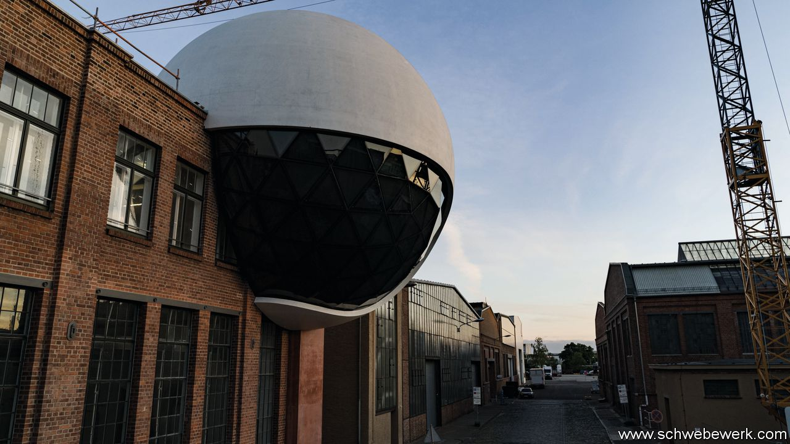

###### Living wills

# In the world of architecture, death is not always fatal 

##### Witness a new building in Leipzig by Oscar Niemeyer—who died in 2012 

 

> Jun 13th 2020 

IN PLAGWITZ, THE old industrial quarter of Leipzig, Ludwig Koehne stands in the middle of a giant sphere designed by Oscar Niemeyer in 2011, the year before the Brazilian architect died at the age of 104. The vaulted, part-glazed upper deck of the orb is due to open later this year as a restaurant, its cosier underbelly as a bar. “I wanted posthumous fidelity to the original design,” says Mr Koehne, a German entrepreneur. “The building had to have the master’s signature.”

The Niemeyer Sphere, as Mr Koehne calls it, perches on a narrow supporting tower at the edge of a two-storey building that houses the canteen of his two companies, Kirow Ardelt, which makes cranes, and HeiterBlick, a tram manufacturer. The smooth, brilliant-white dome contrasts with weathered, angular bricks of deep crimson—the result of an elaborate construction effort involving Jair Valera, longtime head of Niemeyer’s office in Rio, and the structural engineers and on-site architects assembled by Mr Koehne in Germany.


Alongside a project in southern France, this will count as the last work by Niemeyer, the progenitor of sensual architectural curves that complemented modernism’s unrelenting cubes. The completion of the sphere is a tribute to his vision—but it also highlights the collaborative nature of his profession and the slippery notion of authenticity. It always takes more than a single genius to make a beautiful building, which is one reason why, in the world of architecture, death is not always fatal.

The long hiatus between Niemeyer’s death and the opening of the sphere is not unprecedented. The IBM building in Chicago, designed by Mies van der Rohe, was finished two years after he died. For Le Corbusier’s church in Firminy in France, the gap was a whopping 41 years.

Exceptional as these posthumous cases seem, the teamwork they require is routine. “Most buildings are the product of lots of unrecognised labour,” says Donald McNeill of the University of Sydney, who has researched the methods of global architecture firms. He sees the popular focus on star architects as a simplification by the media and marketeers. Big projects, he says, are “the result of work by designers, engineers and even the clients”.

Their master’s voice

And, often, other architects. Rem Koolhaas, a Dutch architect, has noted the role of the American practitioners who in the 1950s helped big-name Europeans build legendary skyscrapers in New York. Emery Roth co-operated with Walter Gropius on the MetLife building, Philip Johnson lent van der Rohe a hand on the Seagram building, and Wallace Harrison oversaw Le Corbusier’s (and Niemeyer’s) input to the UN headquarters. Mr Koolhaas himself collaborated with Ole Scheeren on China Central Television’s HQ in Beijing; the so-called Gherkin in London is generally attributed to Lord Norman Foster, but Ken Shuttleworth drew the initial sketches. “There is a real difference between how architecture operates and how it is perceived,” comments Hilde Heynen of the Catholic University of Leuven in Belgium.

In the case of the Leipzig orb, the story began in 2007 when Mr Koehne visited Brasilia and was wowed by Niemeyer’s designs for the presidential residence, which was completed in 1960, and the city’s cathedral, finished in 1970. Four years later, mulling the idea of a restaurant—his canteen cook deserved a bigger stage, he says—Mr Koehne wrote to Niemeyer and was invited to Rio. Before long he received an email with sketches, side elevations and cross-sections. “It was all there, the tower as a supporting shaft, the sphere with two levels—just like it stands here now.”

But “the physics of the design were insane,” Mr Koehne thought. “How are we going to build this?” It took another two years to find the right structural engineers and several more to make meaningful progress. In the meantime, Niemeyer died. Luckily, Mr Valera was on hand and wanted to finish the project. “I knew Oscar extremely well,” he says. “That made it easy for me to know what he would have done”—which, Mr Valera recalls, always included listening to the client. His own role does not detract from the building’s authenticity, he insists: “This is a piece of architecture by Oscar Niemeyer—it was his idea.” ■

