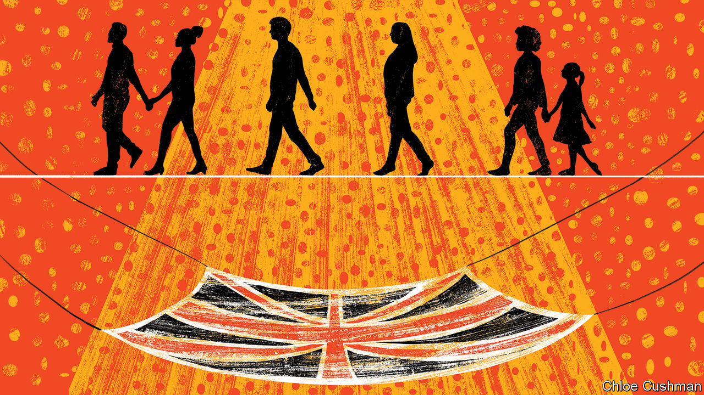

###### Social insurance

# Who bears risk—people or government? 

##### Covid-19 is drawing the state back into the insurance business 

 

> Jun 13th 2020 

RARELY, IF EVER, has a proposal moved from policy paper to implementation in a matter of days. The Coronavirus Job Retention Scheme was first proposed by the Resolution Foundation, a think-tank, on March 19th as the scale of the hit to the economy from the pandemic became clearer. Four days later, on March 23rd, Rishi Sunak, the chancellor, made the furlough scheme the centrepiece of the government’s economic response to the virus. Initially due to run for just three months, it will now be in place until at least October and is currently paying 80% of the wages, up to £2,500 ($3,200) a month, of nearly 9m British workers. It costs the Treasury about the same each month as the National Health Service (NHS).

Viewed through a narrow lens, the furlough scheme is simply a pragmatic response to an unprecedented economic shock, whereby the government is bearing an unusually large share of the risks posed by the covid-19 crisis. But through a wider lens it can be seen as a reversal of a long trend which has shifted the burden of risk onto individuals.


In the first half of the 20th century the state took it upon itself to protect people against, for instance, unemployment and ill-health, establishing compulsory unemployment insurance in 1911 and the NHS in 1948. In the 1980s, when Britons got fed up with the high tax rates levied in part to pay for this, the national mood shifted and the direction of travel changed.

Jacob Hacker, a political scientist, has observed the government and corporations dumping risk back on individuals in America and dubbed this phenomenon the “great risk shift”. In Britain, defined-benefit (DB) schemes, whereby workers pay a set percentage of their income each month in return for a certain level of annual income based on their salary when they retire, used to be the norm in the private sector. Workers in a DB system are, so long as the firm stays afloat, guaranteed their income no matter how long they live or how the investment portfolios perform. Such schemes are now mostly closed to new members and have been replaced by defined-contribution schemes into which people pay with no certainty about what they will get out of them. Individuals, not firms or the government, bear the risk if they live longer than expected or the asset market performs worse than expected.

Work, too, has become more precarious. Construction workers, for example, are now much more likely to be self-employed than in the 1980s, even if they work only for one firm, which often leaves them with meaner benefits if they fall sick. Courier firms often require employees to provide their own vehicles, and bear the risk if they go wrong. Zero-hour contracts, under which the employer does not guarantee a period of paid employment, are welcomed for their flexibility by many but have been abused by unscrupulous employers.

Volatility is a risk for workers, especially if they are poorly paid. The nearer the breadline you are, the more harmful its consequences are. A study by the Resolution Foundation of income volatility found that four in five low-paid workers (defined as earning around £10,000 a year) experienced volatile monthly earnings, compared with just two in three higher-paid workers (defined as an income of around £35,000). About two in five workers suffer what they term “persistent volatility”, with significant changes in their monthly income at least six times a year. And the state does less to protect those who find themselves out of work than it used to. Clare McNeil, of the Institute of Public Policy Research, a left leaning think tank, argues that the reduced levels of unemployment support are the “most vivid” example of the risk shift. The value of the main out-of-work benefit, as a share of average earnings, fell from more than 30% in the late 1960s to under 15% by 2019.

The shift that the furlough scheme represents may be no more than a break in a long-term trend, or it may presage a more significant reversal. Britain’s new political geography, with the government’s majority reliant on the so-called “red wall” of 50 former Labour seats in Wales, the Midlands and the north, points to a different policy agenda. Welfare spending runs at £2,300 per working-age person in those seats, compared with £1,600 in other Conservative areas, while average earnings are £44 a week lower. “I’m not sure people in the red wall are as happy bearing risk as our older coalition was,” says a Tory MP. Social care is one area where the direction of travel may be towards collectivising risk. A report in 2019 from Policy Exchange, a centre-right think-tank, with a foreword from Jacob Rees-Mogg, a right-leaning cabinet member, called for long-term social care to be funded through general taxation rather than by individuals.

Some free-market Tories now worry that a larger state, which carries more of the risk burden of society, will be a lasting consequence of the pandemic. Robert Colvile of the Centre for Policy Studies, a free-market think-tank, argues that resilience matters as much as risk. Spreading wealth more widely is one alternative to a state-funded safety-net. Those with assets to fall back on are better able to bear risks and, Mr Colvile says, “the old popular capitalism arguments about spreading home- and share-ownership are just as relevant today.” But that argument may be less politically appealing to this Conservative government than it was to previous ones.■

