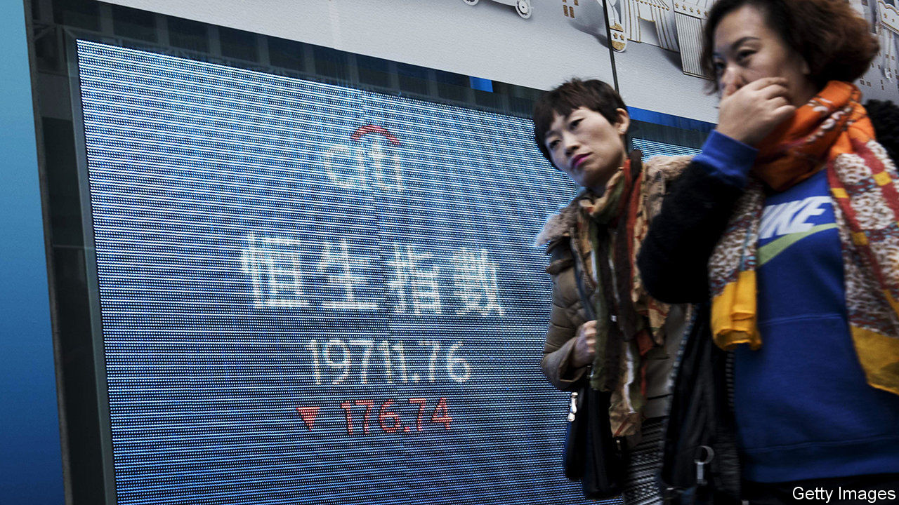
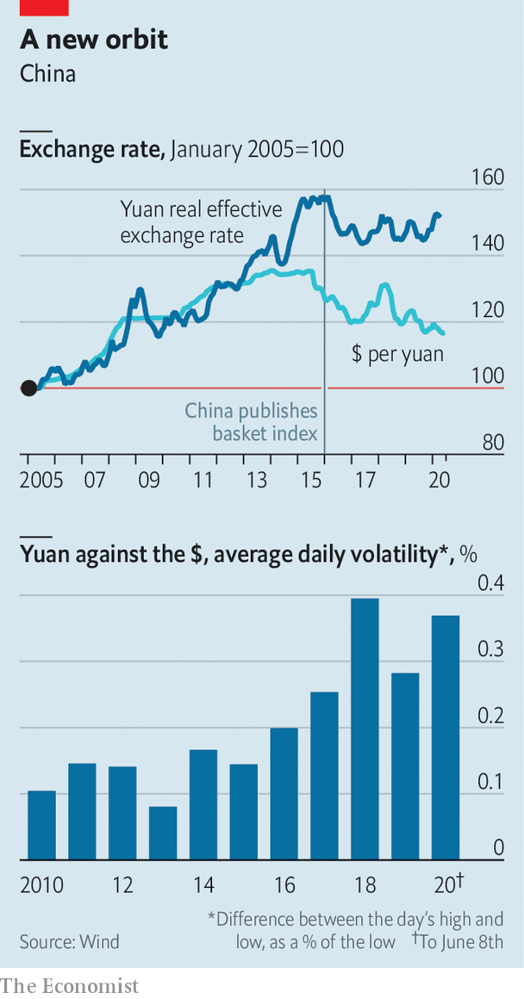

###### The 24-body problem

# The yuan has been one of the world’s most stable major currencies 

##### That is partly by design, and partly through luck 

 

> Jun 13th 2020 

IN THE “Three-Body Problem”, a popular Chinese science-fiction novel, the planet Trisolaris lurches between climatic stability and chaos as it follows an unpredictable orbit around the three suns in its star system. The solution, the inhabitants conclude, is to invade the Earth, so as to enjoy its smooth single-sun orbit. China’s central bank has been making a similar monetary voyage, in reverse.

For years the yuan revolved around the dollar. That benefited China, but it also stored up problems, which were exposed most dramatically in 2015, when it suffered massive capital outflows. Since then the central bank has steadily moved the yuan to a multi-currency orbit, tracking 24 in all. In economic terms, this is known as a currency-basket regime. In Trisolaris terms it looks like a “long Stable Era”, desirable but ultimately doomed.


Our planet’s inhabitants tend to analyse the yuan in comparison with the biggest currency in our solar system. So its recent depreciation against the dollar attracted much attention, especially in late May, when the People’s Bank of China (PBOC) set the yuan’s daily reference rate at 7.13 to the dollar, the weakest since 2008. Amid ever-increasing tensions with America, many economists predicted further depreciation, though the yuan has strengthened against the greenback so far in June.

 


But the singular focus on the dollar misses something important. At the end of 2015 China started announcing the yuan’s exchange rate against a basket of currencies. It took a while to work out the kinks in the new system, but the evidence is that the yuan has been among the most stable currencies in the world since mid-2016. Its real effective exchange rate—its value against the currencies of its trading partners, adjusted for inflation—has risen by just 0.2% over the past four years, anchored by the official basket (see chart).

The yuan’s stability is partly by design. Every morning the PBOC sets its reference rate on the basis of two variables: the previous day’s close against the dollar and the need to limit changes against the basket. The formula tends to push the yuan towards the middle of the pack. For instance, if the dollar is generally weak, the yuan will strengthen against it, but depreciate against other currencies—exactly what has happened in June. The PBOC also adds a third variable, the “counter-cyclical adjustment factor”, when it deems that the yuan is moving too much. This discretionary tweak is its way of leaning against what it defines as herd behaviour in markets.

Every day the yuan can move up or down by 2% from its reference rate against the dollar. Although it has never hit that limit, China has grown comfortable with allowing bigger swings within it. Over the longer term, this may have contributed to stability. On any given day, it is not obvious where the yuan will end up, pressing traders to take both sides of the market.

The basket regime seems to have allowed the PBOC to stop conducting heavy-handed intervention. Foreign-exchange reserves have held steady at around $3.1trn since mid-2016, implying that the yuan faces no great appreciation or depreciation pressure. But the PBOC has also become more targeted in its intervention. When the yuan has been weak, it has called on state-owned commercial banks to sell forward dollars in foreign-exchange swaps, to signal that the yuan will strengthen in the future. One strategist is convinced, albeit without any hard evidence, that the PBOC also has a team of traders who push the yuan around, wrong-footing other investors. And the biggest intervention of all is China’s capital controls, which remain very tight.

The yuan’s stability of the past few years has also been partly the result of good fortune. In that time the dollar, the euro and the yen—the three biggest suns in the yuan’s universe—have themselves been unusually stable against each other. If they were to veer off in wildly different directions, China’s basket regime would be tested. A better course for the world’s second-largest economy would be a truly free float, making the yuan one of the global monetary system’s suns, not a mere planet. For now, Chinese officials show little inclination to undertake such a voyage. ■

