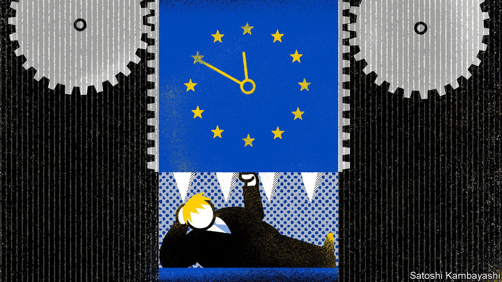

###### Britain and the European Union

# Boris Johnson’s government should prolong the Brexit transition 

##### Britain needs a trade deal more than the EU does 

 

> Jun 13th 2020 

CAUGHT UP IN covid-19, Britons have largely forgotten the crisis that preoccupied them for three-and-a-half years. But Brexit has not gone away. A crunch is approaching, and unless the prime minister, Boris Johnson, acts swiftly, its damaging economic consequences will compound those of the pandemic.

Britain formally left the EU on January 31st, and is now in a transition period until the end of the year, during which time a deal on future relations is meant to be thrashed out. If it is not, and Britain ends that transition without a trade deal, the impact on the economy is likely to be painful.


The prospects are not good. Talks are deadlocked. The two sides have taken extreme positions on fisheries, governance and competition. The chances of sealing a deal in six months look slim. The first, supposedly easier, stage of Brexit talks on withdrawal took 30 months to finish. Negotiating this stage remotely is an unwelcome complication.

Under the withdrawal treaty, the two sides can choose before the end of June to extend the transition for up to two years. After that, any extension would need a fresh treaty and the approval of all 27 national and some regional parliaments. That makes brinkmanship risky. The obvious solution is for Mr Johnson, when he meets EU leaders virtually next week, to ask for an extension. Voters think he should, according to most polls. Yet he refuses to do so.

Mr Johnson says that to extend transition would betray those who voted for Brexit. Yet Brexit happened in January: the only question now is whether it is orderly or disorderly. Mr Johnson also says Britain may have to pay vast extra sums into the EU budget, and even contribute to its new rescue fund. But though there would be a bill to pay, the treaty says it is negotiable; and since Britain is no longer in the common agricultural policy, the bill should be a lot smaller than were its dues as a member.

Would staying in transition constrain Britain’s response to covid-19 through state subsidies, as opponents of an extension also argue? No, because the EU’s state-aid rules are suspended. Claims that transition would stop new free-trade deals are misleading, as negotiations with other countries can continue, and in any case none is ready to come into force soon. Suggestions that an extension would prolong uncertainty for businesses are wrongheaded. It is the risk of leaving without a trade deal that troubles firms. They are already hit by covid-19, and unprepared for tariffs, quotas and customs checks.

Mr Johnson thinks the EU caves in only under the pressure of time. He believes that his renegotiation of the withdrawal treaty last autumn, after he became prime minister, shows the benefits of going up to the wire. Yet it was not the EU, but Britain, that made the big concession then, by accepting a customs border between Great Britain and Northern Ireland. And once again, as last time, Britain needs a deal more than the EU does.

Privately, the government believes that covid-19 has reduced the political risk of leaving without a deal, since its costs will be hidden by the greater damage from the pandemic. Yet this argument is not only improperly self-serving but also fallacious. Covid-19 has severely affected non-tradables, such as restaurants and bars, whereas Brexit without a trade deal would hit big exporters such as carmakers (goodbye, Nissan?) as well as creating visible chaos in Dover.

A sensible, responsible government would treat an extension of the transition not as a political weapon but as an option contract, for use only if a deal cannot be struck in time. If Mr Johnson continues to reject it out of hand he will show his government to be, on the matter of Brexit, neither sensible nor responsible.■

