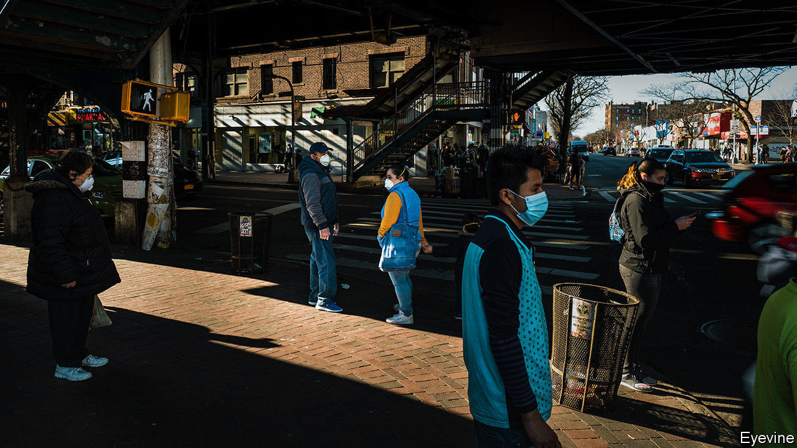
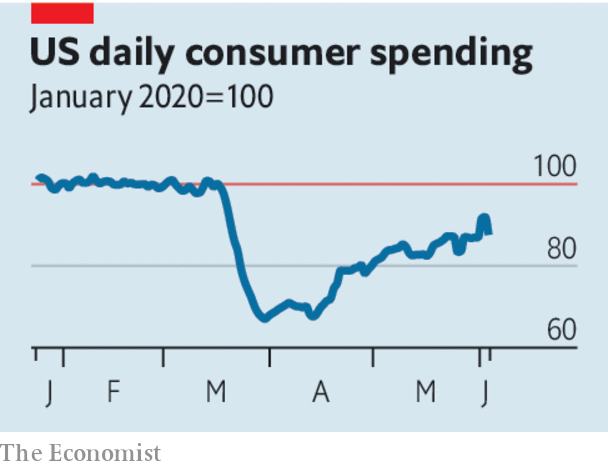

###### Achilles heal

# Most investors and some firms are upbeat about the world economy 

##### They won’t be if stimulus cheques dry up or the virus surges again 

 

> Jun 13th 2020 

ACCORDING TO the theory of cognitive dissonance it is stressful to dwell on contradictions. Pity, then, anyone trying to reconcile the miserable mood of many economic forecasters with booming stockmarkets and the increasingly bullish mood in many boardrooms. This week the OECD, a club of mostly rich countries, predicted “dire and long-lasting consequences” in the rich world from the recessions caused by the covid-19 pandemic. As it did so, the S&amp;P 500 index of American shares was almost back to its level at the start of the year, when to most people “corona” still meant something to be drunk with a slice of lime. For a while the strength of America’s stockmarket, which recently enjoyed its biggest 50-day rally in history, looked like a global exception. But since the end of April European and Japanese markets have outperformed even a jubilant Wall Street.

To some this is a clear sign of spreading irrational exuberance. Shares, it is argued, have been pumped to unsustainable highs by monetary and fiscal stimulus, and, perhaps, by a wave of speculation by idle workers who have been punting on the stockmarket with their stimulus cheques (TD Ameritrade, a retail broker, says trading activity is four times the level of a year ago). In fact, investors have not lost their minds. A stream of positive corporate and economic data provides some grounds for optimism. The trouble is that it would not take much bad news—whether about the withdrawal of stimulus or the pandemic—to throw the rally into reverse.


Start with the good news. Most analysts had thought that America’s unemployment rate would rise from 14.7% to around 20% in May. Instead it fell to 13.3% as millions of Americans were recalled to work (see ). Real-time data on credit-card spending, e-commerce and consumer mobility suggest that American consumer spending reached a trough in April and has now recovered to around 90% of its pre-pandemic level. The recession that was only this week officially declared to have started in March already looks to have bottomed out.

 


Like the market rally, the green shoots are not confined to America. In May Chinese goods exports were only 3.3% lower than a year ago—analysts had expected almost twice that fall. Labour markets have beaten expectations in Canada and South Korea. In Europe surveys of business sentiment remain depressed but have rebounded strongly from record lows in April. It helps that the euro zone has embraced stimulus. This month the ECB has expanded its bond-buying programme and Germany has fired a fiscal bazooka (see ).

Indeed, one conclusion to draw from this turn in the data is that stimulus works. Governments have successfully shielded firms from bankruptcy and protected consumers’ incomes. America’s banks say that fewer debts are turning sour than you might expect from looking at the unemployment rate alone; household incomes are higher than they were before the pandemic. Meanwhile many investors and firms have persuaded themselves that lifting lockdowns will not cause an immediate second spike in covid-19 infections. All this has led them to look past the evisceration of corporate profits in 2020 to a rapid economic rebound in 2021 and 2022.

Yet each prong of the argument also carries a warning. Stimulus will not last for ever. America’s emergency $600 weekly boost to unemployment insurance payouts, for example, expires at the end of July. Were Congress to continue to support the jobless so generously, it could slow the economic restart by discouraging people from working. But an abrupt withdrawal of benefits would slash incomes and leave many unable to spend. America’s headline unemployment rate may be falling but the number of workers who report that they are jobless because they have been permanently (rather than temporarily) laid off continues to rise ominously. Nobody yet knows how many will join their ranks as the economy changes for good in response to the pandemic. That makes it hard to judge for how long policymakers should keep the pedal to the metal. And for as long as the labour market looks damaged, households will save more than they otherwise might, slowing the recovery.

The second risk stems from the virus itself. It is still poorly understood and, as it spreads through developing countries, the global daily count of new cases is trending higher than ever. Another wave of infections still remains possible, especially during the winter, when its transmission may be easier. That could bring on another round of lockdowns or, failing that, lead consumers to choose to stay at home for their own protection, limiting the extent of the rebound. In February markets were caught out by the speed with which the outlook shifted. Though the world economy has begun to recover, do not rule out a relapse. ■

